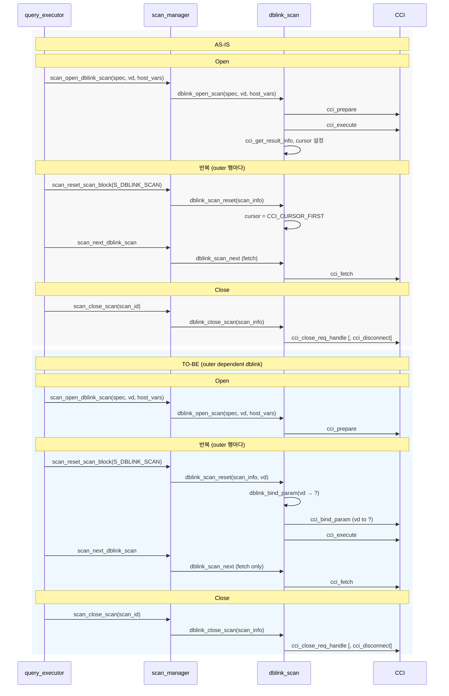

# CBRD-26553 — DBLink 조인 키 푸시 최적화

| 항목 | 내용 |
|------|------|
| 이슈 | CBRD-26553 |
| 브랜치 | `dblink_join_improve` |
| 기준 브랜치 | `develop` |

---

## 1. 문제와 목표

### 1.1 현재 동작 (AS-IS)

로컬 테이블과 dblink(원격) 테이블을 **Nested Loop**으로 조인할 때:

1. `dblink_open_scan`: `cci_prepare` + `cci_execute` → 원격 테이블 **전체**를 한 번에 로컬로 전송
2. outer 행마다 `dblink_scan_reset`: 커서를 처음(`CCI_CURSOR_FIRST`)으로만 되감기
3. `dblink_scan_next`: 매 outer 행마다 원격 결과 전체를 처음부터 순차 스캔하며 조인 조건 평가

→ 원격 테이블 크기에 비례한 **불필요한 데이터 전송**, **로컬 predicate 평가 부담** 발생

### 1.2 목표 동작 (TO-BE)

dblink가 NL inner일 때:

1. `dblink_open_scan`: `cci_prepare`만 (execute 생략)
2. outer 행마다 `dblink_scan_reset`: 현재 outer 행의 조인 키를 `?`에 **rebind** 후 `cci_execute`
3. `dblink_scan_next`: **조인 조건을 만족하는 행만** fetch

→ 전송 데이터 감소, 로컬 predicate 평가 감소

### 1.3 XASL 구조 (기존 vs 수정)

**기존 XASL 구조**  
`mq_rewrite_dblink_as_subquery`가 모든 dblink spec을 `PT_IS_SUBQUERY`(wrapper PT_SELECT)로 변환하여 dblink ACCESS_SPEC이 `aptr_list`(uncorrelated buildlist) 안에 들어감.

```
outer (class scan)
  └── scan_ptr → list_scan     ← reset 시 여기서 처리 (커서 되감기)
                  └── aptr_list → wrapper PT_SELECT XASL
                                    └── spec_list → dblink ACCESS_SPEC
                                                      └── dblink_scan   ← open (prepare+execute)
```

**수정된 XASL 구조**  
push-down 후보 dblink spec은 rewrite를 하지 않고 `PT_DERIVED_DBLINK_TABLE`을 유지하고, XASL 생성 시 `pt_to_dblink_table_spec_list`가 호출되어 dblink scan이 `scan_ptr`에 직접 연결됨.

```
outer (class scan)
  └── scan_ptr → dblink_scan  ← scan_reset_scan_block(S_DBLINK_SCAN) → dblink_scan_reset() → rebind+execute
```
**적용 범위**: push-down 후보 dblink가 NL/IDX join **inner**일 때만. 비후보이거나 dblink가 outer이면 작업 전과 동일한 구조·동작 유지.

---

## 2. 데이터 흐름 요약

```
Parser (view_transform.c)
  ↓  "remote.col = local.col" 조건을 push-down 후보로 허용 (T1-1)
  ↓  rewritten SQL에 "WHERE remote.col = ?" 형태로 반영 (T1-2)
  ↓  PT_DBLINK_INFO.join_key_local_refs[i] = 로컬 측 PT_NODE 저장

XASL 생성 (xasl_generation.c)
  ↓  join_key_local_refs[i] → REGU_VARIABLE 변환 (T2-1, T4-1)
  ↓  vfetch_to = outer val_list 슬롯 포인팅 (T4-1)
  ↓  dblink_spec_node.join_key_count, join_key_regu_list 저장

Runtime (dblink_scan.c)
  ↓  open: join_key_count > 0 → prepare만 (T3-1)
  ↓  reset: join_key_regus[i]로 outer 행 값 읽어 bind → cci_execute (T3-2)
  ↓  next: 기존 fetch 경로 유지
```

### 구조체 전달 경로

```
PT_DBLINK_INFO               →  dblink_spec_node          →  DBLINK_SCAN_INFO
 join_key_local_ref_count        join_key_count               join_key_count
 join_key_local_refs[]           join_key_regu_list            join_key_regus[]
```

### 데이터/호출 흐름

Open / Reset / Close 시점의 호출 관계 (query_executor → scan_manager → dblink_scan → CCI).



## 3. 변경 파일 목록

| 파일 | 변경 요약 |
|------|-----------|
| `src/query/xasl.h` | `dblink_spec_node`에 `join_key_count`, `join_key_regu_list` 추가 |
| `src/parser/parse_tree.h` | `PT_DBLINK_INFO`에 `join_key_local_ref_count`, `join_key_local_refs` 추가; `PARSER_CONTEXT.flag`에 `is_generating_dblink_inner_scan:1` 추가 |
| `src/parser/view_transform.c` | push-down 허용 판별(`pt_check_pushable_term`), **PT_DBLINK_TABLE 경로**에서 join-key 식별·rewritten SQL 생성(`pt_copypush_terms`), rewrite 건너뜀(`mq_rewrite_dblink_as_subquery`, T4-3). 상세는 §4 참고 |
| `src/parser/parse_tree_cl.c` | `pt_apply_dblink_table()`에 `join_key_local_refs` walk 추가 |
| `src/parser/xasl_generation.c` | `pt_to_dblink_table_spec_list()`에 join_key_regu_list 채우기, is_generating_dblink_inner_scan guard |
| `src/query/xasl_to_stream.c` | `dblink_spec_node` 직렬화에 join_key_count, join_key_regu_list 추가 |
| `src/query/stream_to_xasl.c` | `dblink_spec_node` 역직렬화에 join_key_count, join_key_regu_list 추가 |
| `src/query/dblink_scan.h` | `DBLINK_SCAN_INFO`에 `join_key_count`, `join_key_regu_list` 추가; `dblink_scan_reset` 시그니처 변경 |
| `src/query/dblink_scan.c` | `dblink_open_scan` (prepare-only), `dblink_scan_reset` (rebind+execute), `dblink_bind_param_dbvalue` 추가 |
| `src/query/scan_manager.c` | `scan_reset_scan_block`에서 `dblink_scan_reset(scan_info, vd)` 호출 |
| `src/optimizer/plan_generation.c` | `gen_inner()` — dblink inner 진입/퇴장 시 `is_generating_dblink_inner_scan` set/clear |

---

## 4. 태스크별 변경 상세

### T0-2: xasl.h — dblink_spec_node 필드 추가

- **`src/query/xasl.h`**: `dblink_spec_node`에 `int join_key_count`, `REGU_VARIABLE_LIST join_key_regu_list` 추가
- **`src/parser/xasl_generation.c`**: `pt_make_dblink_access_spec()`에서 0/NULL로 초기화
- **`src/query/xasl_to_stream.c`, `stream_to_xasl.c`**: 직렬화/역직렬화 반영

### T0-3: is_generating_dblink_inner_scan 플래그

dblink가 NL/IDX join **inner**일 때만 join_key 처리를 활성화하기 위한 컨텍스트 플래그.

- **`src/parser/parse_tree.h`**: `PARSER_CONTEXT.flag`에 `unsigned is_generating_dblink_inner_scan:1` 추가
- **`src/optimizer/plan_generation.c`**: `gen_inner()` — `PT_DERIVED_DBLINK_TABLE` spec 처리 전후 플래그 set/clear
- **`src/parser/xasl_generation.c`**: `pt_to_dblink_table_spec_list()`에 두 가지 guard:
  - `join_key_count` 설정: `is_generating_dblink_inner_scan == 1`일 때만
  - `conn_sql` 선택: `is_generating_dblink_inner_scan == 1`이면 rewritten SQL 사용, 아니면 qstr

| dblink 위치 | 플래그 | 동작 |
|------------|--------|------|
| NL/IDX join inner | 1 | push-down 적용 |
| NL/IDX join outer | 0 | AS-IS fallback |
| Hash/Merge join | 0 | AS-IS fallback |
| 단일 dblink (join 없음) | 0 | AS-IS |

### T1-1 + T1-1a: push-down 허용 판별

**파일**: `src/parser/view_transform.c`

AS-IS에서는 `pt_check_pushable_term()`이 "원격 컬럼 = 로컬 컬럼" 형태의 조인 조건을 `others_found = true`로 판단해 push 불가 처리했다.

**추가 함수**:
- `PT_DBLINK_SIDE_REFS` 구조체: 서브트리 참조 분류용 (`has_dblink_ref`, `has_outer_ref`, `has_others`)
- `pt_find_dblink_side_refs_walk()`: leaf walk 콜백 — PT_NAME을 spec_id 기준으로 분류; PT_HOST_VAR는 `has_others`로 분류 (앱 `?`와 혼합 금지)
- `pt_find_dblink_side_refs()`: 서브트리 walk 수행
- `pt_is_dblink_join_key_equality()`: equality 양쪽 중 한쪽만 dblink ref, 다른 쪽만 outer ref이고 others 없으면 `true`

**`pt_check_pushable_term()` 수정**:
- 기존 조건이 false여도, spec이 dblink이고 `pt_is_dblink_join_key_equality()` == true이면 push 허용
- T1-1a: spec이 rewrite 후 PT_SELECT wrapper인 경우도 dblink로 인식 (비후보 fallback 경로)

### T1-2: rewritten SQL에 "remote.col = ?" 반영

**파일**: `src/parser/view_transform.c`, `src/parser/parse_tree.h`, `src/parser/parse_tree_cl.c`

- `PT_DBLINK_INFO`에 `join_key_local_ref_count`, `join_key_local_refs` 추가
- `pt_get_remote_side_of_join_key()` 추가: "remote.col = local.col"에서 원격/로컬 측 노드 분리
- **`pt_copypush_terms()`의 `case PT_DBLINK_TABLE`** 에서 join-key 푸시 수행 (래퍼 PT_SELECT 분기는 제거됨):
  - `term_list`에서 `pt_get_remote_side_of_join_key()`로 join-key 등치 식별
  - join-key term → `"remote.col = ?"` 문자열 생성 (원격 WHERE에서 alias 없이 컬럼명만 사용하도록 `PT_PRINT_SUPPRESS_FOR_DBLINK` 등 플래그 적용)
  - `rewritten`에 `SELECT * FROM (원본쿼리) cublink WHERE [기타 predicate AND] remote.col = ?` 형태 설정
  - `join_key_local_refs[i]`에 로컬 측 노드 저장
  - **join-key term은 로컬 WHERE에 남기지 않음** (원격에서만 평가, 푸시 오류 시 fail-fast)

### T2-1: XASL 생성 — join_key_regu_list 채우기

**파일**: `src/parser/xasl_generation.c` — `pt_to_dblink_table_spec_list()`

- 조건: `is_generating_dblink_inner_scan == 1` AND `join_key_local_ref_count > 0` AND PT_HOST_VAR 없음
- `join_key_local_refs`를 `pt_to_position_regu_variable_list()`로 REGU_VARIABLE_LIST 변환
- `dblink_spec_node.join_key_count`, `join_key_regu_list` 저장

### T4-1: outer val_list 슬롯 포인팅

**파일**: `src/parser/xasl_generation.c`

단순히 `pt_to_regu_variable_list()`를 쓰면 `vfetch_to`가 설정되지 않아 reset 시 outer 행 값을 읽을 수 없음.

**해결**: outer 테이블의 `table_info`를 찾아 `pt_to_position_regu_variable_list()`로 REGU 생성
- `join_key_local_refs[0]`에서 outer `spec_id` 추출
- `pt_find_table_info(outer_spec_id, ...)`로 outer `table_info` 획득
- `pt_find_attribute()`로 `attr_offsets[i]` 계산
- `pt_to_position_regu_variable_list(parser, node_list, outer_tbl_info->value_list, attr_offsets)` 호출

결과: `regu->value.vfetch_to` → outer `val_list` 슬롯을 가리킴. outer 행이 바뀌면 val_list 자동 갱신.

### T4-3: PT_IS_SUBQUERY rewrite 건너뜀

**파일**: `src/parser/view_transform.c`

AS-IS에서는 `mq_rewrite_dblink_as_subquery()`가 모든 dblink spec을 `PT_IS_SUBQUERY` wrapper(PT_SELECT)로 감싸, XASL 구조상 dblink ACCESS_SPEC이 `aptr_list`(uncorrelated buildlist) 내부에 위치하게 됐다. 이 경우 outer 행마다 `scan_reset_scan_block`이 dblink까지 전달되지 않아 rebind 불가.

**추가 함수**: `mq_has_dblink_join_key_equality_term()` — WHERE 절에서 join-key equality 탐지

**`mq_rewrite_dblink_as_subquery()` 수정**:
- push-down 후보(join-key equality 있음) → rewrite **건너뜀** → `PT_DERIVED_DBLINK_TABLE` 유지 → `scan_ptr`에 직접 위치
- 비후보 → 기존대로 `PT_IS_SUBQUERY` 변환

### T3-1: open — prepare만 수행

**파일**: `src/query/dblink_scan.c` — `dblink_open_scan()`

- spec에서 `join_key_count`, `join_key_regu_list` → `scan_info`로 복사
- `join_key_count > 0`이면: `cci_prepare`만 수행, bind/execute 생략
- `col_info`/`col_cnt`는 첫 번째 reset(execute 후)에서 설정

### T3-2: reset — rebind + execute

**파일**: `src/query/dblink_scan.c`, `src/query/dblink_scan.h`, `src/query/scan_manager.c`

- `dblink_bind_param_dbvalue()` 추가: 단일 DB_VALUE를 CCI에 바인딩
- `dblink_scan_reset(scan_info, vd)` 시그니처 변경 (vd 추가)
- `scan_manager.c`의 `scan_reset_scan_block()`에서 `dblink_scan_reset(&scan_info, s_id->vd)` 호출

**reset 내부 로직** (`join_key_count > 0`일 때):
1. `fetch_peek_dbval(thread_p, join_key_regus[i], vd, ..., &val)` — outer 행 값 읽기
2. val이 NULL → `no_result = true`, execute 스킵 (S_END 반환)
3. `cci_bind_param(stmt, i+1, ...)` — 파라미터 바인딩
4. `cci_execute(stmt, ...)` — 원격 실행
5. 첫 execute 시 `cci_get_result_info`로 `col_info`/`col_cnt` 설정

---

## 5. 적용 범위 (1차)

| 구분 | 처리 |
|------|------|
| NL inner dblink + WHERE "remote.col = local.col" 단일 등치 | push-down 적용 |
| dblink가 outer인 경우 | AS-IS fallback |
| Hash/Merge join | AS-IS fallback |
| 앱 `?` (PT_HOST_VAR)가 포함된 predicate | AS-IS fallback |
| ON 조건만 있는 경우 (LEFT JOIN 등) | AS-IS fallback (ON은 현재 push 미지원) |
| 복합 조인 키 (AND) | AS-IS fallback (1차 미지원) |

---

## 6. 리뷰 포인트

### 핵심 로직

1. **`pt_check_pushable_term()` 예외 처리** (`view_transform.c`)
   - `pt_is_dblink_join_key_equality()` 판별 조건이 정확한지
   - PT_HOST_VAR를 `has_others`로 분류해 앱 `?`와의 혼합을 막는 로직

2. **`pt_copypush_terms()` — `case PT_DBLINK_TABLE`** (`view_transform.c`)
   - `term_list`에서 join-key / 비 join-key 분리, `join_key_local_refs`·rewritten 생성
   - `remote_side` 출력 시 `PT_PRINT_SUPPRESS_FOR_DBLINK` 등으로 원격 WHERE에 alias 없이 컬럼명만 들어가는지

3. **`mq_rewrite_dblink_as_subquery()` 조건부 건너뜀** (`view_transform.c`)
   - push-down 후보 감지 조건 (`mq_has_dblink_join_key_equality_term()`)
   - rewrite를 건너뜀으로써 `PT_DERIVED_DBLINK_TABLE`이 `scan_ptr`에 직접 위치하는지

4. **`pt_to_position_regu_variable_list()`로 vfetch_to 설정** (`xasl_generation.c`)
   - outer `table_info` 조회 실패 시 fallback 경로가 올바른지
   - `attr_offsets[i]` 계산이 정확한지

5. **`dblink_scan_reset()` — rebind + execute** (`dblink_scan.c`)
   - `fetch_peek_dbval`로 outer 행 값 추출 경로 (TYPE_POS_VALUE, vfetch_to 등)
   - NULL 조인 키 처리 (`no_result = true`, execute 스킵)
   - `cci_execute` 재호출 시 기존 결과셋 대체 여부 (CCI 보장)

6. **`is_generating_dblink_inner_scan` 플래그 scope** (`plan_generation.c`, `xasl_generation.c`)
   - set/clear가 gen_inner() 내에서만 정확히 동작하는지
   - 중첩/재귀 호출 시 플래그 오염 가능성

### 직렬화

- `xasl_to_stream.c` / `stream_to_xasl.c`의 `join_key_regu_list` pack/unpack이 기존 REGU_VARIABLE_LIST 패턴과 일관성 있는지

### 안전장치

- dblink outer, hash/merge join, 앱 `?` 포함 등 AS-IS fallback 케이스에서 `join_key_count == 0`이 보장되는지
- `no_result` 플래그 초기화 위치 확인 (다음 outer 행으로 넘어갈 때 초기화되는지)

---

## 7. 관련 문서

| 문서 | 설명 |
|------|------|
| [PRD](dblink_join_optimization_prd.md) | 요구사항 및 적용 범위 |
| [구현 계획](dblink_join_optimization_plan.md) | 상세 구현 계획 |
| [작업 요약](dblink_join_optimization_work_summary.md) | 태스크별 완료 내용 |
| [테스트](dblink_join_optimization_tests.md) | 테스트 케이스 전체 목록 |
