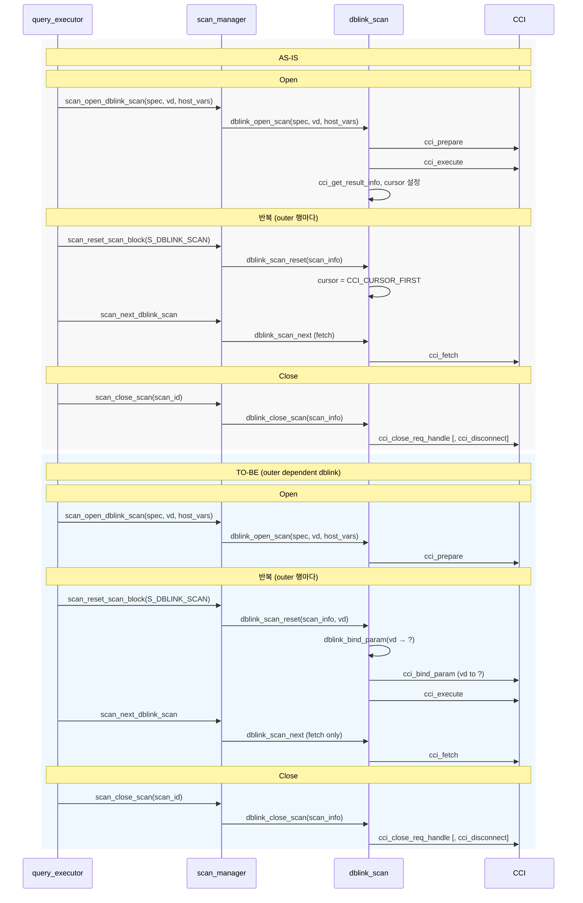
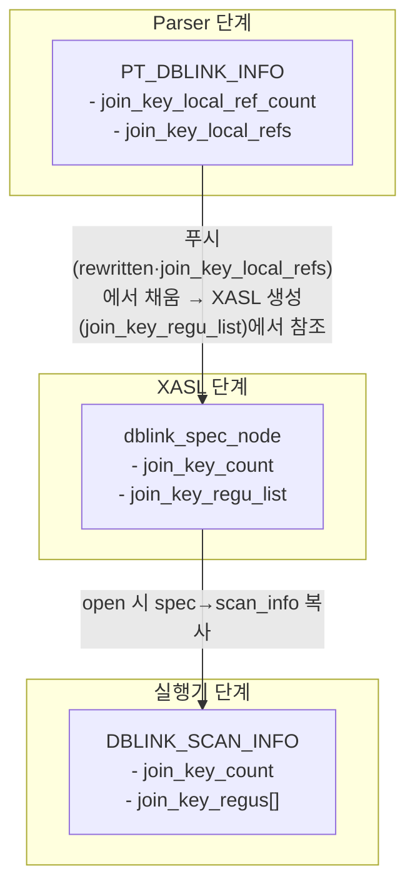

# DBLINK 조인 최적화 — 상세 구현 계획

## 목표 동작 요약

- **현재**: 원격 쿼리 1회 실행 → 결과 전체 로컬 전달 → 매 outer 행마다 해당 결과셋을 처음부터 스캔하며 조인 조건 평가.
- **목표**: dblink가 **inner**일 때, outer 행이 바뀔 때마다 **reset** 시점에 현재 outer 행의 조인 키를 `?`에 rebind 후 **원격 execute** → 조인 조건을 만족하는 행만 fetch.

적용 조건: **Nested loop에서 inner가 dblink**인 경우에만. dblink가 outer이면 기존 방식 유지. **푸시된 predicate에 앱 host 변수(PT_HOST_VAR)가 있으면** 조인 키 푸시 최적화를 적용하지 않고 기존 방식(open에서 bind+execute) 유지.

---

## 데이터/호출 흐름

<!-- Mermaid (GitHub/일부 미리보기에서 렌더링됨) -->

**텍스트 흐름 (미리보기에서 다이어그램이 안 보일 때 참고)**

- **Open (1회)**: Exec → SM: `scan_open_dblink_scan(spec, vd, host_vars)` → SM → DS: `dblink_open_scan` → DS → CCI: `cci_prepare` [, AS-IS: `cci_execute` / TO-BE(outer dependent): prepare만].
- **현재(반복)**: Exec → SM: `scan_reset_scan_block` → SM → DS: `dblink_scan_reset(scan_info)` → DS: `cursor = CCI_CURSOR_FIRST` → ... → DS → CCI: `cci_fetch`
- **목표(반복, outer dependent dblink)**: Exec → SM: `scan_reset_scan_block` → SM → DS: `dblink_scan_reset(scan_info, vd)` → DS: `dblink_bind_param` → DS → CCI: `cci_bind_param` (vd to ?), `cci_execute` → ... → DS → CCI: `cci_fetch`
- **Close**: Exec → SM: `scan_close_scan(scan_id)` → SM → DS: `dblink_close_scan(scan_info)` → DS → CCI: `cci_close_req_handle` [, `cci_disconnect`] (AS-IS·TO-BE 동일)

---

## 자료 구조 (추가/변경)

추가·확장된 구조체와 필드를 단계별로 정리한다. 구현/리뷰 시 "어디에 무엇이 추가됐는지"는 이 섹션과 각 Step을 함께 보면 된다.

### Parser / PT — [src/parser/parse_tree.h](src/parser/parse_tree.h)

| 구조체 | 추가 필드 | 용도 | 관련 Step |
|--------|-----------|------|-----------|
| `PT_DBLINK_INFO` | `join_key_local_ref_count`, `join_key_local_refs` (PT_NODE **) | i번째 `?`에 대응하는 로컬 측 노드(조인 키). rewritten 생성 시 "원격col = ?"와 매핑 | 1-2, 2-1 |

view_transform 내부: equality 양쪽 참조를 분류할 때 쓰는 구조(예: `PT_DBLINK_SIDE_REFS` — has_dblink_ref, has_outer_ref, has_others, dblink_spec_id). Step 1-1 푸시 허용 판별용.

### XASL — [src/query/xasl.h](src/query/xasl.h), 직렬화

| 구조체 | 추가 필드 | 용도 | 관련 Step |
|--------|-----------|------|-----------|
| `dblink_spec_node` | `join_key_count` (int), `join_key_regu_list` (REGU_VARIABLE_LIST) | `join_key_count > 0`이면 조인 키 푸시 적용. `join_key_regu_list[i]`는 i번째 `?`에 대응하는 outer 컬럼 REGU_VARIABLE(TYPE_CONSTANT, `dbvalptr`가 outer `val_list` 엔트리를 가리킴). reset 시 `fetch_peek_dbval`로 outer 행 값 추출용. 기존 `host_var_count`/`host_var_index`는 앱 `?` 전용으로 유지. 직렬화: `xasl_to_stream.c`/`stream_to_xasl.c`에서 REGU_VARIABLE_LIST pack/unpack 추가. | 0-2, 2-1, 3-1/3-2 |

직렬화: `xasl_to_stream.c`, `stream_to_xasl.c`에서 `join_key_count` pack/unpack 및 크기 반영.

### 실행기 — [src/query/dblink_scan.h](src/query/dblink_scan.h)

| 구조체 | 추가 필드 | 용도 | 관련 Step |
|--------|-----------|------|-----------|
| `DBLINK_SCAN_INFO` | `join_key_count` (int), `join_key_regus` (regu_variable_node **) | open 시 spec의 `join_key_regu_list`에서 포인터 배열로 복사. `join_key_count > 0`이면 reset 시 `fetch_peek_dbval(thread_p, join_key_regus[i], vd, NULL, NULL, NULL, &val)`로 outer 행 값 추출 후 `cci_bind_param` 직접 호출. | 3-1, 3-2 |

### 데이터 흐름 (구조체 기준)

**의미**: "조인 키를 원격 `?`에 넣는다"는 정보가 **어느 단계에서 어떤 구조체에 담겨 다음 단계로 넘어가는지**를 구조체 이름으로만 표시한 흐름이다. 화살표는 "이 단계에서 채워진 값이, 다음 단계의 구조체로 복사·반영된다"는 뜻이다.

---

## Step 0: 사전 확인 및 인프라

### 0-1 view_transform — correlated + dblink 제외 확인

- **파일**: [src/parser/view_transform.c](src/parser/view_transform.c)
- **위치**: `pt_check_pushable_term()` (약 4020~4057행)
- **현재 동작**: `infop->out.correlated_found`이고 `infop->in.spec`의 `derived_table`이 `PT_DBLINK_TABLE`이면 `is_correlated_with_dblink = true`로 설정되어 **푸시 불가**로 처리됨.
- **확인 사항**: "원격 컬럼 = 로컬 컬럼" 형태의 term이 여기서 걸려 푸시가 막히는지 코드로 확인. (이미 문서화된 대로라면 여기서 제외됨.)

### 0-2 xasl.h — dblink_node 구조 확인

- **파일**: [src/query/xasl.h](src/query/xasl.h) (약 837~847행)
- **현재 필드**: `host_var_count`, `host_var_index`, `conn_sql`, `conn_url`, `conn_user`, `conn_password`, `dblink_regu_list_pred`, `dblink_regu_list_rest` 등 이미 존재.
- **추가 필요**: `int join_key_count`, `REGU_VARIABLE_LIST join_key_regu_list`. **구현**: `dblink_spec_node`에 추가. `pt_make_dblink_access_spec()`에서 0/NULL로 초기화. 직렬화는 `xasl_to_stream.c`/`stream_to_xasl.c`에서 `join_key_count`는 `or_pack_int`/`or_unpack_int`, `join_key_regu_list`는 기존 `outptr_list` 등의 REGU_VARIABLE_LIST pack/unpack 패턴과 동일하게 처리하고 `xts_sizeof_dblink_spec_type`에 크기 반영.

---

## Step 1: 푸시 조건 식별 (Parser / View transform)

### 1-1 "원격 컬럼 = 로컬 컬럼" 푸시 허용

- **파일**: [src/parser/view_transform.c](src/parser/view_transform.c)
- **대상**: `pt_check_pushable_term()` (4020~4057행)
- **변경 요지**: `is_correlated_with_dblink == true`인 경우에도, term이 **등치 하나**이고 한쪽은 dblink 테이블 컬럼、한쪽은 outer(메인 쿼리) 컬럼만 참조하면 **푸시 허용**하도록 예외 추가.
- **구현 방향**:
  - term이 `PT_EXPR`이고 `op == PT_EQ`인지 확인.
  - **구현**: `pt_is_dblink_join_key_equality(parser, term, infop)` 추가. 내부에서 `pt_find_dblink_side_refs()`로 equality 양쪽 서브트리를 walk하여 `PT_DBLINK_SIDE_REFS`(has_dblink_ref, has_outer_ref, has_others, dblink_spec_id) 수집. 한쪽만 dblink ref, 다른 쪽만 outer ref이고 others 없으면 true 반환. `pt_check_pushable_term()`에서 `is_correlated_with_dblink == true`일 때 이 함수가 true면 `is_correlated_with_dblink = false`로 덮어 푸시 허용.
- **주의**: 1차 작업에서는 "원격 컬럼 = 로컬 컬럼" 한 개 등치만 허용하고, 복합 키/OR 등은 이후 단계로 미룸.

### 1-2 푸시 시 rewritten에 `?` 반영 및 host_var 매핑

- **파일**: [src/parser/view_transform.c](src/parser/view_transform.c)
- **대상**: `pt_copypush_terms()` 내부 `case PT_DBLINK_TABLE:` (4142~4193행)
- **현재**: `pushed_pred`를 그대로 복사한 뒤 `pt_print_and_list(parser, pushed_pred)`로 문자열화해 `rewritten`에 `WHERE <pred>` 붙임. 즉 "원격=로컬"이 그대로 문자열로 들어가 원격에서 해석 불가.
- **변경 요지**:
  - "원격 컬럼 = 로컬 컬럼"으로 푸시된 term에 대해:
    - **원격 쿼리 문자열**: 원격 컬럼만 남기고 `remote.col = ?` 형태로 출력 (기존 `PT_PRINT_SUPPRESS_FOR_DBLINK` 등 플래그 활용 또는 새 플래그로 로컬 측 출력 억제).
    - **로컬 쪽 매핑**: `query->info.dblink_table.host_vars`에 "i번째 `?` ← 로컬 쪽 컬럼/값 정보"를 유지. 현재 `host_vars`는 [parse_tree.h](src/parser/parse_tree.h) 3382행 `PT_HOST_VAR_IDX_INFO`(count + index)로, 주로 메인 쿼리 host var index용. 조인 키용은 **outer row의 어떤 컬럼(또는 나중에 regu/outptr 위치)**에 대응할지 저장할 구조가 필요.
- **구체화**: `pushed_pred`는 유지하되, rewritten 생성 시에만 "원격col = ?"로 출력하고, `dblink_table.join_key_local_refs`에 "i번째 `?`에 대응하는 로컬 PT_NODE" 저장. XASL 생성(Step 2-1)에서 이 PT_NODE를 `pt_to_regu_variable()`로 변환해 `join_key_regu_list`에 보관. PT에는 "어떤 로컬 컬럼인지"만 남기고, REGU 변환은 XASL 생성 단계에서 수행.

- **구현**: [parse_tree.h](src/parser/parse_tree.h) `PT_DBLINK_INFO`에 `join_key_local_ref_count`, `join_key_local_refs` (PT_NODE **) 추가. `pt_copypush_terms()`의 `PT_DBLINK_TABLE` 블록에서: (1) 푸시된 term 리스트를 두 번 순회하여 먼저 join-key equality 개수만 세고 `join_key_local_refs` 배열 할당 후 로컬 측 노드 포인터 저장. (2) rewritten는 "SELECT * FROM (...) cublink"까지 붙인 뒤, where_part를 별도로 구성(각 term이 join-key equality면 dblink_side만 `pt_print_bytes`로 출력 후 `pt_append_bytes(parser, seg, " = ?", 4)`, 아니면 term 전체 출력; " AND "로 연결). 마지막에 `rewritten = pt_append_bytes(parser, rewritten, " WHERE ", 7)` + where_part 붙임.

---

## Step 2: XASL에 반영

### 2-1 conn_sql 및 join_key_regu_list 채우기

- **파일**: [src/parser/xasl_generation.c](src/parser/xasl_generation.c)
- **관련 흐름**: `pt_to_dblink_table_spec()` (약 12980~13053행) — `pdblink->rewritten`으로 `sql` 생성, `pdblink->pushed_pred`를 walk해 `pt_host_vars_count`/`pt_host_vars_index`로 `pdblink->host_vars` 설정 후 `pt_make_dblink_access_spec(..., host_var_count, host_var_index, sql)` 호출.
- **변경 요지**:
  - Step 1-2에서 `join_key_local_refs[i]`(PT_NODE*)로 "i번째 `?`에 대응하는 outer 컬럼" 정보가 남아 있다면, XASL 생성 시점에 `pt_to_regu_variable()`로 REGU_VARIABLE로 변환해 `dblink_spec_node.join_key_regu_list`에 저장한다.
  - outer 컬럼에 대한 REGU_VARIABLE은 TYPE_CONSTANT로 생성되며, `dbvalptr`이 outer scan의 `val_list` 엔트리(공유 DB_VALUE*)를 가리킨다. outer 행이 바뀔 때마다 outer의 `val_list`가 갱신되므로, reset 시점에 `fetch_peek_dbval`로 평가하면 항상 현재 outer 행의 값을 얻는다.
  - `vd->dbval_ptr`(앱 호스트 변수 배열)에는 관여하지 않으므로 `host_var_index` 매핑이 불필요하다.
- **구현**: `pt_to_dblink_table_spec_list()`에서 **`join_key_local_ref_count > 0`이고 푸시된 predicate에 PT_HOST_VAR가 없을 때만** 조인 키 경로 적용:
  - `join_key_local_refs[i]`마다 `pt_to_regu_variable(parser, join_key_local_refs[i], UNBOX_AS_VALUE)` 호출.
  - 반환된 REGU_VARIABLE을 `regu_variable_list_node`로 연결해 리스트 구성 후 `dblink_spec_node.join_key_regu_list`에 저장.
  - `dblink_spec_node.join_key_count = join_key_local_ref_count` 설정.
  - `host_var_count`/`host_var_index`는 **앱 `?` 전용** (`else if (pt_host_vars_count > 0)` 블록)으로만 사용하고 조인 키 경로에서는 건드리지 않음.
- **직렬화**: `dblink_spec_node.join_key_regu_list`(REGU_VARIABLE_LIST)를 `xasl_to_stream.c`의 `xts_sizeof_dblink_spec_type` / `xts_process_dblink_spec_type`과 `stream_to_xasl.c`의 `stx_build_dblink_spec_type`에서 기존 `outptr_list` 등 REGU_VARIABLE_LIST 직렬화 패턴과 동일하게 pack/unpack.

---

## Step 3: 실행기 (Open / Reset / Next)

### 3-1 Open: join_key_count > 0인 dblink는 prepare만

- **파일**: [src/query/dblink_scan.c](src/query/dblink_scan.c) — `dblink_open_scan()` (729~856행)
- **현재**: `cci_prepare` → (host_vars 있으면) `dblink_bind_param(vd, host_vars)` → `cci_execute` → `cci_get_result_info` 등.
- **변경**:
  - **open 시 spec → scan_info 복사**: `join_key_count`를 spec에서 복사하고, `join_key_regu_list`를 순회해 REGU_VARIABLE 포인터 배열 `join_key_regus[i]`를 구성해 `scan_info`에 저장. (reset에서 spec 없이 `fetch_peek_dbval`로 접근할 수 있도록.)
  - `scan_info->join_key_count > 0`이면:
    - `cci_prepare`만 수행.
    - bind/execute는 하지 않음. (첫 실행은 **reset**에서 수행.)
    - `col_info`/`col_cnt` 등은 첫 execute 이후에만 얻을 수 있으므로, open 시점에는 커서/결과 메타 정보를 비워 두고, **첫 번째 reset에서 execute 후** `cci_get_result_info`로 채우는 식으로 분기 필요.

### 3-2 Reset: join_key_count > 0이면 join_key_regus로 rebind 후 cci_execute

- **파일**: [src/query/dblink_scan.c](src/query/dblink_scan.c) — `dblink_scan_reset()` (1135~1143행)
- **현재**: `scan_info->cursor = CCI_CURSOR_FIRST`만 수행. (이미 열린 결과셋 커서를 처음으로 되감기.)
- **필요 변경**:
  - **함수 시그니처 변경**: `dblink_scan_reset(THREAD_ENTRY *thread_p, DBLINK_SCAN_INFO *scan_info, VAL_DESCR *vd)` — `thread_p`는 `fetch_peek_dbval` 호출에 필요, `vd`는 outer val_list 공유 포인터 resolve에 사용.
- **호출부**:
  - [scan_manager.c](src/query/scan_manager.c) `scan_reset_scan_block()` 시그니처를 `SCAN_CODE scan_reset_scan_block (THREAD_ENTRY *thread_p, SCAN_ID *s_id, VAL_DESCR *vd)`로 확장하고,
  - `case S_DBLINK_SCAN:`에서 `status = dblink_scan_reset (thread_p, &s_id->s.dblid.scan_info, vd);`로 호출.
  - [query_executor.c](src/query/query_executor.c)에서 `scan_reset_scan_block (thread_p, &...->s_id)`를 호출하는 4곳(8002, 8085, 8337, 9323행 근처)은, **현재 outer 행의 vd**를 세 번째 인자로 함께 넘기도록 수정.
- **구현**: 3-1 open 시 spec에서 복사해 둔 `scan_info`의 `join_key_count`, `join_key_regus`를 사용. [dblink_scan.h](src/query/dblink_scan.h) `DBLINK_SCAN_INFO`에 해당 필드 추가.
- **reset 내부 로직 (`join_key_count > 0`일 때)**:
  - `scan_info->join_key_count > 0`이고 `vd != NULL`이면, `i = 0 .. join_key_count-1`에 대해:
    - `fetch_peek_dbval(thread_p, scan_info->join_key_regus[i], vd, NULL, NULL, NULL, &val)` 호출.
    - `fetch_peek_dbval` 실패 시 에러 설정 후 S_ERROR 반환.
    - 얻은 `*val`이 **NULL이면** 해당 조인 키에 대한 execute 스킵: `scan_info->no_result = true` 플래그 설정 후 return. (이후 next 시 S_END 반환.)
    - 그 외: `*val`을 CCI 바인드 위치 `i+1`에 `cci_bind_param(stmt_handle, i+1, cci_type, ...)` 으로 바인드.
  - 모든 파라미터 바인드 성공 후 `cci_execute(stmt_handle, ...)` 호출.
  - `scan_info->no_result = false`, `col_info == NULL`이면 `cci_get_result_info`로 `col_info`/`col_cnt` 설정, `cursor = CCI_CURSOR_FIRST`.
  - 실패 시 에러 설정 및 S_ERROR 리턴.
  - 성공 시 `col_info == NULL`이면 `cci_get_result_info`로 `col_info`/`col_cnt` 설정, `cursor = CCI_CURSOR_FIRST`.
  - **이전 결과셋**: 동일 `stmt_handle`로 `cci_execute()`를 재호출하면 CCI에서 기존 결과셋을 새 결과로 대체하므로, 별도로 결과셋을 닫거나 정리할 필요 없음.

### 3-3 Next: 푸시된 경우 fetch만 (predicate 유지 가능)

- **파일**: [src/query/scan_manager.c](src/query/scan_manager.c) — `scan_next_dblink_scan()` (7084~7157행)
- **현재**: `dblink_scan_next`로 fetch한 뒤 `vaidp->scan_pred.pr_eval_fnc`로 predicate 평가, 불일치 시 continue.
- **변경**: `join_key_count > 0`인 dblink의 경우, 원격에서 이미 `WHERE remote_key = ?`로 필터링했으므로 **로컬 predicate 평가를 생략**해도 됨. 다만 안전을 위해 첫 단계에서는 **기존처럼 predicate 평가 유지**하고, 동작/regression 검증 후 "`join_key_count > 0`이면 pr_eval_fnc 스킵"으로 최적화하는 것을 권장.

---

## Step 4: 플랜/스펙 검증

- **목적**: "dblink inner + 조인 키 푸시" 정보가 플랜/스펙에 끝까지 유지되는지 확인.
- **확인 포인트**:
  - Nested loop inner로 선택된 dblink 스펙에 `join_key_count`와 `join_key_regu_list`가 올바르게 채워지는지.
  - `scan_open_dblink_scan` 호출 시 `scan_info.join_key_regus[i]->value.dbvalptr`가 실제로 outer scan의 `val_list` 엔트리를 가리키는지 확인. (outer가 한 행을 fetch하면 해당 포인터가 가리키는 DB_VALUE가 갱신되어야 reset 시 올바른 값을 얻음.)

---

## Step 5: 테스트·검증

- **5-1** 푸시 가능 조인: `WHERE local.id = remote.id` 등 — 결과 행 수·값이 기존(전체 fetch 후 로컬 조인)과 동일한지.
- **5-2** 푸시 불가/기존 단일 dblink: regression 없음.
- **5-3** (선택) Gateway 경유, 원격 전송 행 수 감소 확인.

---

## 의존 관계 및 권장 순서

- **Step 0**: 병렬로 진행 가능.
- **Step 1 → Step 2 → Step 3** 순서 유지. (1-2에서 남기는 "? ↔ 로컬 ref" 형태가 2-1에서 `join_key_regu_list`로 해소되며, 3-1/3-2에서 `join_key_count > 0` 조건으로 분기.)
- **Step 4**는 2·3 구현과 병행 가능.
- **Step 5**는 3 완료 후 통합 검증; 각 Step 마무리 시 빌드 및 기존 테스트 통과 확인 권장.

---

## 참고: NULL·에러 처리

- **outer 조인 키가 NULL**: 로컬 조인과 동일. reset 시 vd에서 읽은 조인 키가 NULL이면 원격 execute 스킵(cci_execute 호출 안 함), 해당 outer 행에 대해 inner 결과 0건. INNER JOIN이면 해당 outer 행 없음, LEFT JOIN이면 outer+NULL 한 행(로컬의 join_dbval NULL 시 QPROC_SINGLE_INNER가 S_END 반환하는 것과 동일 의미). 3-2 구현 시 반영.
- **rebind/execute 실패**: 3-2에서 에러 설정 후 상위로 전파; 필요 시 stmt/conn 정리.

---

## 구현 반영될 사항

- **Step 0-2**: `xasl.h`의 `dblink_spec_node`에 `join_key_count` (int), `join_key_regu_list` (REGU_VARIABLE_LIST) 추가. `pt_make_dblink_access_spec()`에서 0/NULL로 초기화. `xasl_to_stream.c`/`stream_to_xasl.c`에서 REGU_VARIABLE_LIST pack/unpack 및 크기 반영.
- **Step 1-1**: `pt_find_dblink_side_refs`, `pt_is_dblink_join_key_equality` 추가. equality 한쪽은 dblink_spec_id와 일치하는 NAME만, 다른 쪽은 그 외만 참조하고 others(메서드/서브쿼리 등) 없을 때만 푸시 허용.
- **Step 1-2**: `PT_DBLINK_INFO`에 `join_key_local_ref_count`, `join_key_local_refs` 추가. rewritten는 where_part를 " AND "로 이어 만든 뒤 `" WHERE " + where_part`를 붙여 구성. join-key term은 dblink_side만 출력 후 `pt_append_bytes(parser, seg, " = ?", 4)`.
- **Step 2-1**: `join_key_local_ref_count > 0`이고 PT_HOST_VAR 없을 때, `join_key_local_refs[i]`를 `pt_to_regu_variable()`로 변환해 `dblink_spec_node.join_key_regu_list`에 저장. `join_key_count` 설정. `host_var_count`/`host_var_index`는 앱 `?` 전용 경로(`else if` 블록)로 분리 유지.
- **Step 3**: `DBLINK_SCAN_INFO`에 `join_key_count`, `join_key_regus[]` 저장. open 시 `join_key_regu_list`를 포인터 배열로 변환해 복사. `dblink_scan_reset(thread_p, scan_info, vd)` 시그니처 및 `scan_reset_scan_block(thread_p, s_id, vd)` 시그니처를 변경. `query_executor.c`의 4개 호출부에서 **현재 outer 행의 vd**를 함께 전달. reset에서 `join_key_count > 0`이면 `fetch_peek_dbval(thread_p, join_key_regus[i], vd, ...)` → `cci_bind_param` → `cci_execute`. NULL 조인 키 시 `no_result` 플래그 설정. Next는 predicate 평가 유지(스킵 최적화는 추후 검토).
