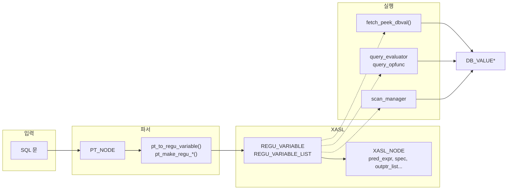
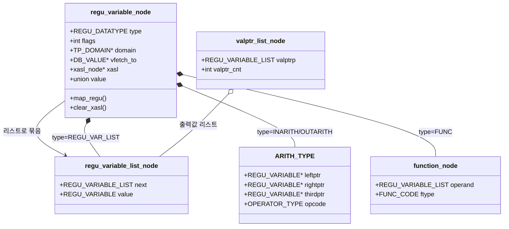
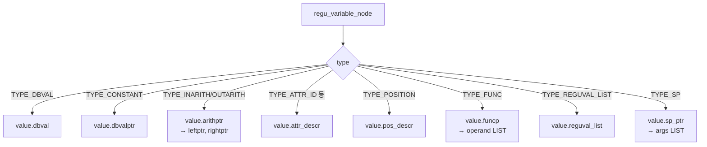
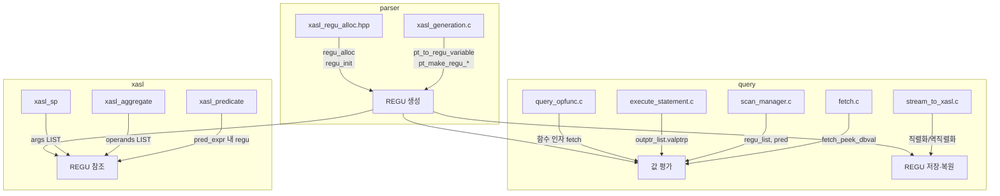
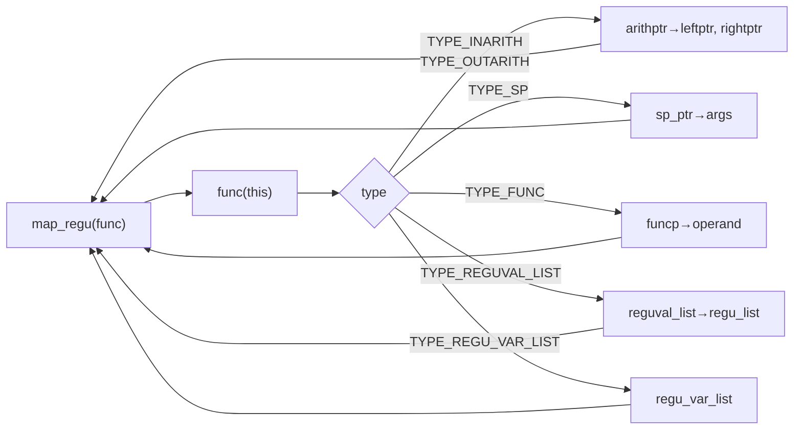

# Regular Variable(regu_var) 코드 분석서

## 목차

- [1. 개요](#1-개요) — 역할, 설계 배경
- [2. 파일·모듈 구조](#2-파일모듈-구조)
- [2.5 다이어그램](#25-다이어그램)
- [3. 핵심 데이터 구조](#3-핵심-데이터-구조)
- [4. REGU_DATATYPE과 value union](#4-regu_datatype과-value-union)
- [5. Regular Variable 플래그](#5-regular-variable-플래그)
- [6. 생성·할당](#6-생성할당)
- [7. 사용처 요약](#7-사용처-요약)
- [8. 평가·페치](#8-평가페치-실행-시-값-얻기)
- [9. 생명주기·메모리](#9-생명주기메모리)
- [10. 참조 모듈 목록](#10-참조-모듈-목록)
- [11. 정리](#11-정리)
- [12. DBLink/원격 조인에서 REGU 활용](#12-dblink원격-조인에서-regu-활용)

---

## 1. 개요

### 한눈에 보기

| 항목 | 내용 |
|------|------|
| **한 문장 정의** | REGU(Regular variable)는 XASL 실행 계획 안에서 "값 또는 식"을 나타내는 **공통 표현**이다. |
| **흐름** | SQL → PT_NODE(파스 트리) → REGU 생성 → XASL에 저장 → 실행 시 `fetch_peek_dbval()`로 DB_VALUE 평가 |
| **핵심 파일** | `regu_var.hpp` / `regu_var.cpp`, `xasl_generation.c`, `fetch.c` |
| **핵심 함수** | `pt_to_regu_variable()` (생성), `fetch_peek_dbval()` (실행 시 값 계산), `map_regu()` / `clear_xasl()` (순회·해제) |

### 용어 정리

| 용어 | 설명 |
|------|------|
| **REGU / Regular variable** | XASL 안의 "값/식"을 나타내는 공통 구조. `regu_variable_node`, `REGU_VARIABLE`로 사용. |
| **XASL** | eXtended Access Specification Language. CUBRID 쿼리 실행 계획 표현. |
| **Regulator** | XASL을 만드는 쪽(파서·계획 생성). PT_NODE를 REGU로 바꿔 XASL에 넣는다. |
| **XASL interpreter** | XASL을 실행하는 쪽(query executor 등). REGU를 보고 `fetch_peek_dbval` 등으로 값을 구한다. |
| **PT_NODE** | 파서가 만드는 파스 트리 노드. SQL 구문이 트리로 변환된 형태. |
| **VAL_DESCR** | 실행 시 값 목록/설명자. REGU 평가 시 tuple, val_list 등과 함께 전달된다. |
| **outptr_list** | XASL 노드의 출력 포인터 리스트. 각 항목이 REGU_VARIABLE_LIST로 결과 컬럼을 가리킨다. |

---

| 항목 | 설명 |
|------|------|
| **역할** | 쿼리 실행 계획(XASL)에서 "값/표현"을 나타내는 공통 추상화. 파서에서 생성되어 최적화·실행·직렬화 전 단계에서 사용됨. |
| **핵심 파일** | `src/query/regu_var.hpp`, `src/query/regu_var.cpp` |
| **주석** | "Regular variable - functionality encoded into XASL" |
| **예제 SQL** | [REGU 종류별 예제 쿼리](regu_var_example_queries.md) |

### 1.1 Regular variable의 역할

**한 줄 요약:** XASL(실행 계획) 안에서 "값 또는 식"을 나타내는 **공통 표현**이다. 파서에서 만든 뒤, 최적화·직렬화·실행까지 같은 구조로 쓴다.

| 역할 | 설명 |
|------|------|
| **값/식의 통일된 표현** | 상수, 컬럼 참조, 산술식, 함수, 서브쿼리, 호스트 변수 등을 `REGU_DATATYPE` + `value` union 하나로 표현한다. |
| **Regulator와 Interpreter 공유** | XASL을 만드는 쪽(regulator)과 실행하는 쪽(XASL interpreter)이 **동일한 REGU 구조**를 사용한다. 한 번 만들면 직렬화·복원·실행까지 그대로 쓴다. |
| **실행 시 "현재 값"으로 평가** | 실행 단계에서는 `fetch_peek_dbval(thread_p, regu, ...)`로 REGU를 **실제 DB_VALUE\*** 로 계산한다. 조건식, 조인 키, SELECT/출력 리스트 등이 이렇게 평가된다. |
| **트리 구조** | 산술식·함수·서브쿼리·SP는 자식 REGU를 갖는 트리가 되며, `map_regu()`로 순회, `clear_xasl()`로 해제한다. |

코드상 위치: **만들 때** 파서의 `pt_to_regu_variable()`, `pt_make_regu_*()` → **담는 곳** `pred_expr`, `outptr_list`, `access_spec` 등 → **쓸 때** `fetch_peek_dbval()`로 "이 REGU의 현재 값"을 구해 조건 평가·함수 인자·결과 출력에 사용.

### 1.2 설계 배경: Regulator와 Interpreter의 공통 표현

REGU는 **파서(parse tree)와 실행기(interpreter) 사이**에 위치하는 표현이다.

- **앞단:** `PT_NODE` (파스 트리)
- **중간:** `REGU_VARIABLE` — XASL 계획에 넣을 "값/식"의 공통 형태
- **뒷단:** 실행기에서 `fetch_peek_dbval` 등으로 `DB_VALUE`로 평가

코드 주석(`regu_var.hpp` 46행, 185행, `subquery_cache.h` 79행)에는 *types/fields used by both XASL interpreter and regulator*라고 되어 있다. 즉, **한 가지 구조를 계획을 만드는 쪽(regulator)과 계획을 실행하는 쪽(XASL interpreter)이 공통으로 쓰기 위해** 둔 것이다.

- **Regulator:** 쿼리 계획을 만드는 부분(XASL 생성, `parser_support.c`의 "Query process regulator" 관련). PT_NODE를 REGU로 바꿔 XASL에 넣는다.
- **XASL interpreter:** 만들어진 XASL을 실행하는 부분(`query_executor.h`의 "XASL interpreter"). REGU를 그대로 보고 `fetch_peek_dbval` 등으로 값을 구한다.

계획용 표현과 실행용 표현을 따로 두면 변환·중복이 생기므로, **하나의 표현(REGU)을 두어 두 단계가 공유**하도록 한 설계로 보인다. 또한 `regu_var.hpp` 20행의 *functionality encoded into XASL*은, "어떤 식인지"를 XASL 안에 한 가지 방식(REGU 트리)으로 넣어 직렬화·실행까지 통일하려는 목적을 반영한다.

---

## 2. 파일·모듈 구조

```
src/query/
  regu_var.hpp     ← 타입/플래그/클래스 정의
  regu_var.cpp     ← map_regu, clear_xasl 구현

src/parser/
  xasl_generation.c   ← PT_NODE → REGU_VARIABLE 변환 (pt_to_regu_variable, pt_make_regu_*)
  xasl_regu_alloc.hpp ← regu 할당/초기화 (regu_alloc, regu_init)

src/query/          ← 실행·스캔·페치
  fetch.c           ← fetch_peek_dbval (REGU 값 평가)
  execute_statement.c
  scan_manager.c
  query_evaluator.c
  query_opfunc.c
  stream_to_xasl.c / xasl_to_stream.c

src/xasl/           ← pred_expr, aggregate, sp 등에서 REGU_VARIABLE_LIST 참조
src/optimizer/      ← plan_generation, query_planner
src/sp/             ← pl_executor (인자 fetch 시 regu_variable_list_node 사용)
```

---

## 2.5 다이어그램

### 전체 흐름: REGU_VARIABLE이 쓰이는 단계



### 데이터 구조 관계



### REGU_DATATYPE별 value 사용



### 모듈별 사용 방식



### map_regu 순회 대상 (regu_var.cpp)



---

## 3. 핵심 데이터 구조

### 3.1 `regu_variable_node` (REGU_VARIABLE)

**위치:** `regu_var.hpp` 173~221행

| 멤버 | 의미 |
|------|------|
| `type` | `REGU_DATATYPE` — 어떤 종류의 값/표현인지 |
| `flags` | 비트 플래그 (hidden, constant, correlated 등) |
| `domain` / `original_domain` | 결과 타입/도메인 정보 |
| `vfetch_to` | `qp_fetchvlist` 등에서 값을 채울 DB_VALUE* |
| `xasl` | 서브쿼리일 때 연결된 XASL 노드 |
| `value` | `union regu_data_value` — type에 따라 사용하는 필드가 다름 |

### 3.2 `regu_variable_list_node` (REGU_VARIABLE_LIST)

**위치:** `regu_var.hpp` 224~228행

```c
struct regu_variable_list_node {
  REGU_VARIABLE_LIST next;   // 다음 노드
  REGU_VARIABLE value;       // 실제 regular variable (값이 아닌 노드 자체)
};
```

연결 리스트로 여러 REGU_VARIABLE을 묶을 때 사용 (출력 컬럼, 조건 피연산자, 스캔 속성 등).

### 3.3 관련 구조체

- **ATTR_DESCR**: 속성 ID, 타입, 캐시 (attr_descr)
- **ARITH_TYPE**: 산술식 — leftptr, rightptr, thirdptr (REGU_VARIABLE*), opcode
- **function_node**: 함수 호출 — operand(REGU_VARIABLE_LIST), ftype
- **valptr_list_node (OUTPTR_LIST)**: `valptrp`(REGU_VARIABLE_LIST), `valptr_cnt` — 출력 값 리스트
- **regu_value_list / regu_value_item**: VALUES 절 등에서 REGU_VARIABLE* 리스트

---

## 4. REGU_DATATYPE과 value union

**위치:** `regu_var.hpp` 44~63행, 183~197행

| REGU_DATATYPE | value union 필드 | 용도 |
|---------------|------------------|------|
| TYPE_DBVAL | dbval | 단일 DB_VALUE |
| TYPE_CONSTANT | dbvalptr | 상수(포인터) |
| TYPE_ORDERBY_NUM | dbvalptr | orderby_num() 갱신용 |
| TYPE_INARITH / TYPE_OUTARITH | arithptr | 산술/연산 트리 |
| TYPE_ATTR_ID / TYPE_CLASS_ATTR_ID / TYPE_SHARED_ATTR_ID | attr_descr | 테이블/클래스 속성 |
| TYPE_POSITION | pos_descr | list file 컬럼 위치 |
| TYPE_LIST_ID | srlist_id | 서브쿼리 정렬 리스트 ID |
| TYPE_POS_VALUE | val_pos | 호스트 변수 위치 |
| TYPE_OID / TYPE_CLASSOID | (없음) | 현재 OID/클래스 OID |
| TYPE_FUNC | funcp | 함수 호출 |
| TYPE_REGUVAL_LIST | reguval_list | VALUES 절 |
| TYPE_REGU_VAR_LIST | regu_var_list | CUME_DIST, PERCENT_RANK 등 |
| TYPE_SP | sp_ptr | 저장 프로시저 |

---

## 5. Regular Variable 플래그

**위치:** `regu_var.hpp` 158~171행

| 플래그 | 비트 | 설명 |
|--------|------|------|
| REGU_VARIABLE_HIDDEN_COLUMN | 0x01 | list file에 포함하지 않음 |
| REGU_VARIABLE_FIELD_COMPARE | 0x02 | FIELD 함수 하단 표시 |
| REGU_VARIABLE_FIELD_NESTED | 0x04 | FIELD 트리 내 자식 |
| REGU_VARIABLE_APPLY_COLLATION | 0x08 | COLLATE 적용 |
| REGU_VARIABLE_ANALYTIC_WINDOW | 0x10 | 분석 함수 윈도우 |
| REGU_VARIABLE_INFER_COLLATION | 0x20 | 기본 인자 collation 추론 |
| REGU_VARIABLE_FETCH_ALL_CONST | 0x40 | 모두 상수 |
| REGU_VARIABLE_FETCH_NOT_CONST | 0x80 | 상수 아님 |
| REGU_VARIABLE_CLEAR_AT_CLONE_DECACHE | 0x100 | clone decache 시 clear |
| REGU_VARIABLE_UPD_INS_LIST | 0x200 | UPDATE/INSERT 리스트용 |
| REGU_VARIABLE_STRICT_TYPE_CAST | 0x400 | UPDATE/INSERT 타입 캐스트 |
| REGU_VARIABLE_CORRELATED | 0x800 | 상관 서브쿼리 캐시용 |

헬퍼: `REGU_VARIABLE_IS_FLAGED`, `REGU_VARIABLE_SET_FLAG`, `REGU_VARIABLE_CLEAR_FLAG`, `REGU_VARIABLE_GET_TYPE` (inline, 256~282행).

---

## 6. 생성·할당

### 6.1 파서: PT_NODE → REGU_VARIABLE

**파일:** `src/parser/xasl_generation.c`

- **pt_to_regu_variable()**: 표현식(PT_NODE)을 REGU_VARIABLE 하나로 변환. 조건/SELECT 리스트 등에서 공통 사용.
- **pt_to_regu_variable_list()**: PT 노드/리스트를 REGU_VARIABLE_LIST로 변환 (예: 조인 속성 리스트).
- **pt_make_regu_*** 계열: 타입별 생성
  - pt_make_regu_hostvar, pt_make_regu_constant, pt_make_regu_pred
  - pt_make_regu_subquery, pt_make_regu_numbering, pt_make_regu_level/isleaf/iscycle
  - pt_make_function, pt_make_position_regu_variable 등
- 조건식: `pt_make_pred_term_comp`, `pt_make_pred_term_like`, `pt_make_pred_term_some_all` 등이 좌/우 피연산자를 REGU_VARIABLE로 받음.

### 6.2 할당·초기화

**파일:** `src/parser/xasl_regu_alloc.hpp`

- **regu_init(regu_variable_node &)**: 노드 초기화 (parser 단, XASL 생성 시).
- **regu_alloc(T *&ptr)**: `pt_alloc_packing_buf`로 한 개 할당 후 regu_init.
- **regu_array_alloc(T **ptr, size_t size)**: 배열 할당 후 각 원소 regu_init.

REGU는 파서의 packing buffer에서 할당되며, XASL과 함께 한 번에 직렬화/역직렬화되는 구조로 보면 됨.

---

## 7. 사용처 요약

| 단계 | 파일/기능 | 역할 |
|------|-----------|------|
| 파서 | xasl_generation.c | pt_to_regu_variable, pt_make_regu_*, predicate/출력 리스트 구성 |
| 스캔 | scan_manager.c | scan_init_scan_pred, indx_cov.regu_val_list, heap/index/list/set scan 초기화 시 regu_list 전달 |
| 실행 | execute_statement.c | outptr_list->valptrp 순회, REGU_VARIABLE_UPD_INS_LIST 설정 |
| 평가 | fetch.c | fetch_peek_dbval — TYPE별로 값 계산 후 peek_dbval 반환 |
| 평가 | query_opfunc.c | fetch_peek_dbval로 함수/연산 인자 값 조회 |
| 파티션 | partition.c | partition_get_value_from_regu_var — 프루닝용 상수/식 평가 |
| 직렬화 | stream_to_xasl.c / xasl_to_stream.c | REGU_VARIABLE_LIST 배열 할당·복사·스트림 입출력 |
| 최적화 | memoize.cpp | 조건식 내 상수 regu 수집 등 |

---

## 8. 평가·페치 (실행 시 값 얻기)

### 8.1 fetch_peek_dbval

**파일:** `src/query/fetch.c`

- 인자: `REGU_VARIABLE*`, VAL_DESCR, tuple 등.
- 동작: `regu->type`에 따라 처리
  - TYPE_DBVAL → `&regu->value.dbval`
  - TYPE_CONSTANT → dbvalptr 사용 (상수)
  - TYPE_CONSTANT + xasl (서브쿼리) → EXECUTE_REGU_VARIABLE_XASL 후 dbvalptr
  - TYPE_INARITH/TYPE_OUTARITH → 산술 평가
  - TYPE_ATTR_ID 등 → tuple/캐시에서 속성값
  - TYPE_FUNC → 함수 실행
  - 기타 타입도 동일 파일 내에서 분기 처리.

스캔 조건, 조인 키, 함수 인자 등 실행 중 "이 regu의 현재 값"이 필요할 때 전반적으로 사용됨 (`scan_manager.c`, `query_opfunc.c`, `px_heap_scan` 등).

### 8.2 partition_get_value_from_regu_var

**파일:** `src/query/partition.c` (1619~1697행 근처)

- 파티션 프루닝용으로 REGU에서 "상수처럼 구할 수 있는 값"을 추출.
- TYPE_DBVAL, TYPE_POS_VALUE, TYPE_FUNC(일부), TYPE_INARITH 등만 지원하고, 나머지는 `*is_value = false`로 두어 평가하지 않음.

---

## 9. 생명주기·메모리

### 9.1 map_regu / map_regu_and_xasl

**파일:** `regu_var.cpp` 34~119행, 122~140행

- **map_regu(func)**: regu 트리를 재귀 순회하며 `func(regu, stop)` 호출.
  TYPE_INARITH/OUTARITH, TYPE_SP, TYPE_FUNC, TYPE_REGUVAL_LIST, TYPE_REGU_VAR_LIST의 자식만 순회 (주석: "implementation is not mature").
- **map_regu_and_xasl(regu_func, xasl_func)**: regu 순회 중 `regu->xasl`이 있으면 xasl_func 적용 후 regu_func 적용.

용도: 트리 전체에 대한 작업 (복사, clear, 통계 수집 등).

### 9.2 clear_xasl / clear_xasl_local

**파일:** `regu_var.cpp` 143~218행

- **clear_xasl_local()**: 이 노드만 정리
  - TYPE_INARITH/OUTARITH: rand_seed 해제, pred->clear_xasl
  - TYPE_SP: pr_clear_value, sig 삭제
  - TYPE_FUNC: value clear, tmp_obj(예: compiled_regex) 삭제
  - TYPE_DBVAL: pr_clear_value(&value.dbval)
  - vfetch_to: pr_clear_value
- **clear_xasl()**: map_regu로 트리 전체에 clear_xasl_local 적용.

`function_tmp_obj` 주석대로, 정리는 `regu_variable_node::clear_xasl_local()` 및 `qexec_clear_regu_var()`와 맞춰서 사용해야 함.

---

## 10. 참조 모듈 목록 (파일 기준)

- **parser:** xasl_generation.c, xasl_regu_alloc.hpp/cpp, type_checking.c
- **query:** execute_statement.c, fetch.c, scan_manager.c, set_scan.c, query_executor.c, query_evaluator.c, query_opfunc.c, query_aggregate.cpp, stream_to_xasl.c, xasl_to_stream.c, partition.c, memoize.cpp, list_file.c, subquery_cache.c, query_hash_scan.c, query_dump.c, dblink_scan.c
- **optimizer:** plan_generation.c, query_planner.c
- **xasl:** xasl_predicate.cpp/hpp, xasl_spawner.cpp, xasl_aggregate.hpp, xasl_analytic.hpp, xasl_sp.hpp, xasl_stream.hpp, access_spec.hpp, access_json_table.hpp
- **storage:** btree.c
- **sp:** pl_executor.cpp/hpp, pl_compile_handler.hpp
- **parallel:** px_heap_scan, px_hash_join, px_query_execute 관련 cpp/hpp

---

## 11. 정리

- **Regular variable**의 **역할**은 XASL 상의 "값/표현"을 나타내는 공통 표현이며, regulator(계획 생성)와 XASL interpreter(실행)가 같은 구조를 공유한다. 단일 타입(`regu_variable_node`)과 `REGU_DATATYPE`/`value` union으로 상수·속성·산술·함수·서브쿼리·SP 등을 하나의 인터페이스로 다룬다.
- **설계 배경:** 파스 트리(PT_NODE)와 실행(DB_VALUE) 사이에서 "한 번 정의해 두 단계가 공유"하도록 하기 위함이다. 계획용·실행용 표현을 분리하면 변환과 중복이 생기므로, REGU 하나로 통일한 설계이다.
- **생성**은 파서의 `pt_to_regu_variable`/`pt_make_regu_*`와 `xasl_regu_alloc`의 `regu_alloc`/`regu_init`에서 이루어지고, **실행 시 값**은 `fetch_peek_dbval`로 평가되며, **정리**는 `clear_xasl`/`clear_xasl_local`과 실행부의 `qexec_clear_regu_var` 등과 연동된다.
- dblink/원격 조인 등에서 "로컬/원격 피연산자"를 구분하거나, 실행 계획을 분석할 때는 이 REGU 트리와 `type`/`xasl`/`flags`를 따라가면 "어디서 값이 오는지"를 추적할 수 있다. 자세한 내용은 [12. DBLink/원격 조인에서 REGU 활용](#12-dblink원격-조인에서-regu-활용) 참조.

---

## 12. DBLink/원격 조인에서 REGU 활용

DBLink join push-down(CBRD-26553) 구현 시, 조인 조건의 각 피연산자가 **로컬에서 오는 값**인지 **원격에서 오는 값**인지 판단해야 한다. 이 판단은 `type` / `xasl` / `flags` 세 필드를 조합해 수행한다.

### 12.1 배경 쿼리 예시

```sql
SELECT * FROM local_t, DBLINK(...) AS remote_t
WHERE remote_t.col = local_t.id;
```

이 조건을 REGU 트리로 표현하면 두 `TYPE_ATTR_ID` 노드가 나타나는데, 겉으로는 동일해 보여도 출처가 다르다.

### 12.2 `type` 으로 1차 구분

| type | 의미 |
|------|------|
| `TYPE_ATTR_ID` | 현재 scan 중인 테이블의 컬럼 — 로컬 또는 원격 모두 가능 |
| `TYPE_DBVAL` | 리터럴 상수 — scan 전에 즉시 사용 가능 |
| `TYPE_CONSTANT` | 호스트 변수/서브쿼리 결과 캐시 |
| `TYPE_INARITH` 등 | 복합식 — 자식 노드를 재귀 추적해야 출처 확인 가능 |

`TYPE_ATTR_ID`라도 **어느 access_spec에 속하는 `attr_id`인지**를 봐야 로컬/원격이 구분된다.

### 12.3 `xasl` 필드로 2차 구분

```c
struct regu_variable_node {
    xasl_node *xasl;   // NULL이면 현재 plan 내 값, 비NULL이면 서브쿼리/원격 XASL
    ...
};
```

- `xasl == NULL` → 현재 실행 중인 plan 내의 값 (로컬 컬럼, 상수)
- `xasl != NULL` → 해당 XASL을 먼저 실행해야 얻을 수 있는 값 (서브쿼리, 원격 dblink XASL)

DBLink 원격 쿼리의 XASL이 `regu->xasl`에 연결된 경우 → 원격에서 오는 값.

### 12.4 `flags` 로 3차 구분

| 플래그 | 의미 |
|--------|------|
| `REGU_VARIABLE_CORRELATED` (0x800) | outer 쿼리 row에 의존 → outer row가 바뀔 때마다 재평가 필요 |
| `REGU_VARIABLE_FETCH_ALL_CONST` (0x40) | 전체가 상수 → scan 전 한 번만 계산 가능 |
| `REGU_VARIABLE_FETCH_NOT_CONST` (0x80) | 상수 아님 → row마다 재계산 필요 |

`REGU_VARIABLE_CORRELATED`가 설정된 REGU는 **outer 루프(로컬 테이블)에서 공급**되는 값임을 의미 → push-down 시 bind parameter 후보.

### 12.5 세 필드 조합 판단 예시

```
조인 조건:  remote_t.col = local_t.id

lhs: TYPE_ATTR_ID, xasl = dblink_xasl, flags = 0
     → 원격 테이블 컬럼, dblink scan 결과에서 옴

rhs: TYPE_ATTR_ID, xasl = NULL, flags = REGU_VARIABLE_CORRELATED
     → 로컬 테이블 컬럼, outer row에서 공급
     → push-down bind parameter 후보
```

**결론:** `xasl == NULL` + `REGU_VARIABLE_CORRELATED` 조합 = 로컬에서 오는 값 = 원격 쿼리의 `WHERE` bind parameter로 내려보낼 수 있다.
