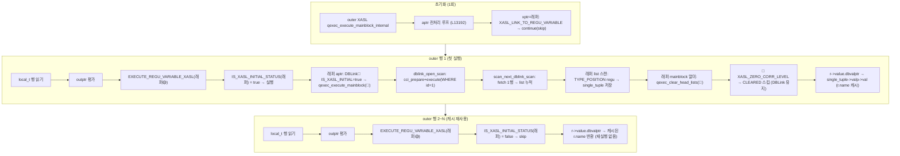

# DBLink 비상관(Uncorrelated) 스칼라 서브쿼리 소스 분석

| 항목 | 내용 |
|------|------|
| 대상 | `SELECT a.id, (SELECT r.name FROM remote_t@cubrid_conn r WHERE r.id = 1) FROM local_t a` 형태의 **uncorrelated 스칼라 서브쿼리** |
| 목적 | 서브쿼리 내 dblink에서 **outer 참조 없음** 시 어떻게 1회만 실행되는지 코드 경로 정리 |

---

## 목차

1. [개요](#1-개요)
2. [전체 처리 흐름 (SQL → 결과)](#2-전체-처리-흐름-sql--결과)
3. [XASL 구조 (실제 덤프 기준)](#3-xasl-구조-실제-덤프-기준)
4. [파서·뷰 변환](#4-파서뷰-변환)
5. [원격 SQL 문자열 생성 상세](#5-원격-sql-문자열-생성-상세)
6. [XASL 생성](#6-xasl-생성)
7. [실행 경로 상세](#7-실행-경로-상세)
8. [Correlated 케이스와 비교](#8-correlated-케이스와-비교)
9. [주요 코드 위치](#9-주요-코드-위치)

---

## 1. 개요

**패턴**: 서브쿼리의 WHERE 조건이 상수값(`r.id = 1`)이어서 외부 행을 전혀 참조하지 않는 형태.

**현재 동작 (AS-IS)**:
- `WHERE r.id = 1` 은 상수 조건이므로 `pt_check_pushable_term()` 이 push-down 허용.
  → DBLink의 `conn_sql` 에 `WHERE id=1` 이 포함된 원격 SQL이 생성됨.
- 서브쿼리 `correlation_level = 0` → `XASL_ZERO_CORR_LEVEL` 플래그 부여.
- 스칼라 래퍼 XASL가 outer의 **aptr_list** 에 연결 (`dptr_list` 아님).
- `EXECUTE_REGU_VARIABLE_XASL()` 에서 최초 1회만 실행되고, 이후 outer 행에서는 `IS_XASL_INITIAL_STATUS()` = false → **캐시된 single_tuple 값 재사용**.
- `qexec_clear_head_lists()` 에서 `XASL_ZERO_CORR_LEVEL` 플래그 → **CLEARED 스킵** → DBLink/래퍼 모두 재실행되지 않음.

**결과**: outer 행 수(N)에 무관하게 원격 DBLink는 **1회만** 실행됨.

---

## 2. 전체 처리 흐름 (SQL → 결과)

```
SQL 문자열
  │
  ▼ [1] 파싱 (Lexing + Parsing)
  PT_NODE 트리 (parse tree)
  │
  ▼ [2] DBLink 구문 변환 (pt_rewrite_for_dblink)
  PT_NODE 트리 (@conn 표기 → DBLINK() 함수 형태)
  │
  ▼ [3] 의미 분석 (pt_compile → pt_semantic_check)
  이름 해석·타입 체크 완료 PT_NODE 트리
  │
  ▼ [4] 뷰·DBLink 재작성 (mq_translate → mq_rewrite_dblink_as_subquery)
  DBLINK() derived table → PT_IS_SUBQUERY 래퍼
  correlation_level = 0 배정
  push-down 성공: WHERE r.id = 1 → conn_sql 에 포함
  │
  ▼ [5] 쿼리 최적화 (qo_optimize_query)
  조인 순서·인덱스 선택 → QO_PLAN
  │
  ▼ [6] XASL 생성 (parser_generate_xasl → pt_plan_query)
  PT_NODE + QO_PLAN → XASL_NODE 트리 (메모리)
  correlation_level == 0 → XASL_ZERO_CORR_LEVEL 플래그
  스칼라 래퍼 → outer의 aptr_list 연결
  │
  ▼ [7] XASL 직렬화 (xts_map_xasl_to_stream)
  XASL_NODE → 바이트 스트림
  │
  ▼ [8] 서버 전송 및 등록 (prepare_and_execute_query)
  클라이언트: qmgr_prepare_and_execute_query → network
  서버: xqmgr_execute_query → XASL 캐시 등록 / 실행
  │
  ▼ [9] XASL 실행 (query_executor.c)
  outer 스캔 시작 전: aptr 루프에서 래퍼 스킵 (XASL_LINK_TO_REGU_VARIABLE)
  outer 행 1: EXECUTE_REGU_VARIABLE_XASL → IS_XASL_INITIAL → 1회 실행
              DBLink cci_execute(WHERE id=1) → 1행 fetch → single_tuple 저장
  outer 행 2~N: IS_XASL_INITIAL = false → 캐시된 single_tuple 값 반환
  │
  ▼ 결과 리스트(QFILE_LIST_ID) → 클라이언트 fetch
```

---

### 2.1 [1] 파싱

| 항목 | 내용 |
|------|------|
| Lexer | `src/parser/csql_lexer.l` (flex) |
| Parser | `src/parser/csql_grammar.y` (bison) |
| 출력 | `PT_NODE` 트리 (`PT_SELECT`, `PT_SPEC`, `PT_NAME`, `PT_EXPR`, …) |
| DBLink 관련 | `remote_t@conn` 은 `PT_DERIVED_DBLINK_TABLE` spec으로 파싱됨 |

---

### 2.2 [2] DBLink 구문 변환 (pt_rewrite_for_dblink)

- **파일**: `src/parser/parser_support.c`
- **역할**: `@conn` 표기를 `DBLINK(conn, 'sql')` 함수 형태로 변환. `PT_DERIVED_DBLINK_TABLE` spec + `conn_sql` 문자열 생성.
- **호출 위치**: `db_compile_statement_local()` — 의미 분석(pt_compile) **전**에 호출.

---

### 2.3 [3] 의미 분석

- **파일**: `src/parser/compile.c` (`pt_compile`), `src/parser/semantic_check.c`
- **역할**: 이름 해석, 타입 체크, 권한 확인.
- DBLink 반환 컬럼은 `AS t(col TYPE)` 로 명시된 타입으로만 처리됨.

---

### 2.4 [4] 뷰·DBLink 재작성 (mq_translate)

- **파일**: `src/parser/view_transform.c` (`mq_translate_helper`)
- **호출 위치**: `do_execute_statement()` → `do_select()` 경로

`mq_translate_helper()` 내 처리 순서:
```
parser_walk_tree(mq_translate_local)          ← 뷰/가상 클래스 로컬 번역
  ↓
parser_walk_tree(mq_rewrite_dblink_as_subquery) ← DBLink 핵심
  ↓
mq_rewrite()                                  ← push-down & constant fold
  ↓
pt_semantic_type()                            ← 상수 폴딩 재적용
```

#### mq_rewrite_dblink_as_subquery (view_transform.c)

- `PT_DERIVED_DBLINK_TABLE` spec을 `PT_IS_SUBQUERY` 래퍼로 변환.
- `mq_rewrite_dblink_as_derived()` 로 `SELECT * FROM DBLINK(...)` 형태의 derived SELECT 생성.

#### push-down 시도 (pt_check_pushable_term, view_transform.c L4022)

```c
static bool
pt_check_pushable_term (PARSER_CONTEXT * parser, PT_NODE * term, FIND_ID_INFO * infop)
{
  bool is_correlated_with_agg = false;
  bool is_correlated_with_dblink = false;
  ...
  parser_walk_leaves (parser, term, pt_find_only_name_id, infop, NULL, NULL);

  if (infop->out.correlated_found) {
    ...
    if (infop->in.spec) {
      derived = infop->in.spec->info.spec.derived_table;
      if (derived->node_type == PT_DBLINK_TABLE) {
        is_correlated_with_dblink = true;  // outer 참조 있으면 차단
      }
    }
  }
  return PT_PUSHABLE_TERM(infop) && !is_correlated_with_agg && !is_correlated_with_dblink;
}
```

- `WHERE r.id = 1`: outer 참조 없음 → `infop->out.correlated_found = false`
- → `is_correlated_with_dblink = false`
- → **push-down 허용**: `conn_sql` 에 `WHERE id=1` 포함됨

**결과 conn_sql** (query_alias 덤프 확인):
```
SELECT * FROM (SELECT name, id FROM remote_t r) cublink WHERE id=1
```

#### correlation_level 할당

- outer 참조 없음 → `correlation_level = 0`
- 이후 XASL 생성에서 `XASL_ZERO_CORR_LEVEL` 플래그 부여, `aptr_list` 연결.

---

### 2.5 [5] 쿼리 최적화

- **파일**: `src/optimizer/` 디렉터리
- DBLink 스캔은 `ACCESS_METHOD_SEQUENTIAL` 고정.

---

### 2.6 [6] XASL 생성

- **파일**: `src/parser/xasl_generation.c`
- **진입점**: `parser_generate_xasl()` → `parser_generate_xasl_proc()` → `pt_plan_query()`

`pt_to_buildlist_proc()` → `pt_to_spec_list()` 분기:

| `derived_table_type` 값 | 처리 |
|------------------------|------|
| `PT_IS_SUBQUERY` | `pt_to_subquery_table_spec_list()` ← **DBLink spec: 이 경로** |
| `PT_DERIVED_DBLINK_TABLE` | `pt_to_dblink_table_spec_list()` |

- `mq_rewrite_dblink_as_subquery` 가 이미 `PT_IS_SUBQUERY` 로 변환 완료 → **항상 subquery 경로** 진입.
- `correlation_level == 0` → `pt_set_aptr()` → outer XASL의 **aptr_list** 에 연결.
- `XASL_ZERO_CORR_LEVEL` 플래그가 스칼라 래퍼와 DBLink XASL 모두에 설정됨.

---

### 2.7 [7]~[8] XASL 직렬화·서버 전송

- 직렬화: `src/xasl/xasl_to_stream.c` (`xts_map_xasl_to_stream`)
- 역직렬화: `src/xasl/stream_to_xasl.c` (`stx_map_stream_to_xasl`)
- 등록: `xqmgr_execute_query()` → `xqmgr_prepare_query()` (XASL 캐시)

---

### 2.8 [9] XASL 실행 요약

| 단계 | 함수 | 시점 |
|------|------|------|
| aptr_list 전처리 루프 | `qexec_execute_mainblock_internal()` L13192 | outer 실행 시작 전 (1회) |
| 래퍼 스킵 (`XASL_LINK_TO_REGU_VARIABLE`) | aptr 루프 내 `continue` | 전처리에서 skip됨 |
| 래퍼 1회 실행 | `EXECUTE_REGU_VARIABLE_XASL()` | 첫 outer 행 outptr 평가 시 |
| DBLink open+execute | `dblink_open_scan()` | 래퍼 aptr 실행 시 (1회) |
| 원격 1행 fetch → single_tuple | `scan_next_dblink_scan()` | DBLink 스캔 루프 |
| ZERO_CORR_LEVEL로 clear 스킵 | `qexec_clear_head_lists()` L3372 | 래퍼 mainblock 말미 |
| 2~N outer 행: 캐시 반환 | `EXECUTE_REGU_VARIABLE_XASL()` | IS_XASL_INITIAL=false → skip |

---

## 3. XASL 구조 (실제 덤프 기준)

실행 계획은 **3단 buildlist** 로 구성된다.
덤프 파일: `CBRD-26601_dblink_correlated/docs/zz_xasl_dump_asis_uncorrelated.txt`

### 3.1 연결 정보 조회 XASL (0x2db749a0)

```
[buildlist_proc:0x2db749a0]  flag: XASL_ZERO_CORR_LEVEL|XASL_TOP_MOST_XASL
  ├─ access spec: class, index (index id:<Btree:(4288;0;4289)>), key=R_KEY (EQ)
  │      hfid: OID[193,29,0]  ← _db_server 테이블
  │      key: [TYPE_POS_VALUE:CHAR]  (link_name 및 owner.name 바인딩)
  ├─ val_list: [OBJECT, OBJECT, VARCHAR]
  ├─ dbval_cnt: 2  (bind_var: owner.name=?:0, link_name=?:1)
  ├─ query_alias: select [_db_server], [_db_server].[owner]
  │              from [_db_server] where [_db_server].[owner].[name]=?:0
  │              and [_db_server].[link_name]=?:1
  └─ fptr_list → 0x2db74eb0

[objfetch_proc:0x2db74eb0]
  ├─ access spec: class, sequential  hfid: OID[193,3,0]
  ├─ if predicate: [TYPE_CONSTANT:VARCHAR] = [TYPE_POS_VALUE:CHAR]
  └─ fetch: addr:0x2db72070 (OBJECT)
```

- `cubrid_conn` 이름으로 `_db_server` 테이블을 인덱스 스캔.
- 연결 서버 OID를 `remote={1686184791,4016480443}` 형태로 메인 쿼리에 embed.
- 메인 쿼리 실행 전 연결 정보 조회 단계.

### 3.2 메인 쿼리 XASL

```
[buildlist_proc] outer (🔴0x2db97f20)  flag: XASL_ZERO_CORR_LEVEL|XASL_TOP_MOST_XASL
  ├─ access spec: class, sequential  hfid:OID[213,9,0]  ← local_t
  ├─ regu_list_rest: [TYPE_ATTR_ID]attr_id:1|INTEGER        (a.id만 읽음)
  ├─ val_list: (values 1 <addr:0x2db4c4f8|INTEGER>)
  ├─ aptr_list → 🟡0x2db97a10           ← ZERO_CORR_LEVEL → 1회 실행 후 캐시
  └─ outptr: [TYPE_CONSTANT:id(INTEGER)],
             [xasl:🟡0x2db97a10][TYPE_CONSTANT:name(VARCHAR)]

[buildlist_proc] 스칼라 래퍼 (🟡0x2db97a10)  flag: XASL_LINK_TO_REGU_VARIABLE|XASL_ZERO_CORR_LEVEL
  ├─ single_tuple: ← r.name 1값 저장
  ├─ outptr: [TYPE_CONSTANT:name(VARCHAR)]
  ├─ access spec: list, sequential ← 0x2db4ceb0 DBLink 결과 리스트 스캔
  ├─ regu_list_rest: [TYPE_POSITION:0(VARCHAR)], [TYPE_POSITION:1(INTEGER)]
  ├─ val_list: (values 2 <VARCHAR:name, INTEGER:id>)
  └─ aptr_list → 🔵0x2db4ceb0

[buildlist_proc] DBLink (🔵0x2db4ceb0)  flag: XASL_ZERO_CORR_LEVEL
  ├─ access spec: dblink, sequential
  │      conn_sql: 'SELECT * FROM (SELECT name, id FROM remote_t r) cublink WHERE id=1'
  ├─ val_list: (values 2 <VARCHAR:name, INTEGER:id>)
  └─ access_pred: (없음)  ← WHERE id=1은 conn_sql에 push-down됨
```

### 3.3 XASL 덤프 핵심 관찰

| 항목 | 비상관 케이스 | 상관 케이스 (참고) |
|------|-------------|------------------|
| 스칼라 래퍼 위치 | outer의 **aptr_list** | outer의 **dptr_list** |
| 스칼라 래퍼 플래그 | `LINK_TO_REGU_VARIABLE` \| `ZERO_CORR_LEVEL` | `LINK_TO_REGU_VARIABLE` (ZERO_CORR 없음) |
| DBLink 플래그 | `ZERO_CORR_LEVEL` | (없음) |
| DBLink access_pred | **없음** (상수 조건 push-down 됨) | `TYPE_CONSTANT = TYPE_CONSTANT` (outer ref) |
| DBLink 실행 횟수 | **1회** | outer 행마다 N회 |
| 원격 SQL WHERE | `WHERE id=1` (push-down) | WHERE 없음 (전체 fetch) |

`query_alias` 확인 (dump L131):
```text
select [a].[id], (select [r].[name] from (
  select [_dbl].[name], [_dbl].[id]
  from DBLINK([cubrid_conn], 'SELECT * FROM (SELECT name, id FROM remote_t r) cublink WHERE id=1')
  as [_dbl]([name] varchar(32), [id] integer)
) [r] ([name], [id])) from [cubrid.local_t] [a]
```

→ 원격에 `WHERE id=1` 이 포함 → DBLink는 필터된 1행만 반환.

---

## 4. 파서·뷰 변환

### 4.1 mq_rewrite_dblink_as_subquery

- **파일**: `src/parser/view_transform.c`
- **역할**: `PT_DERIVED_DBLINK_TABLE` spec → `PT_IS_SUBQUERY` 래퍼.
- 상관·비상관 구분 없이 모든 DBLink spec에 적용.

### 4.2 push-down (pt_check_pushable_term)

- **파일**: `src/parser/view_transform.c` L4022
- `WHERE r.id = 1`: outer 컬럼 참조 없음 → `correlated_found = false`
  → `is_correlated_with_dblink = false` → **push-down 허용**
- 결과: DBLink XASL의 `conn_sql` 에 `WHERE id=1` 포함 → 원격 서버에서 직접 필터링.
- `pt_copypush_terms()` → `mq_copypush_sargable_terms_helper()` 에서 `conn_sql` 재작성.

### 4.3 correlation_level 및 XASL 플래그

- **필드**: `PT_NODE.info.query.correlation_level`
  - 0: uncorrelated (이 케이스) → `XASL_ZERO_CORR_LEVEL` 플래그
  - 1: 직계 부모 참조 → dptr_list
  - N > 1: N단계 위 참조 → aptr_list (ZERO_CORR 없음)

- **규칙** (`xasl_generation.c`):
  - `correlation_level == 0` → `pt_set_aptr()` + `XASL_ZERO_CORR_LEVEL` 설정 → outer의 **aptr_list**
  - `correlation_level == 1` → `pt_set_dptr()` → outer의 **dptr_list**
  - `correlation_level > 1` → `pt_set_aptr()` → wrapper의 **aptr_list** (ZERO_CORR 없음)

---

## 5. 원격 SQL 문자열 생성 상세

원격으로 전달되는 SQL `SELECT * FROM (SELECT name, id FROM remote_t r) cublink WHERE id=1` 은
4단계를 거쳐 조립된다.

### 5.1 전체 조립 흐름

```
SQL 파싱 후
  │
  ▼ [A] pt_mk_spec_derived_dblink_table  (parser_support.c)
  remote_t@cubrid_conn r
    → PT_DBLINK_TABLE 노드 생성
       .qstr      = PT_NAME("remote_t") 노드   ← 아직 텍스트 SQL 아님
       .qstr->next= PT_NAME("r")               ← alias
       .conn      = PT_NAME("cubrid_conn")
  │
  ▼ [B] pt_gather_dblink_colums → pt_get_cols_for_dblink  (name_resolution.c)
  SELECT 목록·WHERE·ORDER BY 등 walk
    → sel_list = [name, id]   ← SELECT r.name + WHERE r.id 에서 수집
  │
  ▼ [C] pt_remake_dblink_select_list  (name_resolution.c)
  sel_list + entity_name + range_var 조합
    → "SELECT name, id FROM remote_t r"  문자열 생성
    → .qstr = PT_VALUE 문자열 노드 (기존 PT_NAME 노드 해제 후 교체)
  │
  ▼ [D] pt_copypush_terms (PT_DBLINK_TABLE 분기)  (view_transform.c)
  push-down 대상 조건 print + 외부 래퍼 조립
    → .rewritten = "SELECT * FROM (<qstr>) cublink WHERE id=1"
  │
  ▼ [E] pt_to_dblink_table_spec_list  (xasl_generation.c)
  rewritten → conn_sql
    → "/* DBLINK SELECT */ SELECT * FROM (SELECT name, id FROM remote_t r) cublink WHERE id=1"
```

---

### 5.2 [A] pt_mk_spec_derived_dblink_table — PT_DBLINK_TABLE 노드 생성

- **파일**: `src/parser/parser_support.c` L11118
- **호출 위치**: `pt_convert_dblink_select_query()` → `pt_convert_select()` (POST walk) → `pt_rewrite_for_dblink()`
- **역할**: `spec->info.spec.entity_name`(PT_NAME "remote_t") + `range_var`("r") + `remote_server_name`("cubrid_conn")을 `PT_DBLINK_TABLE` 노드로 변환.

```c
derived_spec->info.dblink_table.qstr = class_spec_info->entity_name;  // PT_NAME("remote_t")
derived_spec->info.dblink_table.qstr->next = class_spec_info->range_var; // PT_NAME("r")
derived_spec->info.dblink_table.conn = class_spec_info->remote_server_name; // "cubrid_conn"
derived_spec->info.dblink_table.remote_table_name = "remote_t";  // 텍스트 복사
```

이 시점에서 `qstr` 는 아직 SQL 문자열이 아닌 `PT_NAME` 노드이다.

---

### 5.3 [B] pt_gather_dblink_colums → pt_get_cols_for_dblink — 필요 컬럼 수집

- **파일**: `src/parser/name_resolution.c`
- **호출 위치**: `pt_check_dblink_query()` → `pt_convert_select()` (바로 직후)
- **역할**: 서브쿼리 SELECT 목록·WHERE·GROUP BY·ORDER BY 전체를 walk하여 DBLink 테이블에서 읽어야 할 컬럼 이름 목록(`sel_list`)을 수집.

```c
// pt_get_cols_for_dblink (name_resolution.c L11996)
parser_walk_tree(parser, query->q.select.list,  pt_get_column_name_pre, plkcol, ...); // r.name → name
parser_walk_tree(parser, query->q.select.where, pt_get_column_name_pre, plkcol, ...); // r.id  → id
```

`sel_list` = [`name`, `id`]

> **주의**: push-down 판단 전에 실행되므로, WHERE 조건이 나중에 push-down 되더라도 일단 SELECT 목록에 포함됨.
> 이로 인해 inner SELECT에 `id`가 포함되고, 외부 래퍼(`WHERE id=1`)에서 사용할 수 있게 된다.

---

### 5.4 [C] pt_remake_dblink_select_list — inner SELECT 문자열 생성

- **파일**: `src/parser/name_resolution.c` L5288
- **호출 위치**: `pt_resolve_dblinks_in_query()` (이름 해석·타입 체크 단계 중)
  - `pt_dblink_table_get_column_defs()` 로 원격 서버에 접속해 컬럼 타입 정보를 가져온 후 호출.
- **역할**: `sel_list`, `entity_name`, `range_var` 를 조합하여 SQL 문자열을 만들고 `qstr` 를 PT_VALUE 노드로 교체.

```c
// pt_remake_dblink_select_list (name_resolution.c L5321)
var_buf = pt_append_nulstring(parser, var_buf, "SELECT ");
var_buf = pt_append_varchar(parser, var_buf,
         pt_build_select_list_for_dblink(parser, dblink_table->sel_list)); // "name, id"
var_buf = pt_append_nulstring(parser, var_buf, " FROM ");
var_buf = pt_append_varchar(parser, var_buf,
         pt_print_bytes(parser, entity_name));  // "remote_t"
// range_var 있으면 alias 추가
var_buf = pt_append_bytes(parser, var_buf, " ", 1);
var_buf = pt_append_varchar(parser, var_buf,
         pt_print_bytes(parser, range_var));    // "r"

// → var_buf = "SELECT name, id FROM remote_t r"

val->type_enum = PT_TYPE_CHAR;
val->info.value.data_value.str = var_buf;
parser_free_node(parser, dblink_table->qstr);  // 기존 PT_NAME 해제
dblink_table->qstr = val;                       // PT_VALUE 노드로 교체
```

**결과**: `qstr->info.value.data_value.str->bytes` = `"SELECT name, id FROM remote_t r"`

---

### 5.5 [D] pt_copypush_terms (PT_DBLINK_TABLE 분기) — 래퍼 + WHERE 조립

- **파일**: `src/parser/view_transform.c` L4101
- **호출 위치**: `mq_copypush_sargable_terms_helper()` → (push_cnt > 0 이면) `pt_copypush_terms()`
- **역할**: push-down 가능 조건을 `pushed_pred` 로 print한 뒤, `qstr` 를 외부 래퍼로 감싸고 WHERE를 붙임.

```c
// pt_copypush_terms (view_transform.c L4143~4195)
// case PT_DBLINK_TABLE:

// pushed_pred 출력 (PT_CONVERT_RANGE | PT_SUPPRESS_RESOLVED 플래그로 print)
pushed_pred = pt_print_and_list(parser, query->info.dblink_table.pushed_pred);
// → "id=1"   (PT_SUPPRESS_RESOLVED 로 테이블 prefix 제거: r.id → id)

// outer 래퍼 조립
rewritten = pt_append_bytes(parser, rewritten, "SELECT * FROM (", 15);
query_str  = query->info.dblink_table.qstr->info.value.data_value.str;
rewritten  = pt_append_varchar(parser, rewritten, query_str);
// → "SELECT * FROM (SELECT name, id FROM remote_t r"
rewritten  = pt_append_bytes(parser, rewritten, ") cublink", 9);
// → "SELECT * FROM (SELECT name, id FROM remote_t r) cublink"

if (pushed_pred != NULL) {
    rewritten = pt_append_bytes(parser, rewritten, " WHERE ", 7);
    rewritten = pt_append_varchar(parser, rewritten, pushed_pred);
}
// → "SELECT * FROM (SELECT name, id FROM remote_t r) cublink WHERE id=1"

query->info.dblink_table.rewritten = rewritten;
```

**`PT_SUPPRESS_RESOLVED` 플래그 역할**: `r.id` 와 같이 테이블 prefix가 붙은 컬럼명을 print할 때
`resolved`(테이블 alias) 부분을 억제하여 `id` 만 출력. 원격 서버는 래퍼 내부의 alias `cublink` 를 통해 컬럼에 접근하므로 prefix 없이 `id` 만 사용.

---

### 5.6 [E] pt_to_dblink_table_spec_list — conn_sql 최종 확정

- **파일**: `src/parser/xasl_generation.c` L12995
- **역할**: `pdblink->rewritten` 이 있으면 해당 문자열을 `conn_sql` 로 채택.

```c
// pt_to_dblink_table_spec_list (xasl_generation.c L13030)
if (pdblink->rewritten) {
    sql = pt_append_string(parser, "/* DBLINK SELECT */ ",
                           (char *) pdblink->rewritten->bytes);
} else {
    sql = pt_append_string(parser, "/* DBLINK SELECT */ ",
                           (char *) pdblink->qstr->info.value.data_value.str->bytes);
}
```

**최종 conn_sql**:
```
/* DBLINK SELECT */ SELECT * FROM (SELECT name, id FROM remote_t r) cublink WHERE id=1
```

`/* DBLINK SELECT */` 주석은 서버 측 디버깅/로깅을 위한 마커이며, 원격 서버로 그대로 전송된다.

---

### 5.7 push-down 불가 케이스 — rewritten 없음 경우

push-down 대상 조건이 없으면 `pt_copypush_terms` 가 호출되지 않아 `rewritten = NULL` 이 된다.
이 경우 `pt_to_dblink_table_spec_list` 에서 `else` 분기:

```c
sql = "/* DBLINK SELECT */ SELECT name, id FROM remote_t r";
```

원격 SQL에 WHERE 절 없이 전체 결과를 가져온다 (상관 서브쿼리 케이스).

---

## 6. XASL 생성

### 6.1 pt_to_spec_list 분기

- **파일**: `src/parser/xasl_generation.c`

| `derived_table_type` | 처리 함수 |
|----------------------|---------|
| `PT_IS_SUBQUERY` | `pt_to_subquery_table_spec_list()` ← 이 케이스 |
| `PT_DERIVED_DBLINK_TABLE` | `pt_to_dblink_table_spec_list()` |

### 6.2 pt_to_subquery_table_spec_list

- `TYPE_POSITION` regu 생성 (리스트 파일 내 컬럼 위치 기반).
- WHERE 절이 push-down됐으므로 서브쿼리 WHERE 없음 → `access_pred = NULL`.
- `pt_make_list_access_spec(subquery_proc, ACCESS_METHOD_SEQUENTIAL, NULL, NULL, ...)` → **list sequential access spec** 생성.

### 6.3 XASL_ZERO_CORR_LEVEL 설정 위치

- **파일**: `src/parser/xasl_generation.c`
- `parser_generate_xasl_proc()` 에서 `correlation_level == 0` 인 경우
  → `XASL_SET_FLAG(xasl, XASL_ZERO_CORR_LEVEL)` 설정.
- 스칼라 래퍼(🟡)와 DBLink(🔵) 모두 `correlation_level == 0` → 둘 다 플래그 부여.

---

## 7. 실행 경로 상세

### 7.1 실행 흐름 다이어그램



### 7.2 텍스트 형식 상세 흐름

```
[초기화: 1회]
  qexec_execute_mainblock_internal(outer: 🔴0x2db97f20)
    └─ aptr_list 전처리 루프 (L13192)
         for xptr = 🟡0x2db97a10:
           XASL_IS_FLAGED(🟡, XASL_LINK_TO_REGU_VARIABLE) → true → continue (skip)
    └─ 스캔 시작: scan_open_scan(local_t)

[outer 행 1]
  local_t 행 읽기 → val_list: [a.id=INTEGER]

  [dptr 루프]: dptr_list 없음 (dptr = NULL) → skip

  [outptr 평가]
  fetch_peek_dbval([xasl:🟡][TYPE_CONSTANT:name])
    └─ EXECUTE_REGU_VARIABLE_XASL(🟡0x2db97a10, vd)  ← xasl.h L527
         XASL_IS_FLAGED(🟡, XASL_LINK_TO_REGU_VARIABLE) → true
         IS_XASL_INITIAL_STATUS(🟡->status) → true (CLEARED 상태)
         → qexec_execute_mainblock(🟡0x2db97a10)
              ├─ aptr_list 전처리: 🔵0x2db4ceb0
              │    XASL_IS_FLAGED(🔵, XASL_LINK_TO_REGU_VARIABLE) → false
              │    IS_XASL_INITIAL_STATUS(🔵->status) → true
              │    → qexec_execute_mainblock(🔵0x2db4ceb0)
              │         access spec: dblink
              │         dblink_open_scan: cci_prepare + cci_execute
              │           conn_sql: 'SELECT * FROM (...) WHERE id=1'
              │         buildlist 루프: scan_next_dblink_scan
              │           → cci_cursor + cci_fetch → name='remote_a1', id=1
              │           → list 파일에 저장
              │         🔵 status = XASL_SUCCESS
              ├─ list access spec: 🔵->list_id 스캔
              │    regu_list_rest: TYPE_POSITION(0)=name, TYPE_POSITION(1)=id
              │    single_tuple: [name='remote_a1'] 저장
              └─ mainblock 말미: qexec_clear_head_lists(래퍼->aptr_list)  ← L3366
                   for xasl = 🔵0x2db4ceb0:
                     XASL_IS_FLAGED(🔵, XASL_ZERO_CORR_LEVEL) → true → continue  ← 스킵!
                   🔵 status 그대로 XASL_SUCCESS 유지
         r->value.dbvalptr = 🟡->single_tuple->valp->val  ← 'remote_a1'
         🟡 status = XASL_SUCCESS

  [출력]: (a.id=1, 'remote_a1')

[outer 행 2]
  local_t 행 읽기 → val_list: [a.id=INTEGER]

  [outptr 평가]
  EXECUTE_REGU_VARIABLE_XASL(🟡0x2db97a10, vd)
    IS_XASL_INITIAL_STATUS(🟡->status) → false (SUCCESS 상태)
    → 실행 skip
    → r->value.dbvalptr 이미 🟡->single_tuple->valp->val 를 가리킴
    → 'remote_a1' 반환

  [출력]: (a.id=2, 'remote_a1')

[outer 행 3~N]: 동일하게 캐시 반환
```

### 7.3 핵심 매크로·함수

| 파일 | 식별자 | 역할 |
|------|--------|------|
| `xasl.h` L527 | `EXECUTE_REGU_VARIABLE_XASL(thread_p, r, v)` | `XASL_LINK_TO_REGU_VARIABLE` xasl의 lazy 실행. `IS_XASL_INITIAL_STATUS` 검사 후 1회만 실행 |
| `xasl.h` | `IS_XASL_INITIAL_STATUS(s)` | `(s) <= XASL_CLEARED` — INITIALIZED 또는 CLEARED 이면 true |
| `query_executor.c` L3366 | `qexec_clear_head_lists()` | aptr xasl list 순회하며 clear. `XASL_ZERO_CORR_LEVEL` 있으면 **skip** |
| `query_executor.c` L3300 | `qexec_clear_head_lists_with_truncate()` | dptr xasl list 순회하며 truncate+clear. 동일하게 `XASL_ZERO_CORR_LEVEL` skip |
| `query_executor.c` L13192 | aptr 전처리 루프 | `XASL_LINK_TO_REGU_VARIABLE` 이면 skip (outptr 평가 시 lazy 실행) |

---

## 8. Correlated 케이스와 비교

| 항목 | 비상관 (`WHERE r.id = 1`) | 상관 (`WHERE r.id = a.id`) |
|------|--------------------------|--------------------------|
| WHERE 조건 | 상수 → push-down 성공 | outer 참조 → push-down 차단 |
| correlation_level | 0 | 1 (서브쿼리 → outer 직접 참조) |
| 스칼라 래퍼 위치 | outer **aptr_list** | outer **dptr_list** |
| XASL_ZERO_CORR_LEVEL | 래퍼·DBLink 모두 있음 | 없음 |
| DBLink access_pred | 없음 (push-down됨) | `TYPE_CONSTANT = TYPE_CONSTANT` |
| DBLink 실행 횟수 | **1회** | outer 행마다 **N회** |
| clear 동작 | `ZERO_CORR_LEVEL` → skip → 재실행 안 함 | dptr loop에서 래퍼 CLEARED → 매번 재실행 |
| 성능 | 원격 쿼리 1회, 결과 캐시 재사용 | 원격 쿼리 N회 (N=outer 행 수) |

---

## 9. 주요 코드 위치

| 단계 | 파일 | 함수/라인 | 역할 |
|------|------|----------|------|
| push-down 판단 | `src/parser/view_transform.c` L4022 | `pt_check_pushable_term()` | 상수 조건 push-down 허용 |
| conn_sql 재작성 | `src/parser/view_transform.c` | `mq_copypush_sargable_terms_helper()` | WHERE를 conn_sql에 추가 |
| DBLink → subquery 변환 | `src/parser/view_transform.c` | `mq_rewrite_dblink_as_subquery()` | PT_DERIVED_DBLINK_TABLE → PT_IS_SUBQUERY |
| correlation_level 할당 | `src/parser/view_transform.c` | `mq_bump_correlation_level()` | 비상관 → level=0 |
| XASL 생성 분기 | `src/parser/xasl_generation.c` | `pt_to_spec_list()` | PT_IS_SUBQUERY 경로 |
| aptr 배치 | `src/parser/xasl_generation.c` | `pt_set_aptr()` | corr_level==0 → aptr_list |
| ZERO_CORR 플래그 | `src/parser/xasl_generation.c` | `parser_generate_xasl_proc()` | XASL_ZERO_CORR_LEVEL 설정 |
| aptr 전처리 루프 | `src/query/query_executor.c` L13192 | `qexec_execute_mainblock_internal()` | LINK_TO_REGU_VARIABLE → skip |
| lazy 실행 매크로 | `src/query/xasl.h` L527 | `EXECUTE_REGU_VARIABLE_XASL()` | 1회 실행 후 캐시 반환 |
| clear skip | `src/query/query_executor.c` L3372 | `qexec_clear_head_lists()` | ZERO_CORR_LEVEL → skip |
| DBLink open | `src/query/dblink_scan.c` | `dblink_open_scan()` | cci_prepare + cci_execute |
| DBLink fetch | `src/query/scan_manager.c` | `scan_next_dblink_scan()` | cci_cursor + cci_fetch |
