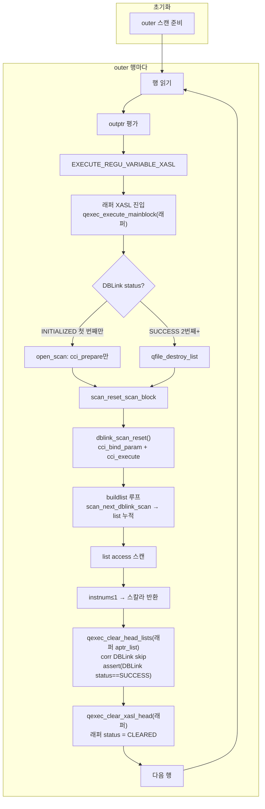

# DBLink Correlated 서브쿼리 최적화 — Design Doc

| 항목 | 내용 |
|------|------|
| 이슈 | CBRD-26601 |
| 기준 문서 | [02 PRD](02_dblink_correlated_optimization_prd.md), [01 소스 분석](01_dblink_correlated_source_analysis.md) |
| 기준 브랜치 | develop |
| 대상 | SELECT 절 correlated 스칼라 서브쿼리 안의 DBLink (1차) |

> 문서 내 라인 번호는 develop 기준이며, 머지·리팩터 시 변경될 수 있다.

---

## 1. 개요

이 문서는 PRD의 FR-1 ~ FR-8, FR-9 및 NFR-1 ~ NFR-3을 구현하기 위한 레이어별 설계를 기술한다.
AS-IS 코드 분석은 [01 소스 분석](01_dblink_correlated_source_analysis.md)을 참고한다.

### 1.1 핵심 설계 원칙

- **보수적 탐지**: 탐지 불확실 시 기존 동작(AS-IS) 유지.
- **기존 경로 최소 변경**: rewrite 흐름은 그대로 유지, push-down 대상에만 추가 처리.
- **단일 등치 한정**: `remote.col = outer.col` 패턴만 허용 (1차).

### 1.2 변경 대상 레이어 요약

| 레이어 | 파일 | 변경 내용 |
|--------|------|-----------|
| 탐지 | `view_transform.c` | `mq_rewrite_dblink_as_subquery` 내 corr 조건 탐지 |
| XASL 생성 | `xasl_generation.c` | `pt_to_dblink_table_spec_list`에서 `corr_key_regu_list` 채우기 |
| XASL 생성 | `xasl_generation.c` | `pt_to_subquery_table_spec_list`에서 push-down 조건 제거 |
| 데이터 구조 | `xasl.h`, `dblink_scan.h` | corr_key 필드 추가 |
| 런타임 | `dblink_scan.c` | open = prepare만; `dblink_scan_reset`에 `vd` 추가 + corr_key bind+execute |
| 런타임 | `scan_manager.c` | `scan_reset_scan_block` → `dblink_scan_reset(scan_info, s_id->vd)` 호출 |
| 런타임 | `query_executor.c` | aptr 루프에서 corr DBLink list 파괴 후 `scan_reset_scan_block` 호출 |
| 직렬화 | `xasl_to_stream.c`, `stream_to_xasl.c` | 신규 필드 pack/unpack |

---

## 2. 변경 데이터 구조

### 2.1 `dblink_spec_node` (`src/query/xasl.h`)

```c
/* AS-IS */
struct dblink_spec_node {
  REGU_VARIABLE_LIST dblink_regu_list_pred;
  REGU_VARIABLE_LIST dblink_regu_list_rest;
  int    host_var_count;
  int   *host_var_index;
  char  *conn_url;
  char  *conn_user;
  char  *conn_password;
  char  *conn_sql;
};

/* TO-BE: 추가 필드 */
struct dblink_spec_node {
  /* ... 기존 필드 유지 ... */
  int                 corr_key_count;      /* correlation 키 수 (0 = push-down 없음) */
  REGU_VARIABLE_LIST  corr_key_regu_list;  /* outer val_list 슬롯을 가리키는 TYPE_CONSTANT regu list */
};
```

### 2.2 `DBLINK_SCAN_INFO` (`src/query/dblink_scan.h`)

```c
/* AS-IS */
struct dblink_scan_info {
  int   conn_handle;
  int   stmt_handle;
  int   col_cnt;
  char  cursor;
  void *col_info;
};

/* TO-BE: 추가 필드 */
struct dblink_scan_info {
  /* ... 기존 필드 유지 ... */
  int                 corr_key_count;      /* dblink_spec_node에서 복사 */
  REGU_VARIABLE_LIST  corr_key_regu_list;  /* dblink_spec_node에서 복사 */
};
```

> `corr_key_regu_list` 의 각 regu는 `TYPE_CONSTANT` 타입으로 outer XASL의 `val_list` 슬롯을 가리킨다.
> 런타임에서 `vd`(value descriptor)를 통해 현재 outer 행의 값을 읽는다.

---

## 3. 레이어별 설계

### 3.1 Layer 1 — 탐지 (`view_transform.c`)

**진입점**: `mq_rewrite_dblink_as_subquery()` (develop:6607)

#### 처리 흐름

```
mq_rewrite_dblink_as_subquery()
  ├─ spec->derived_table_type == PT_DERIVED_DBLINK_TABLE 확인
  ├─ [신규] detect_corr_key(parser, spec, subquery_where)
  │    ├─ WHERE 절 순회: remote.col = outer.col 단일 등치 탐지
  │    ├─ PT_HOST_VAR 포함 시 → 실패 반환 (기존 방식)
  │    ├─ OR 조건 포함 시 → 실패 반환 (기존 방식)
  │    ├─ 성공 시 PT_DBLINK_INFO.corr_key_remote_col, corr_key_outer_ref 기록
  │    └─ 성공 시 (초기안) view_transform 단계에서 conn_sql에 "WHERE remote.col = ?" (또는 "AND remote.col = ?") append
  │         또는 XASL 생성 단계(pt_to_dblink_table_spec_list)에서 PT_DBLINK_INFO 기반으로 conn_sql을 구성하도록 조정 가능 (5.4 참고)
  └─ rewrite는 기존과 동일하게 진행 (PT_IS_SUBQUERY로 변환)
```

#### 탐지 조건 (`detect_corr_key`)

| 조건 | 결과 |
|------|------|
| `PT_EQ` 노드, 한 쪽 = DBLink 컬럼, 반대쪽 = outer col ref | 탐지 성공 |
| `PT_HOST_VAR` 포함 | 탐지 실패 |
| `PT_OR` 포함 | 탐지 실패 |
| 등치가 아닌 비교 (`PT_GT`, `PT_LT` 등) | 탐지 실패 |
| 기타 불확실 케이스 | 탐지 실패 (기존 방식 유지) |

#### outer ref 판별 방법

outer ref는 `TYPE_CONSTANT` regu (outer val_list 슬롯)로 나타난다.
`correlation_level == 1`인 컬럼 참조가 해당 슬롯을 가리킨다.

#### conn_sql append 규칙

```
기존: "/* DBLINK SELECT */ SELECT name, id FROM remote_t r"
추가: "WHERE r.id = ?"  (또는 기존 WHERE 있으면 " AND r.id = ?")
```

> **확인 포인트**: `conn_sql`에 기존 WHERE 절이 있는지 판별하는 방법 — `pdblink->qstr` 또는 `pdblink->rewritten`에서 `WHERE` 키워드 유무 확인 필요.

---

### 3.2 Layer 2a — XASL 생성: corr_key_regu_list 채우기 (`xasl_generation.c`)

**진입점**: `pt_to_dblink_table_spec_list()` (develop:12993)

`mq_rewrite_dblink_as_subquery`가 PT_IS_SUBQUERY 래퍼로 감싼 뒤에도, 이상적인 흐름은 래퍼 안의 `PT_DERIVED_DBLINK_TABLE` spec이 `pt_to_dblink_table_spec_list`를 통해 처리되는 것이다. (실제 접근 가능 여부는 C-1 확인 후, 불가 시 where 재탐지로 fallback.)  
C-1에서 `pt_to_dblink_table_spec_list` 진입이 불가한 경우, corr_key_regu_list 채우기 및 access_pred 제거를 `pt_to_subquery_table_spec_list` 경로(플랜 B)에서 수행한다. (Tasks T2-1, T4-1 참고.)

```
pt_to_dblink_table_spec_list()
  ├─ [기존] conn_sql, conn_url 등 dblink_spec_node 생성
  ├─ [신규] PT_DBLINK_INFO.corr_key_count > 0 && host_var_count == 0 이면:
  │    ├─ dblink_node->corr_key_count = PT_DBLINK_INFO.corr_key_count
  │    └─ dblink_node->corr_key_regu_list 생성:
  │         └─ corr_key_outer_ref (PT_NODE) → pt_to_regu_variable() → TYPE_CONSTANT regu
  │              (outer val_list 슬롯을 가리키는 regu — access_pred 생성과 동일 방식)
  └─ [기존] access spec 반환
```

#### corr_key_regu 생성 방식

`access_pred`에서 `l.id` 쪽 regu를 만드는 기존 `pt_to_pred_expr` 경로와 동일하게 `TYPE_CONSTANT` regu를 생성한다.
단, pred 빌드 전 `parser->symbols->current_class = NULL` 설정이 필요 — `pt_to_subquery_table_spec_list`에서 이미 설정하는 패턴 참고.

---

### 3.3 Layer 2b — XASL 생성: access_pred 제거 (`xasl_generation.c`)

**진입점**: `pt_to_subquery_table_spec_list()` (develop:12772)

push-down된 조건이 list access spec의 `access_pred`에 이중으로 남지 않도록, `where_part`에서 push-down된 조건을 제외하고 PRED_EXPR를 생성한다. **제거 대상은 PT_DBLINK_INFO에 기록한 corr_key_remote_col / corr_key_outer_ref와 일치하는 PT_EQ만** 한정하며, 다른 `=` 조건(상수 필터 등)은 유지한다.

```
pt_to_subquery_table_spec_list()
  ├─ subquery 노드에서 원본 PT_DBLINK_INFO 접근 가능 여부 확인
  ├─ [신규] corr_key_count > 0 이면 where_part에서 해당 PT_EQ 노드 제거 (corr_key와 일치하는 것만)
  │    └─ 제거 후 나머지 where로 pt_to_pred_expr 호출
  └─ [기존] pt_make_list_access_spec(...)
```

> **확인 포인트**: `pt_to_subquery_table_spec_list`의 `subquery` 인자에서 원래 PT_DBLINK_INFO에 접근하는 경로. 래퍼 SELECT → FROM spec → derived_table(원본 dblink PT_NODE) 참조 체인 확인 필요.
> 접근 불가 시 대안: `where_part`에서 직접 corr 패턴 탐지 후 제거 (재탐지).

---

### 3.4 Layer 3 — 런타임 open (`dblink_scan.c`)

**진입점**: `dblink_open_scan()` (develop:686)

```c
/* AS-IS */
dblink_open_scan():
  cci_prepare(sql)  // sql = "SELECT * FROM remote_t"
  cci_bind_param(host_vars)
  cci_execute()
  cursor = CCI_CURSOR_FIRST  // fetch는 이후 scan_next_dblink_scan(cci_cursor+cci_fetch)에서 1행씩 on-demand

/* TO-BE */
dblink_open_scan():
  cci_prepare(sql)  // sql = "SELECT * FROM remote_t WHERE id = ?"
  scan_info->corr_key_count = spec->corr_key_count
  scan_info->corr_key_regu_list = spec->corr_key_regu_list
  if (corr_key_count > 0):
    // [ASSERT] prepare 성공 확인
    assert(scan_info->stmt_handle > 0)
    assert(scan_info->conn_handle > 0)
    return  // execute는 aptr 루프(scan_reset_scan_block)에서 처리
  // corr_key_count == 0: 기존대로 cci_bind_param(host_vars) + cci_execute() 수행
```

> `cci_prepare` 결과(`stmt_handle`)는 `scan_info->stmt_handle`에 유지된다.
> 이후 재실행 시 이 핸들을 재사용한다.
>
> **C-2 확인 결과**: `qexec_clear_head_lists` → `qexec_clear_xasl_head`는 `scan_close_scan`을 호출하지 않는다.
> conn_handle과 stmt_handle은 clear 후에도 유효하게 유지된다.
> 단, `dblink_open_scan` 자체는 `scan_info->conn_handle = -1` 리셋 후 `cci_prepare`를 무조건 수행하므로
> corr DBLink에서 `dblink_open_scan`이 재호출되지 않도록 보장하는 것이 핵심이다 (→ §3.5 Option 1).

---

### 3.5 Layer 4 — 런타임 re-execute (`query_executor.c`)

#### 실제 호출 경로 (디버깅 진입점)

```
[outer XASL 처리]
qexec_execute_mainblock_internal(outer)          ← outer 행 루프
  → outptr 평가: fetch_peek_dbval()              ← fetch.c
    → EXECUTE_REGU_VARIABLE_XASL 매크로           ← xasl.h:527
        IS_XASL_INITIAL_STATUS(래퍼) == true (매번 clear됨)
        → qexec_execute_mainblock(래퍼)           ← query_executor.c:14849
          → qexec_execute_mainblock_internal(래퍼) ← query_executor.c:15007  ★ 수정 위치
              L15347: for (xptr = 래퍼; xptr; xptr = xptr->scan_ptr)
              L15371: for (xptr2 = xptr->aptr_list; ...)  ← xptr2 = DBLink XASL
              L15400: XASL_LINK_TO_REGU_VARIABLE? → DBLink는 해당 없음 → skip 안 됨
              L15406: IS_XASL_INITIAL_STATUS(DBLink) → 처리
```

> **핵심**: `qexec_execute_mainblock_internal`은 outer/래퍼/DBLink 세 레벨 모두에서 호출되는 재귀 구조다.
> TO-BE 수정 위치는 **래퍼 XASL을 `xasl` 인자로 받은 호출** 내부의 aptr 루프(L15371)다.
> outer XASL 실행 시에는 래퍼가 `XASL_LINK_TO_REGU_VARIABLE` 플래그로 L15400에서 skip되므로 관계없다.
>
> **브레이크포인트 위치** (gdb):
> - `b query_executor.c:15371` (aptr 루프 진입 — xasl이 래퍼인지 확인)
> - `b qexec_clear_head_lists` (clear skip 로직 확인)
> - `b dblink_scan.c:dblink_open_scan` (prepare만 수행 확인)
> - `b scan_manager.c:scan_reset_scan_block` (corr_key bind+execute 진입 확인)

#### Option 1: corr DBLink는 `qexec_clear_head_lists`에서 제외

corr DBLink XASL는 `qexec_clear_head_lists`에서 skip하여 status를 SUCCESS로 유지한다.
이렇게 하면 aptr 루프에서 INITIAL 분기는 진짜 첫 번째(XASL_INITIALIZED) 때만 진입하고,
이후는 항상 SUCCESS 분기로 진입한다. re-prepare가 발생하지 않는다.

```c
/* TO-BE: qexec_clear_head_lists 수정 */
qexec_clear_head_lists(THREAD_ENTRY *thread_p, XASL_NODE *xasl_list)
{
  for (xasl = xasl_list; xasl; xasl = xasl->next) {
    if (XASL_IS_FLAGED(xasl, XASL_ZERO_CORR_LEVEL))
      continue;  // 비상관 서브쿼리: 기존과 동일하게 skip

    if (IS_CORR_DBLINK_XASL(xasl)) {
      // [ASSERT] Option 1 불변 조건: clear 시점에 corr DBLink는 항상 SUCCESS여야 함
      // (INITIAL이면 첫 outer 행 처리가 아직 완료되지 않은 것 → 비정상)
      assert(xasl->status == XASL_SUCCESS);
      continue;  // status 유지 → 다음 outer 행에서 SUCCESS 분기로 진입
    }

    qexec_clear_xasl_head(thread_p, xasl);
  }
}
```

```c
/* TO-BE: aptr 루프 */
for (aptr = xasl->aptr_list; aptr; aptr = aptr->next) {

  if (IS_XASL_INITIAL_STATUS(aptr->status)) {
    // INITIAL(XASL_INITIALIZED): 첫 번째 outer 행 — open_scan(prepare만) + scan_reset_scan_block
    if (IS_CORR_DBLINK_XASL(aptr)) {
      // [ASSERT] Option 1에서 INITIAL은 XASL_INITIALIZED여야 함 (CLEARED는 허용 안 됨)
      assert(aptr->status == XASL_INITIALIZED);
      // open_scan: cci_prepare만 수행 (TO-BE dblink_open_scan 내 early return)
      if (qexec_execute_mainblock(thread_p, aptr, xasl_state, NULL) != NO_ERROR)
        goto exit_on_error;
      // [ASSERT] prepare 완료 확인
      DBLINK_SCAN_INFO *scan_info = &aptr->spec_list->s_id.s.dblid.scan_info;
      assert(scan_info->stmt_handle > 0);
      // corr_key bind + cci_execute: scan_reset_scan_block → dblink_scan_reset(scan_info, s_id->vd)
      if (scan_reset_scan_block(&aptr->spec_list->s_id) != NO_ERROR)
        goto exit_on_error;
    } else {
      if (qexec_execute_mainblock(thread_p, aptr, xasl_state, NULL) != NO_ERROR)
        goto exit_on_error;
    }

  } else if (aptr->status == XASL_SUCCESS && IS_CORR_DBLINK_XASL(aptr)) {
    // SUCCESS: 2번째+ outer 행 — list 파괴 후 재실행
    DBLINK_SCAN_INFO *scan_info = &aptr->spec_list->s_id.s.dblid.scan_info;
    // [ASSERT] stmt_handle은 반드시 유효 (clear에서 보존됨)
    assert(scan_info->stmt_handle > 0);
    qfile_destroy_list(thread_p, aptr->list_id);
    // corr_key bind + cci_execute: scan_reset_scan_block → dblink_scan_reset(scan_info, s_id->vd)
    if (scan_reset_scan_block(&aptr->spec_list->s_id) != NO_ERROR)
      goto exit_on_error;
  }
}
```

> **IS_CORR_DBLINK_XASL 판별 매크로**:
> ```c
> #define IS_CORR_DBLINK_XASL(x)  XASL_IS_FLAGED(x, XASL_CORR_DBLINK)
> ```

#### `dblink_scan_reset()` 확장 (`dblink_join_improve` 패턴 적용)

신규 함수(`dblink_execute_corr`)를 추가하는 대신, 기존 `dblink_scan_reset`의 시그니처에 `VAL_DESCR *vd`를 추가하고 corr_key 처리를 확장한다. `scan_manager.c`의 `scan_reset_scan_block`이 `s_id->vd`를 전달하는 방식은 `dblink_join_improve` 브랜치(commit `ac9436893`)에서 이미 검증된 패턴이다.

```c
/* src/query/scan_manager.c — scan_reset_scan_block 수정 */
// 기존: dblink_scan_reset(&s_id->s.dblid.scan_info)
// 변경: dblink_scan_reset(&s_id->s.dblid.scan_info, s_id->vd)

/* src/query/dblink_scan.c — dblink_scan_reset 시그니처 + corr_key 처리 추가 */
int dblink_scan_reset(DBLINK_SCAN_INFO *scan_info, VAL_DESCR *vd)
{
  if (scan_info->corr_key_count > 0) {
    // [ASSERT] 진입 조건: prepare는 반드시 완료된 상태
    assert(scan_info->stmt_handle > 0);

    // NULL 체크 (FR-6): outer corr_key가 NULL이면 cursor만 되감기 → 빈 list → list access 시 0건 → 스칼라 NULL (PRD §3.3)
    for (regu = scan_info->corr_key_regu_list; regu; regu = regu->next):
      fetch_peek_dbval(regu, vd, &val)
      if (DB_IS_NULL(val)):
        scan_info->cursor = CCI_CURSOR_FIRST;
        return NO_ERROR;  // 빈 list

    // corr_key bind
    for (i = 0, regu = ...; regu; regu = regu->next, i++):
      fetch_peek_dbval(regu, vd, &val)  // TYPE_CONSTANT: outer val_list 슬롯
      dblink_bind_one_param(scan_info->stmt_handle, i + 1, val)
      // dblink_bind_one_param: dblink_join_improve에서 추출된 공유 유틸리티

    // execute
    cci_execute(scan_info->stmt_handle, ...)
    scan_info->cursor = CCI_CURSOR_FIRST;

    // col_info 초기화 (첫 reset 시, dblink_join_improve 패턴)
    if (scan_info->col_info == NULL):
      populate col_info from cci_get_result_info(stmt_handle)

  } else {
    // 기존 동작: cursor만 되감기
    scan_info->cursor = CCI_CURSOR_FIRST;
  }

  return NO_ERROR;

error:
  er_set(...);
  return ER_FAILED;
}
```

> `dblink_bind_one_param`은 `dblink_join_improve` 브랜치에서 추출된 공유 유틸리티로, host_var 바인딩과 corr_key 바인딩 모두에서 재사용한다.
> `fetch_peek_dbval`의 `vd` 경로: `TYPE_CONSTANT` regu → `scan_info->corr_key_regu_list`의 각 regu가 outer `val_list` 슬롯을 가리킨다.

---

### 3.6 TO-BE 전체 실행 흐름

**전체 흐름 다이어그램 (TO-BE)**



**텍스트 형식 상세**

```
[초기화]
  outer 스캔 준비: scan_open_scan(local_t)

[outer 행마다 반복]
  local_t 행 읽기 → val_list: [l.id=INTEGER, l.name=VARCHAR]

  [outptr 평가]
  fetch_peek_dbval(TYPE_CONSTANT[xasl:0x40269c00])
    └─ EXECUTE_REGU_VARIABLE_XASL(0x40269c00)
         └─ IS_XASL_INITIAL_STATUS(0x40269c00) = true (래퍼 매번 CLEARED)
         └─ qexec_execute_mainblock(0x40269c00)  ← 래퍼 XASL (BUILDVALUE_PROC)
              ├─ [aptr 루프: DBLink XASL (BUILDLIST_PROC, 0x40249d60)]
              │    ├─ [첫 행] INITIAL → dblink_open_scan(cci_prepare만)
              │    │         → scan_reset_scan_block → dblink_scan_reset(scan_info, vd)
              │    │         → cci_bind_param(1=1) + cci_execute (cursor=FIRST)
              │    └─ [2번째+] SUCCESS → qfile_destroy_list
              │              → scan_reset_scan_block → dblink_scan_reset(scan_info, vd)
              │              → cci_bind_param(1=2) + cci_execute (cursor=FIRST)
              ├─ [buildlist 루프]
              │    └─ scan_next_dblink_scan(cci_cursor+cci_fetch) → 0x40249d60->list_id 누적
              ├─ [list access: 0x40249d60->list_id 스캔]
              │    ├─ access_pred: (push-down 조건 제거됨, 나머지만)
              │    ├─ instnum: inst_num() <= 1
              │    └─ → single_tuple → 스칼라 반환
              └─ qexec_clear_head_lists(0x40249d60)  ← 래퍼 aptr_list 정리
                   └─ IS_CORR_DBLINK_XASL → skip: DBLink status = SUCCESS 유지

  [다음 outer 행 준비]
  qexec_clear_xasl_head(0x40269c00)  ← 래퍼 clear
    └─ list_id 파괴 + status = XASL_CLEARED
         → 다음 outer 행에서 IS_XASL_INITIAL_STATUS(래퍼) = true
```

---

### 3.7 Layer 5 — 세션 파라미터 (`view_transform.c`)

**FR-9**: `use_dblink_corr_pushdown` 세션 파라미터로 push-down 적용 여부를 제어한다. 기본값 `yes`.

#### 구현 위치

`mq_rewrite_dblink_as_subquery()` 내 `detect_corr_key()` 호출 직전에 파라미터를 확인한다.

```c
/* mq_rewrite_dblink_as_subquery() */
if (!prm_get_bool_value (PRM_ID_USE_DBLINK_CORR_PUSHDOWN)) {
  /* push-down OFF: 탐지 스킵, 기존 rewrite만 수행 */
  goto do_rewrite;
}
/* push-down ON: detect_corr_key() 호출 */
detect_corr_key(parser, spec, subquery_where);

do_rewrite:
  /* 기존 PT_IS_SUBQUERY rewrite */
```

#### 파라미터 등록

| 항목 | 내용 |
|------|------|
| 파라미터 ID | `PRM_ID_USE_DBLINK_CORR_PUSHDOWN` |
| 타입 | `bool` |
| 기본값 | `true` (ON) |
| 등록 위치 | `src/base/system_parameter.c` (파라미터 테이블), `src/base/system_parameter.h` (enum) |
| 세션 파라미터 | `SET SYSTEM PARAMETERS 'use_dblink_corr_pushdown=no'` 로 런타임 변경 가능 |

#### 향후 하드코드 전환

push-down을 항상 ON으로 확정할 경우 이 if 블록만 제거하면 된다. 파라미터 등록 코드 및 `PRM_ID` enum 항목도 함께 제거.

---

## 4. 직렬화 (`xasl_to_stream.c` / `stream_to_xasl.c`)

### 4.1 변경 위치

`dblink_spec_node` 직렬화 기존 코드에 추가 필드 pack/unpack 추가.

```c
/* xasl_to_stream.c — dblink_spec_node pack */
// 기존 필드 pack 이후
or_pack_int(ptr, node->corr_key_count);
if (node->corr_key_count > 0) {
  // corr_key_regu_list pack (REGU_VARIABLE_LIST 직렬화)
  pack_regu_variable_list(ptr, node->corr_key_regu_list);
}

/* stream_to_xasl.c — dblink_spec_node unpack */
ptr = or_unpack_int(ptr, &node->corr_key_count);
if (node->corr_key_count > 0) {
  ptr = unpack_regu_variable_list(ptr, &node->corr_key_regu_list);
}
```

> 위 함수명(`pack_regu_variable_list` / `unpack_regu_variable_list`)은 예시이며, 실제 함수명은 C-5 확인 및 `xasl_to_stream.c`의 `dblink_regu_list_pred` pack 패턴에 따른다.

### 4.2 REGU_VARIABLE_LIST 직렬화 참고

기존 `dblink_regu_list_pred` / `dblink_regu_list_rest` pack/unpack 패턴을 그대로 따른다.

---

## 5. 설계 결정 근거

### 5.1 rewrite 유지 방식 선택

| 옵션 | 내용 | 선택 이유 |
|------|------|-----------|
| **A — rewrite 스킵** | corr 탐지 성공 시 PT_DERIVED_DBLINK_TABLE 유지, pt_to_dblink_table_spec_list 경로 | 래퍼 구조 변경 필요, scan open/close 사이클 변화 예측 어려움 |
| **B — rewrite 유지** | 기존 PT_IS_SUBQUERY 변환 그대로, aptr DBLink의 dblink_spec_node에 corr_key 추가 | **변경 범위 최소화**, 기존 aptr/dptr 배치 유지, scan 사이클 동일 |

→ **옵션 B 채택**: 기존 실행 경로를 최대한 보존하면서 aptr 루프에서만 재실행 로직 추가.

### 5.2 prepare 1회 유지

`dblink_open_scan`에서 corr_key 있으면 prepare만 수행 → `stmt_handle` 유지.
aptr 루프에서 재실행 시 `stmt_handle`로 bind + execute.
→ N회 outer 행에 대해 prepare 1회, execute N회.

**C-2 확인 완료 (코드 직접 확인)**:
- `qexec_clear_head_lists` → `qexec_clear_xasl_head`: list_id 파괴 + status=CLEARED만 수행. `scan_close_scan` 호출 없음.
- `dblink_open_scan`은 호출 시마다 `scan_info->conn_handle = -1` 리셋 후 `cci_prepare` 무조건 수행 ("skip if prepared" 로직 없음).
- 따라서 `dblink_open_scan`이 재호출되지 않도록 보장하는 것이 핵심.

**Option 1 채택**: `qexec_clear_head_lists`에서 corr DBLink를 skip → status SUCCESS 유지 → IS_XASL_INITIAL_STATUS = false → `qexec_execute_mainblock` 미호출 → `dblink_open_scan` 재호출 없음 → **cci_prepare 1회 보장**.

불변 조건: corr DBLink가 `qexec_clear_head_lists`에 도달하는 시점에는 반드시 XASL_SUCCESS 상태여야 한다. 이를 `assert(xasl->status == XASL_SUCCESS)`로 런타임 검증.

### 5.3 NULL 처리

corr_key 값이 NULL이면 `cci_execute` 없이 빈 list → 스칼라 NULL 반환.
로컬 조인에서 `NULL = NULL`이 FALSE인 것과 동일한 의미.

---

## 6. 미결 사항 / 구현 시 확인 포인트

| ID | 항목 | 상태 | 확인 방법 |
|----|------|------|-----------|
| C-1 | `pt_to_subquery_table_spec_list`에서 원본 PT_DBLINK_INFO 접근 경로 | 미결 | gdb: subquery 인자 → info.query.from → spec → derived_table 체인 추적 |
| ~~C-2~~ | ~~래퍼 재실행 시 DBLink spec에 `scan_close_scan`/`scan_open_scan` 호출 여부~~ | **해결** | 코드 확인 완료: `qexec_clear_head_lists`는 `scan_close_scan` 미호출. `dblink_open_scan`은 재호출 시 무조건 re-prepare. Option 1(clear skip)으로 재호출 자체 차단. |
| C-3 | `conn_sql`에 기존 WHERE 절 존재 여부 판별 | 미결 | gdb: `pdblink->qstr` 또는 원본 SQL 문자열 확인 |
| C-4 | aptr DBLink 판별 조건 (`spec_list->type` 등) 정확한 필드명 | 미결 | `xasl.h` ACCESS_SPEC_TYPE 값 확인 (TARGET_DBLINK 사용 가능성 높음, §3.5 판별 매크로 참고) |
| C-5 | `REGU_VARIABLE_LIST` pack/unpack 기존 함수명 | 미결 | `xasl_to_stream.c`에서 `dblink_regu_list_pred` pack 코드 참고 |

---

## 7. 추가 개선 고려 사항

### 7.1 이전 행 키 비교 최적화

outer 행 중 correlated 키 값이 연속으로 중복되는 경우, 원격 재실행을 스킵하여 RTT 오버헤드를 줄이는 최적화다. full 결과 캐시 대비 구현이 단순하고 메모리 부담이 없다.

**적용 조건**: 로컬 테이블의 조인 키에 인덱스가 있으면 optimizer가 index scan을 선택할 가능성이 높고, 그 경우 outer 행이 키 순으로 정렬되어 연속 중복이 자연스럽게 형성된다.

```c
/* DBLINK_SCAN_INFO에 추가 */
DB_VALUE prev_corr_key;   /* 이전 outer 행의 corr key 값 */
bool     prev_key_valid;  /* 첫 행 여부 */
```

```c
/* dblink_scan_reset() 진입 시 (corr_key_count > 0 분기) */
if (prev_key_valid && db_value_compare(curr_key, &prev_corr_key) == 0) {
  /* 같은 키 → 원격 재실행 없이 list cursor만 되감기 */
  scan_info->cursor = CCI_CURSOR_FIRST;
  return NO_ERROR;
}
/* 다른 키 → 기존대로 bind + execute + fetch */
prev_corr_key = curr_key;
prev_key_valid = true;
```

| outer 행 순서 | 효과 |
|---|---|
| `[1, 1, 1, 2, 2]` (연속 중복) | 모든 중복에서 skip |
| `[1, 2, 1, 2, 1]` (교차) | skip 없음 |

heap scan(sequential) 시 키 순서 보장이 없으므로 이점이 없을 수 있다. index scan으로 유도되는 케이스에서 효과가 크다.

> Phase 1 기본 구현(T3-1~T3-3) 완료 후 추가 최적화로 적용한다. (Tasks: T3-4)

### 7.2 LIMIT append to conn_sql

corr push-down 적용 시 `conn_sql`에 `LIMIT n`도 함께 append하면 outer 행당 원격 전송량을 최대 1행으로 줄일 수 있다. 로컬 `instnum_pred`는 그대로 유지(safety net).

- **효과**: 전송 행 수 N × k → N × 1 (k = 키당 원격 매칭 수)
- **round-trip(N회)은 변화 없음** — §7.1 이전 행 키 비교와 상호 보완적
- **구현 진입점**: T1-2 conn_sql 구성 시점에 서브쿼리의 `instnum_val`에서 LIMIT 값 추출 후 append
- 현재 작업 범위 밖. corr push-down 안정화 후 검토.

### 7.3 Push-Down 후보 플래그 + Optimizer 결정 구조

탐지(view_transform)와 결정(optimizer)을 분리하여 향후 통계 기반 비용 비교로 교체 가능하도록 설계하는 방안.

**흐름:**

```
view_transform (탐지만):
  detect_corr_key() → PT_DBLINK_INFO.is_corr_pushdown_candidate = true
  (push-down 여부는 미결)

optimizer (결정):
  DBLink spec에 candidate flag 있으면:
  → 현재: 단순 휴리스틱(outer filter/LIMIT 유무 등)으로 AS-IS/TO-BE 선택
  → 나중: outer cardinality 추정값 기반 비용 비교

XASL 생성 (결과 반영):
  optimizer 결정에 따라 corr_key_regu_list 채우거나 생략
```

**장점:**
- 탐지 로직(view_transform)과 결정 로직(optimizer)이 명확히 분리됨
- 통계 기반 비용 모델 구현 시 optimizer 쪽만 교체하면 됨 (탐지 로직 변경 불필요)

**현실적 과제:**
- CUBRID optimizer가 현재 DBLink를 불투명 스캔으로 취급 → optimizer에서 DBLink candidate를 인식하는 훅 추가 필요
- remote 테이블 통계는 플래닝 타임에 획득 불가 → outer cardinality(N)만으로 단방향 비용 추정
- 현재 작업 범위 밖. corr push-down 안정화 및 통계 기반 비용 모델 구현 후 검토.

### 7.4 Outer Filter Guard

outer query(local_t)에 join 조건 외의 조건이 없을 때 push-down을 억제하는 휴리스틱.

- **동기**: worst case는 outer 필터 없이 N이 크고 remote가 작은 조건에서 발생하기 쉬움 (worst_case.md §7). outer 필터 유무가 N을 결정하는 핵심 변수.
- **허용 조건 (OR)**:
  - outer WHERE 절에 local_t를 참조하는 조건이 있음
  - outer LIMIT 절이 있음 (N이 명시적으로 bounded)
- **한계**: outer 필터가 있어도 selectivity가 낮으면 N이 클 수 있음. POC-A 패턴(테이블 자체가 소형)은 outer 필터가 없어도 TO-BE가 유리하지만 이 guard로 차단됨.
- **구현 위치**: `detect_corr_key()` 내 또는 호출 직전에 `has_outer_bound(outer_statement)` 확인. outer statement는 `mq_rewrite_dblink_as_subquery()`의 `statement` 파라미터.
- **세션 파라미터와의 관계**: `use_dblink_corr_pushdown=yes`(기본)일 때 guard 적용. 파라미터로 guard를 우회 가능.
- 현재 작업 범위 밖. corr push-down 안정화 후 검토.

---

## 8. 참고 문서

- [02 PRD](02_dblink_correlated_optimization_prd.md) — 요구사항
- [01 소스 분석](01_dblink_correlated_source_analysis.md) — AS-IS 소스 분석
- [04 Tasks](04_dblink_correlated_optimization_tasks.md) — 구현 태스크

---

## 9. 문서 이력

| 일자 | 내용 |
|------|------|
| 2026-03-13 | 초안 작성 |
| 2026-03-16 | FR-9 세션 파라미터 설계 추가 (§3.7) |
| 2026-03-16 | 이전 행 키 비교 최적화 추가 (Phase 2) |
| 2026-03-17 | Outer Filter Guard, Push-Down 후보 플래그 + Optimizer 결정 구조 추가 |
| 2026-03-18 | C-2 확인 완료 (코드 직접 분석). Option 1(corr DBLink clear skip) 채택. §3.4/3.5/3.6/5.2/6 assert 및 불변 조건 추가. |
| 2026-03-18 | §3.5/3.6 신규 함수 `dblink_execute_corr` → `scan_reset_scan_block` + `dblink_scan_reset(scan_info, vd)` 확장으로 교체 (`dblink_join_improve` 패턴 적용). §1.2 테이블 `scan_manager.c` 행 추가. |
| 2026-03-19 | 리뷰 반영: 문서 상단 라인 번호 유의사항, §1.1 AS-IS 유지 표현, §3.2 플랜 B 명시, §3.3 access_pred 제거 대상 한정, §3.4 corr_key_count==0 분기 명시, §3.6 N회 제거, §4.1 pack 함수명 C-5 참고 주석 |
