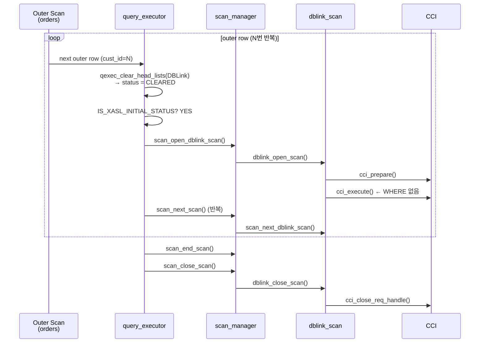
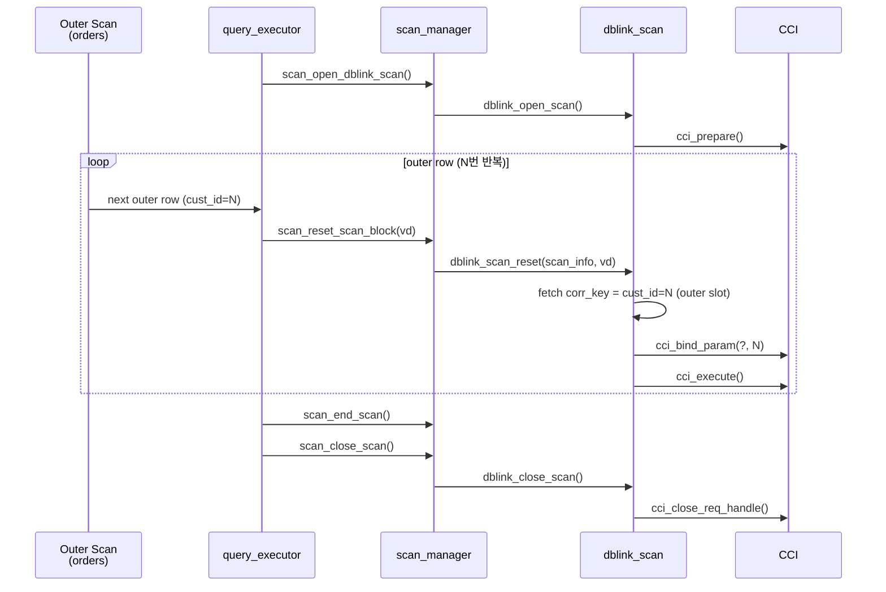

# CBRD-26601 DBLink Correlated Subquery 최적화 — AS-IS vs TO-BE

> 대상: 팀 코드 리뷰 / 설계 공유
> 작성일: 2026-03-19

---

## 0. 예제 쿼리 (공통 기준)

각 주문의 주문ID, 금액과 그 고객 이름을 찾아줘.

각 주문의 주문ID와 금액을 조회하되, 해당 주문의 고객ID와 일치하는 원격 고객 테이블에서 고객 이름을 1건 가져와 함께 찾아줘.

```sql
-- 로컬 주문 테이블 × 원격 고객 테이블 (Correlated Scalar Subquery)
SELECT o.order_id,
       o.amount,
       (SELECT c.name
          FROM customer@remote_conn c
         WHERE c.cust_id = o.cust_id   -- correlated condition
         LIMIT 1) AS cust_name
  FROM orders o;
```

- `orders` : 로컬 테이블 (outer)
- `customer@remote_conn` : DBLink 원격 테이블 (inner subquery)
- `c.cust_id = o.cust_id` : correlated 조건 — outer 행마다 값이 달라짐

**실행 결과**

```
     order_id       amount  cust_name
================================================
            1        10000  'Alice'
            2        20000  'Bob'
            3        15000  'Charlie'
            4        30000  'Diana'
            5         5000  'Eve'

5 rows selected. (0.168000 sec)
```

**AS-IS XASL 구조 요약**

```
0x2ee69850 [buildlist_proc] XASL_ZERO_CORR_LEVEL | TOP_MOST  ← orders 스캔
  val_list: [order_id:0x2ee1dea8] [amount:0x2ee1df20] [cust_id:0x2ee1df98]
  └─ dptr: 0x2ee69340 [buildlist_proc] XASL_LINK_TO_REGU_VARIABLE  ← 스칼라 서브쿼리 래퍼
               └─ aptr: 0x2ee1e7f0 [buildlist_proc]                ← DBLink XASL
                           access spec: dblink
                           conn_sql: 'SELECT name, cust_id FROM customer c'  ← WHERE 없음
                           val_list: [name:0x2ee46f18] [cust_id:0x2ee46f90]
                           access pred: TYPE_CONSTANT(0x2ee46f90, DBLink.cust_id)
                                      = TYPE_CONSTANT(0x2ee1df98, orders.cust_id)
                                        ← 양쪽 모두 val_list 슬롯 참조 (로컬 필터)
```

---

## Part 1: 원격 SQL 생성 파트

**목적**: DBLink correlated 조건(`c.cust_id = o.cust_id`)이 원격 `conn_sql`로 pushdown 되어 `WHERE ... = ?` 형태가 되는 지점과, AS-IS에서 원격 `conn_sql`에 WHERE가 포함되지 않음을 설명한다.

---

### AS-IS — 원격 SQL 생성 흐름

```
SQL 텍스트 입력
  │
  ▼
[Parser]
  customer@remote_conn → PT_DERIVED_DBLINK_TABLE 노드 생성
  │
  ▼
[view_transform.c] mq_rewrite_dblink_as_subquery()
  PT_DERIVED_DBLINK_TABLE → PT_IS_SUBQUERY 래퍼(SELECT)로 변환
  conn_sql = "SELECT cust_id, name FROM customer c"  ← 원격 SQL에는 correlated 조건이 포함되지 않음
WHERE c.cust_id = o.cust_id 는 원격이 아닌 로컬 실행 단계의 predicate로 남아(예: access_pred 등) 결과를 필터링함
  │
  ▼
[xasl_generation.c] parser_generate_xasl_proc()
  스칼라 서브쿼리 래퍼(XASL_LINK_TO_REGU_VARIABLE)
    → outer XASL(orders)의 dptr_list 에 등록

  래퍼 XASL 내부:
    DBLink XASL 는 래퍼 XASL 의 aptr_list 에 등록 (outer row마다 재실행 대상)
  │
  ▼
[xasl_generation.c] pt_to_dblink_table_spec_list()
  conn_sql = "SELECT cust_id, name FROM customer c"  ← WHERE 없이 그대로 확정
  WHERE c.cust_id = o.cust_id → access_pred (로컬 필터)로 변환
  │
  ▼
[런타임] outer row마다:
  qexec_clear_head_lists() → dblink XASL CLEARED
  → dblink_open_scan() → cci_prepare + cci_execute (WHERE 없음)
  → 원격 전체 테이블 fetch → access_pred로 로컬 필터링
```

**핵심 문제점 요약**

| 단계 | 문제 | 영향 |
|------|------|------|
| `mq_rewrite_dblink_as_subquery` | correlated 조건을 `conn_sql`에 포함하지 않음 | 원격 SQL에 WHERE 없음 |
| `pt_to_dblink_table_spec_list` | `conn_sql` 그대로 확정 | 원격 DB에서 전체 테이블 반환 |
| 런타임 `qexec_clear_head_lists` | outer row마다 DBLink XASL clear → 전체 재실행 | N회 전체 테이블 fetch |

---

### TO-BE — 원격 SQL 생성 흐름

```
SQL 텍스트 입력
  │
  ▼
[Parser]
  customer@remote_conn → PT_DERIVED_DBLINK_TABLE 노드 생성
  │
  ▼
[view_transform.c] mq_rewrite_dblink_as_subquery()  ← ★ 변경
  │
  ├─ detect_corr_key() 신규 호출
  │    WHERE c.cust_id = o.cust_id 분석
  │      ├─ 원격 컬럼: c.cust_id
  │      ├─ 외부 컬럼: o.cust_id
  │      └─ 단일 등호 조건 확인 → push 가능 판정
  │    → conn_sql 에 "WHERE c.cust_id = ?" 추가
  │    → PT_DBLINK_INFO.corr_key_count = 1
  │    → PT_DBLINK_INFO.corr_key_ref  = o.cust_id (outer slot 참조)
  │
  ▼
[xasl_generation.c] parser_generate_xasl_proc()
  스칼라 서브쿼리 래퍼(XASL_LINK_TO_REGU_VARIABLE)
    → outer XASL(orders)의 dptr_list 에 등록

  래퍼 XASL 내부:
    DBLink XASL(XASL_CORR_DBLINK) → 래퍼 XASL의 aptr_list 에 등록
  │
  ▼
[xasl_generation.c] pt_to_dblink_table_spec_list()  ← ★ 변경
  corr_key_count = 1
  corr_key_regu_list = [TYPE_CONSTANT → o.cust_id outer slot]
  conn_sql = "SELECT cust_id, name FROM customer c WHERE c.cust_id = ?"
```

**변경 파일 요약**

| 파일 | 함수 | 변경 내용 |
|------|------|----------|
| `view_transform.c` | `detect_corr_key()` (신규) | WHERE 패턴 분석, `conn_sql`에 `?` 추가, `corr_key_ref` 저장 |
| `view_transform.c` | `mq_rewrite_dblink_as_subquery()` | `detect_corr_key()` 호출 추가 |
| `xasl_generation.c` | `pt_to_dblink_table_spec_list()` | `corr_key_regu_list` 생성 추가 |
| `xasl.h` | `dblink_spec_node` | `corr_key_count`, `corr_key_regu_list` 필드 추가 |

---

## TO-BE 예상 XASL 구조

```
orders XASL [buildlist_proc] XASL_ZERO_CORR_LEVEL | TOP_MOST
  val_list: [order_id] [amount] [cust_id:slot-A]
  └─ dptr: 스칼라 서브쿼리 래퍼 [buildlist_proc] XASL_LINK_TO_REGU_VARIABLE
               └─ aptr: DBLink XASL [buildlist_proc] XASL_CORR_DBLINK  ← 신규 플래그
                           access spec: dblink
                           conn_sql: 'SELECT name, cust_id FROM customer c
                                      WHERE cust_id = ?'         ← WHERE 포함
                           corr_key_count: 1
                           corr_key_regu_list: [TYPE_CONSTANT(slot-A)]  ← orders.cust_id 슬롯
```

| 항목 | AS-IS | TO-BE |
|------|-------|-------|
| conn_sql | WHERE 없음 | `WHERE cust_id = ?` |
| corr_key_regu_list | 없음 | orders.cust_id 슬롯 참조 |
| DBLink XASL 플래그 | 없음 | `XASL_CORR_DBLINK` |

---

## Part 2: 실행기 파트

**목적**: 런타임에서 outer row마다 어떤 일이 일어나는지 설명한다.

---

### AS-IS — 실행 흐름 (Sequence Diagram)



---

### TO-BE — 실행 흐름 (Sequence Diagram)
corr_key가 있는 경우 원격 stmt는 1회 `prepare` 후, outer row마다 `bind + execute`로 재사용한다.


**변경 파일 요약**

| 파일 | 함수 | 변경 내용 |
|------|------|----------|
| `dblink_scan.c` | `dblink_open_scan()` | `corr_key_count > 0`이면 prepare만, execute 안 함 |
| `dblink_scan.c` | `dblink_scan_reset()` | 시그니처에 `vd` 추가; corr case: bind + execute |
| `scan_manager.c` | `scan_reset_scan_block()` | `dblink_scan_reset`에 `vd` 전달 |
| `query_executor.c` | `qexec_clear_head_lists()` | `XASL_CORR_DBLINK_XASL` → skip clear |
| `query_executor.c` | aptr loop (~L15371) | corr DBLink: 첫 행 open-only, 이후 행 rebind |

---

## Fall-back: AS-IS 유지 조건

다음 경우에는 TO-BE 최적화를 적용하지 않고 AS-IS로 동작합니다.

- OR 조건 포함 (예: `c.cust_id = o.cust_id OR c.name = o.name`)
- correlated 등호 조건이 2개 이상 (Phase 1 제한)
- 앱 파라미터(`?`)와 correlated 조건의 혼합 (바인딩 순서/매핑 규칙 확정 전까지 제한)

---

## 구현 순서

1. `system_parameter.h` / `system_parameter.c` — `use_dblink_corr_pushdown` 세션 파라미터 등록 (기본값 `yes`)
2. `xasl.h` + `dblink_scan.h` — 구조체 필드 추가 (`corr_key_count`, `corr_key_regu_list`)
3. `view_transform.c` — `detect_corr_key()` 구현 및 `mq_rewrite_dblink_as_subquery()` 호출 추가
   - 파라미터 guard: `use_dblink_corr_pushdown=no`이면 `detect_corr_key()` 호출 스킵 → AS-IS 유지
4. `xasl_generation.c` — `pt_to_dblink_table_spec_list()` corr_key regu 생성
5. `xasl_to_stream.c` / `stream_to_xasl.c` — 신규 필드 직렬화/역직렬화
6. `dblink_scan.c` — `dblink_open_scan()` early return + `dblink_scan_reset()` bind+execute
7. `scan_manager.c` — `scan_reset_scan_block()` vd 전달
8. `query_executor.c` — `qexec_clear_head_lists()` skip + aptr loop 수정

---

## 참고 문서

- 상세 소스 분석: `CBRD-26601_dblink_correlated/docs/01_dblink_correlated_Source_Analysis.md`
- 최적화 설계: `CBRD-26601_dblink_correlated/docs/03_dblink_correlated_Desgin_Doc.md`
- PRD: `CBRD-26601_dblink_correlated/docs/02_dblink_correlated_PRD.md`
- Tasks / Tests: `CBRD-26601_dblink_correlated/docs/04_dblink_correlated_Tasks.md`, `CBRD-26601_dblink_correlated/docs/05_dblink_correlated_Tests.md`
