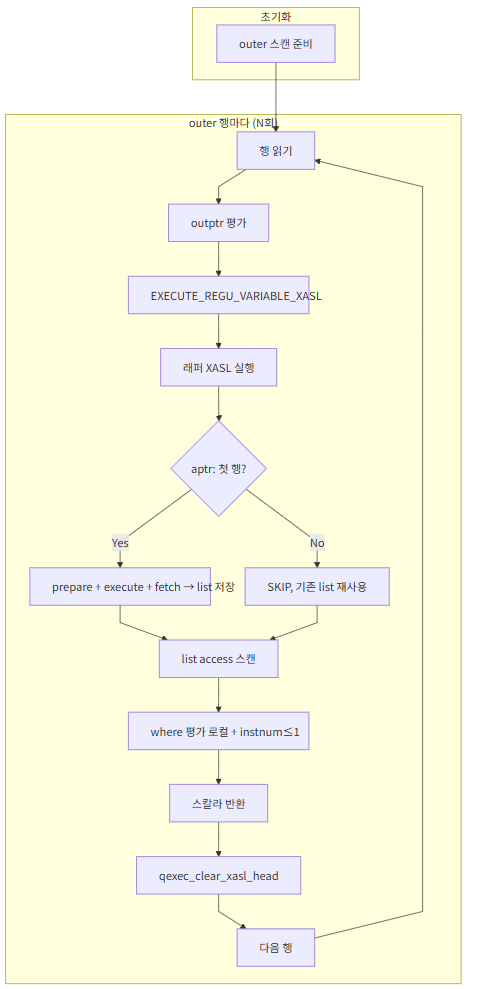
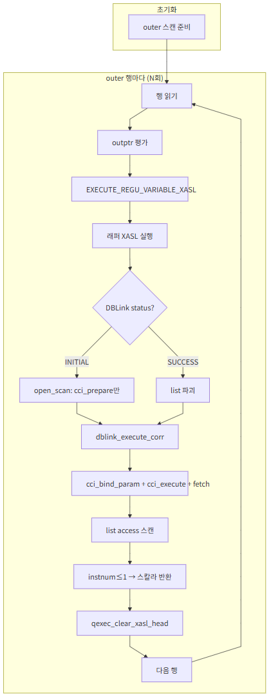

# DBLink Correlated — AS-IS / TO-BE 구조적 한계 및 Worst Case

| 항목 | 내용 |
|------|------|
| 이슈 | CBRD-26601 |
| 기준 문서 | [Design Doc](03_dblink_correlated_Desgin_Doc.md), [소스 분석](01_dblink_correlated_Source_Analysis.md) |
| 목적 | AS-IS·TO-BE 동작 특성, TO-BE worst case, 구조적 한계를 정리하여 설계·운영 시 참고 |

---

## 1. 개요

Correlated 스칼라 서브쿼리 내 DBLink는 **AS-IS**(outer 행마다 N회 전체 fetch 후 로컬 필터)와 **TO-BE**(outer 행마다 원격 execute, WHERE 포함) 두 방식으로 동작할 수 있다.
두 방식 모두 N회 round-trip이지만, AS-IS는 매회 원격 전체를 fetch하고 TO-BE는 매회 매칭 행만 fetch한다.
이 문서는 AS-IS/TO-BE의 동작을 요약하고, **TO-BE worst case**와 **구조적 한계**(결정 시점, cost 기반 선택 불가 등)를 정리한다.

---

## 2. AS-IS 동작 요약

### 2.1 예제 질의 및 dblink로 전달되는 질의

**예제 질의 (사용자 SQL)**

```sql
SELECT l.id, l.name,
       (SELECT r.name
        FROM remote_t@conn r
        WHERE r.id = l.id
        LIMIT 1) AS remote_name
FROM local_t l;
```

**dblink로 전달되는 질의 (conn_sql, AS-IS)**

- Correlation 조건(`r.id = l.id`)은 push-down 되지 않으므로 원격에는 **WHERE 없이** 전달된다.

```sql
/* DBLINK SELECT */ SELECT name, id FROM remote_t r
```

→ 원격에서 위 SQL이 outer 행마다 **N회** 실행되고, 매회 결과 **전체**를 로컬로 가져온다. `r.id = l.id` 및 `LIMIT 1`은 **로컬**에서 `access_pred`·`instnum`으로만 평가된다.

---

## 3. TO-BE 동작 요약

### 3.1 dblink로 전달되는 질의 (TO-BE)

- Correlation 조건(`remote.col = outer.col`)을 **원격에 push**하므로, `conn_sql`에 `WHERE r.id = ?` 가 포함된다.  
  outer 행마다 `?`에 현재 행의 `l.id`를 바인딩하여 실행한다.

**dblink로 전달되는 질의 (conn_sql, TO-BE)**

```sql
/* DBLINK SELECT */ SELECT name, id FROM remote_t r WHERE r.id = ?
```

→ outer 행마다 위 SQL을 **한 번씩** 실행하며, 매 회 `?`에 해당 outer 행의 `l.id`를 넣어 원격에서 조건에 맞는 행만 가져온다. LIMIT 1은 원격에 없고, 로컬에서 `instnum`으로 1건만 사용한다.

### 3.2 실행 흐름 비교

| AS-IS | TO-BE |
|:---:|:---:|
|  |  |

---

## 4. Best Case / Worst Case 비교

### 4.1 정의

- **N**: outer 행 수.
- **M**: AS-IS에서 한 번에 가져오는 원격 행 수(conn_sql 결과 전체).
- **U**: 실제로 outer와 매칭되는 **고유 원격 행 수**(동일 키로 여러 outer가 참조하면 U ≤ N).

### 4.2 AS-IS

| 구분 | Round-trip | 전송 행 수 |
|------|------------|------------|
| 항상 | **N회** (outer 행마다) | N × M |

- **Best case**: M이 작을 때. (원격이 작아 매회 전송량이 적음.)
- **Worst case**: M이 클 때. (원격이 크고 조건이 없어 매회 전체를 가져옴.)

### 4.3 TO-BE

| 구분 | Round-trip | 전송 행 수(상한) |
|------|------------|------------------|
| 항상 | **N회** (고정) | **N × k** (k = 키당 원격 매칭 행 수, k ≤ M) |

- **Best case**: M이 크고, 매칭 비율이 낮을 때 (k ≪ M).
  → AS-IS는 N × M 전송, TO-BE는 N × k만 전송. 전송량 이득이 큼.
- **Worst case**: k ≈ M일 때 (매칭 비율이 높아 WHERE 조건이 선택적이지 않음).
  → AS-IS와 TO-BE 모두 N × M에 가까운 전송량. round-trip은 동일.
  → AS-IS 대비 TO-BE가 나빠지는 경우는 없음 (round-trip 동일, 전송량은 같거나 적음).

### 4.4 수치 예시 (Worst Case)

- **가정**: outer 10,000행, 원격 10행, correlation 키가 10개 값만 가짐(예: 10개 상품 코드).
  → 각 원격 행은 평균 1,000개 outer 행에서 참조됨.

| 방식 | Round-trip | 전송 행 수 |
|------|------------|------------|
| AS-IS | **10,000회** | **100,000** (10행짜리 원격을 매회 전체 fetch) |
| TO-BE | 10,000회 | **10,000** (같은 10행을 각 outer 행마다 1건씩 받음) |

→ round-trip은 동일하지만, **전송 행 수는 AS-IS가 TO-BE보다 10배** 많다. correlated 서브쿼리에서는 AS-IS가 이미 N회 실행이므로 TO-BE worst case가 AS-IS보다 나빠지는 경우는 없다.

---

## 5. TO-BE Worst Case의 원인

### 5.1 실행 모델에 따른 필연성

- AS-IS/TO-BE 모두 **”outer 행마다 한 번씩 원격 실행”**으로 동작함.
- 각 실행은 **현재 outer 행의 키 하나**만 처리하므로, **다른 outer 행이 같은 키를 가져도** 별도 round-trip이 발생함.
- 따라서 **”같은 원격 행을 여러 outer가 참조”**하는 구조에서는, **참조 횟수(outer 행 수)만큼** round-trip이 발생함. 다만 TO-BE는 WHERE 조건으로 매칭 행만 가져오므로 매회 전송량은 AS-IS보다 적음.

### 5.2 AS-IS와의 근본 차이

- AS-IS: outer 행마다 원격에 질의하고, 매회 **원격 전체 행**을 가져와 **로컬에서만** predicate으로 필터. 결과를 재사용하지 않음.
- TO-BE: outer 행마다 **원격에 질의**하되, `WHERE col = ?`로 매칭 행만 가져옴. 결과를 **캐시·공유하지 않음** (현재 설계상).

→ round-trip 횟수는 AS-IS/TO-BE 모두 N회로 동일하다. 차이는 **매회 전송량** — AS-IS는 M행, TO-BE는 k행(k ≤ M).

### 5.3 요약

| 구조적 요인 | 설명 |
|-------------|------|
| 행 단위 재실행 | AS-IS/TO-BE 모두 outer N회 → 원격 execute N회 고정. |
| 결과 미공유 | 같은 correlation 키에 대해 원격 결과를 재사용하지 않고 매번 실행·전송. |
| AS-IS 전송량 | WHERE 없이 매회 M행 전체 전송 → 총 N × M. |
| TO-BE 전송량 | WHERE 포함해 매회 k행(k ≤ M)만 전송 → 총 N × k. LIMIT 원격 push 불가로 k > 1일 수 있어 로컬에서 instnum으로 1건 선택. |

---

## 6. 기존 코드 제약: LIMIT·집계 push-down 불가와 TO-BE 한계

TO-BE의 한계(행마다 round-trip, 원격에서 “매칭 행 전체”가 아닌 “1건만” 걸러내지 못함, 집계를 원격에서 처리할 수 없음)는 **기존 파서/뷰 변환 코드**에서 LIMIT·집계를 원격(conn_sql)으로 push하지 못하도록 막고 있기 때문에 발생한다. 아래는 코드베이스 기준으로 그 제약과 위치를 정리한 것이다.

### 6.1 LIMIT → inst_num() 변환 및 push-down 차단

- **LIMIT 절**은 의미 분석 단계에서 **inst_num() 조건**으로 바뀐다.
  - `src/parser/type_checking.c` — `pt_limit_to_numbering_expr()`를 호출해 SELECT의 `node->info.query.limit`을 **WHERE 절**에 `inst_num() <= n` 형태로 붙인다.
  - 따라서 view transform / push-down 단계에서는 이미 **LIMIT 노드가 없고**, predicate 안에 **PT_INST_NUM** 노드만 존재한다.

- **Push-down 가능 여부**는 `pt_find_only_name_id()`에서 predicate을 순회하며 판단한다.
  - `src/parser/view_transform.c` — `PT_EXPR` case에서 `node->info.expr.op == PT_INST_NUM`(또는 `PT_ROWNUM`, `PT_ORDERBY_NUM`)이면 **`infop->out.others_found = true`** 로 설정한다.
  - Push 가능 조건은 `PT_PUSHABLE_TERM(infop)` ≡ `pushable && found && !others_found` 이므로, **inst_num()이 포함된 term은 push 불가**가 된다.

- **결과**: conn_sql에는 **LIMIT n**을 넣을 수 없다. AS-IS는 “전체 fetch 후 로컬에서 instnum 평가”, TO-BE는 “행마다 원격 실행한 결과를 로컬에서 instnum으로 1건만 사용”하는 구조만 가능하다.
  → TO-BE에서도 **원격에는 LIMIT 1이 없어**, 키 하나에 대해 원격이 여러 행을 보낼 수 있고, 로컬에서만 “1행만 사용”하게 된다.

### 6.2 집계 함수와 correlation push-down 차단

- **Push-down 대상**은 outer WHERE에서 CNF로 쪼개진 **term_list**뿐이다.
  - `pt_copypush_terms()` (`src/parser/view_transform.c`)는 이 `term_list`를 derived subquery(PT_SELECT case) 또는 dblink(PT_DBLINK_TABLE case)의 WHERE로 복사·추가한다.
  - SELECT 절의 **집계 함수**(COUNT, MIN, MAX 등)는 `term_list`에 포함되지 않으므로, **원격으로 “집계만 수행하라”는 식의 push 경로가 없다.**

- **Correlated term**을 push할 때는 **집계·DBLink 여부**로 추가 차단한다.
  - `pt_check_pushable_term()` (`src/parser/view_transform.c`):
    - 서브쿼리 안에 **집계가 있으면** (`pt_has_aggregate(parser, infop->in.subquery)`) **`is_correlated_with_agg = true`**.
      주석: “correlated term을 집계 있는 서브쿼리로 push하면 group_by가 반복 수행되어 성능 저하 가능 → copypush 수행 안 함.”
    - derived가 **PT_DBLINK_TABLE**이면 **`is_correlated_with_dblink = true`**.
      주석: “correlated term을 dblink 서브쿼리로 push하면 원격으로 넘어가는데, 원격이 correlation을 처리할 수 없어 에러 가능 → push 안 함.”
      단, `mq_rewrite_dblink_as_subquery`가 먼저 실행되어 derived_table이 `PT_SELECT`로 변환된 이후에는 이 guard가 동작하지 않는다.
      실제로는 `mq_copypush_sargable_terms_helper`(`query_rewrite_select.c`)가 correlated term을 push하고 correlation_level을 0→2로 변경 → `XASL_ZERO_CORR_LEVEL` 미설정 → N회 실행으로 이어진다.
  - 반환값은 `PT_PUSHABLE_TERM(infop) && !is_correlated_with_agg && !is_correlated_with_dblink` 이므로, **집계가 있는 경우 correlation 조건이 기존 copypush 경로로 push되지 않는다.**
  - (CBRD-26601 TO-BE는 이 “correlation을 원격으로” 넘기는 부분만 별도 경로로 구현한 것이고, **집계를 원격으로 넘기는 것은 여전히 해당 경로에 없다.)**

- **결과**: **집계 함수**는 원격 SQL(conn_sql)로 push되지 않는다.
  → TO-BE도 “원격에서 집계 1건만 계산해서 보내라”는 형태가 아니며, **스칼라/집계에 대한 기존 코드 제약**이 TO-BE의 최적화 한계(행 단위 실행, 로컬에서만 instnum/집계 평가)로 그대로 이어진다.

### 6.3 요약

| 제약 | 코드 위치 | TO-BE에 미치는 영향 |
|------|-----------|---------------------|
| LIMIT → inst_num() 변환 | `type_checking.c` — `pt_limit_to_numbering_expr()` | push 시점에 LIMIT 노드 없음, inst_num만 존재. |
| inst_num() 포함 term push 불가 | `view_transform.c` — `pt_find_only_name_id()` | conn_sql에 LIMIT 추가 불가 → 행마다 원격이 여러 행 보낼 수 있음, 로컬에서만 1건 사용. |
| 집계 시 correlation push 불가 | `view_transform.c` — `pt_check_pushable_term()` | 집계 있는 서브쿼리로 correlation push 안 함. |
| DBLink correlated push (실제 동작) | `query_rewrite_select.c` L112 — `mq_copypush_sargable_terms_helper()` | `mq_rewrite_dblink_as_subquery` 이후 guard가 무효화되어 실제로는 correlated term이 push됨 → DBLink XASL correlation_level=2 → `XASL_ZERO_CORR_LEVEL` 미설정 → N회 실행. |
| SELECT 절 집계는 term_list 외부 | `view_transform.c` — `pt_copypush_terms()` | SELECT 절 집계는 push 대상 아님 → 원격에 “집계만” 넣을 수 없음. |

→ **스칼라 함수·집계 함수·LIMIT에 대한 기존 코드의 제약** 때문에, TO-BE도 **원격에서는 “조건(WHERE)만” 추가**할 수 있고, **LIMIT/집계는 로컬에서만** 처리되는 구조적 한계를 가진다.

---

## 7. 결정 시점의 구조적 제약

### 7.1 AS-IS vs TO-BE가 정해지는 시점

- **View transform 단계** (`mq_rewrite_dblink_as_subquery`, `detect_corr_key`, `pt_to_dblink_table_spec_list` 등)에서  
  correlation push-down 적용 여부가 결정됨.
- 그 시점에는 **아직 plan이 완성되지 않았고**, **optimizer의 카디널리티·cost 정보가 반영된 상태가 아님**.

### 7.2 Plan 시점에서는 이미 확정

- Plan(XASL)을 만들 때는 **이미 “TO-BE로 갈지 / AS-IS로 갈지”가 정해진 뒤**라서,  
  “plan을 보고 cost로 AS-IS vs TO-BE를 고른다”는 식의 **후보 비교가 구조상 불가**.
- 즉, **cost 기반 선택**을 하려면  
  - view transform 단계에서 **추정만으로** 결정하거나,  
  - **결정 시점을 optimizer로 옮기고** “한 번에 가져오기 vs 행마다 가져오기”를 plan 후보로 두는 등 **구조 변경**이 필요함.

### 7.3 정리

| 제약 | 내용 |
|------|------|
| 결정 시점 | View transform (parse tree 단계). |
| Plan과의 관계 | Plan은 이미 선택된 방식(AS-IS 또는 TO-BE)으로만 생성됨. |
| Cost 기반 선택 | 현재 구조로는 plan 시점의 cost로 두 방식을 비교할 수 없음. |

---

## 8. 완화 방안

구조적 한계를 완화하기 위한 방향만 정리한다. 구현 여부는 별도 결정.

| 방안 | 설명 |
|------|------|
| **힌트/세션 변수** | 사용자가 AS-IS/TO-BE 중 선택. (`use_dblink_corr_pushdown=no` 시 AS-IS 유지 — N회 실행, conn_sql에 WHERE 없음) |
| **이전 행 키 비교** | outer 행 처리 전 직전 행의 corr key와 비교하여 같으면 원격 재실행 스킵. 연속 중복 키(index scan 시 자연 형성)에서 round-trip 절약. |
| **LIMIT append to conn_sql** | corr push-down 적용 시 `conn_sql`에 `LIMIT n`도 함께 append. outer 행당 원격 전송량을 최대 1행으로 제한. 로컬 `instnum_pred`는 safety net으로 유지. round-trip 수(N회)는 변화 없음. |

---

## 9. 문서 참조

- [Design Doc](03_dblink_correlated_Desgin_Doc.md) — TO-BE 설계 및 실행 흐름.
- [소스 분석](01_dblink_correlated_Source_Analysis.md) — AS-IS 실행 경로 및 코드 위치.
- [PRD](02_dblink_correlated_PRD.md) — 요구사항.

---

## 10. 문서 이력

| 일자 | 내용 |
|------|------|
| 2026-03-16 | 초안 작성 (AS-IS/TO-BE 특성, worst case, 구조적 한계, 결정 시점 제약, 완화 방안). |
