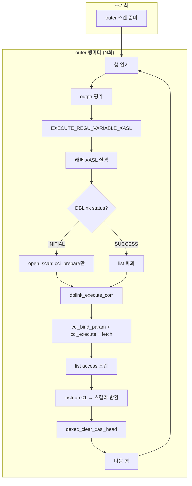

# DBLink Correlated 서브쿼리 최적화 — Design Doc

| 항목 | 내용 |
|------|------|
| 이슈 | CBRD-26601 |
| 기준 문서 | [PRD](dblink_correlated_optimization_prd.md), [소스 분석](dblink_correlated_source_analysis.md) |
| 기준 브랜치 | develop |
| 대상 | SELECT 절 correlated 스칼라 서브쿼리 안의 DBLink (1차) |

---

## 1. 개요

이 문서는 PRD의 FR-1 ~ FR-8, FR-9 및 NFR-1 ~ NFR-3을 구현하기 위한 레이어별 설계를 기술한다.
AS-IS 코드 분석은 `dblink_correlated_source_analysis.md` 를 참고한다.

### 1.1 핵심 설계 원칙

- **보수적 탐지**: 탐지 불확실 시 기존 방식(1회 전체 fetch) 유지.
- **기존 경로 최소 변경**: rewrite 흐름은 그대로 유지, push-down 대상에만 추가 처리.
- **단일 등치 한정**: `remote.col = outer.col` 패턴만 허용 (1차).

### 1.2 변경 대상 레이어 요약

| 레이어 | 파일 | 변경 내용 |
|--------|------|-----------|
| 탐지 | `view_transform.c` | `mq_rewrite_dblink_as_subquery` 내 corr 조건 탐지 |
| XASL 생성 | `xasl_generation.c` | `pt_to_dblink_table_spec_list`에서 `corr_key_regu_list` 채우기 |
| XASL 생성 | `xasl_generation.c` | `pt_to_subquery_table_spec_list`에서 push-down 조건 제거 |
| 데이터 구조 | `xasl.h`, `dblink_scan.h` | corr_key 필드 추가 |
| 런타임 | `dblink_scan.c` | open = prepare만; re-execute 함수 |
| 런타임 | `query_executor.c` | aptr 루프에서 corr DBLink 재실행 |
| 직렬화 | `xasl_to_stream.c`, `stream_to_xasl.c` | 신규 필드 pack/unpack |

---

## 2. 변경 데이터 구조

### 2.1 `dblink_spec_node` (`src/query/xasl.h`)

```c
/* AS-IS */
struct dblink_spec_node {
  REGU_VARIABLE_LIST dblink_regu_list_pred;
  REGU_VARIABLE_LIST dblink_regu_list_rest;
  int    host_var_count;
  int   *host_var_index;
  char  *conn_url;
  char  *conn_user;
  char  *conn_password;
  char  *conn_sql;
};

/* TO-BE: 추가 필드 */
struct dblink_spec_node {
  /* ... 기존 필드 유지 ... */
  int                 corr_key_count;      /* correlation 키 수 (0 = push-down 없음) */
  REGU_VARIABLE_LIST  corr_key_regu_list;  /* outer val_list 슬롯을 가리키는 TYPE_CONSTANT regu list */
};
```

### 2.2 `DBLINK_SCAN_INFO` (`src/query/dblink_scan.h`)

```c
/* AS-IS */
struct dblink_scan_info {
  int   conn_handle;
  int   stmt_handle;
  int   col_cnt;
  char  cursor;
  void *col_info;
};

/* TO-BE: 추가 필드 */
struct dblink_scan_info {
  /* ... 기존 필드 유지 ... */
  int                 corr_key_count;      /* dblink_spec_node에서 복사 */
  REGU_VARIABLE_LIST  corr_key_regu_list;  /* dblink_spec_node에서 복사 */
};
```

> `corr_key_regu_list` 의 각 regu는 `TYPE_CONSTANT` 타입으로 outer XASL의 `val_list` 슬롯을 가리킨다.
> 런타임에서 `vd`(value descriptor)를 통해 현재 outer 행의 값을 읽는다.

---

## 3. 레이어별 설계

### 3.1 Layer 1 — 탐지 (`view_transform.c`)

**진입점**: `mq_rewrite_dblink_as_subquery()` (develop:6607)

#### 처리 흐름

```
mq_rewrite_dblink_as_subquery()
  ├─ spec->derived_table_type == PT_DERIVED_DBLINK_TABLE 확인
  ├─ [신규] detect_corr_key(parser, spec, subquery_where)
  │    ├─ WHERE 절 순회: remote.col = outer.col 단일 등치 탐지
  │    ├─ PT_HOST_VAR 포함 시 → 실패 반환 (기존 방식)
  │    ├─ OR 조건 포함 시 → 실패 반환 (기존 방식)
  │    ├─ 성공 시 PT_DBLINK_INFO.corr_key_remote_col, corr_key_outer_ref 기록
  │    └─ 성공 시 (초기안) view_transform 단계에서 conn_sql에 "WHERE remote.col = ?" (또는 "AND remote.col = ?") append
  │         또는 XASL 생성 단계(pt_to_dblink_table_spec_list)에서 PT_DBLINK_INFO 기반으로 conn_sql을 구성하도록 조정 가능 (5.4 참고)
  └─ rewrite는 기존과 동일하게 진행 (PT_IS_SUBQUERY로 변환)
```

#### 탐지 조건 (`detect_corr_key`)

| 조건 | 결과 |
|------|------|
| `PT_EQ` 노드, 한 쪽 = DBLink 컬럼, 반대쪽 = outer col ref | 탐지 성공 |
| `PT_HOST_VAR` 포함 | 탐지 실패 |
| `PT_OR` 포함 | 탐지 실패 |
| 등치가 아닌 비교 (`PT_GT`, `PT_LT` 등) | 탐지 실패 |
| 기타 불확실 케이스 | 탐지 실패 (기존 방식 유지) |

#### outer ref 판별 방법

outer ref는 `TYPE_CONSTANT` regu (outer val_list 슬롯)로 나타난다.
`correlation_level == 1`인 컬럼 참조가 해당 슬롯을 가리킨다.

#### conn_sql append 규칙

```
기존: "/* DBLINK SELECT */ SELECT name, id FROM remote_t r"
추가: "WHERE r.id = ?"  (또는 기존 WHERE 있으면 " AND r.id = ?")
```

> **확인 포인트**: `conn_sql`에 기존 WHERE 절이 있는지 판별하는 방법 — `pdblink->qstr` 또는 `pdblink->rewritten`에서 `WHERE` 키워드 유무 확인 필요.

---

### 3.2 Layer 2a — XASL 생성: corr_key_regu_list 채우기 (`xasl_generation.c`)

**진입점**: `pt_to_dblink_table_spec_list()` (develop:12993)

`mq_rewrite_dblink_as_subquery`가 PT_IS_SUBQUERY 래퍼로 감싼 뒤에도, 이상적인 흐름은 래퍼 안의 `PT_DERIVED_DBLINK_TABLE` spec이 `pt_to_dblink_table_spec_list`를 통해 처리되는 것이다. (실제 접근 가능 여부는 C-1 확인 후, 불가 시 where 재탐지로 fallback.)

```
pt_to_dblink_table_spec_list()
  ├─ [기존] conn_sql, conn_url 등 dblink_spec_node 생성
  ├─ [신규] PT_DBLINK_INFO.corr_key_count > 0 && host_var_count == 0 이면:
  │    ├─ dblink_node->corr_key_count = PT_DBLINK_INFO.corr_key_count
  │    └─ dblink_node->corr_key_regu_list 생성:
  │         └─ corr_key_outer_ref (PT_NODE) → pt_to_regu_variable() → TYPE_CONSTANT regu
  │              (outer val_list 슬롯을 가리키는 regu — access_pred 생성과 동일 방식)
  └─ [기존] access spec 반환
```

#### corr_key_regu 생성 방식

`access_pred`에서 `a.id` 쪽 regu를 만드는 기존 `pt_to_pred_expr` 경로와 동일하게 `TYPE_CONSTANT` regu를 생성한다.
단, pred 빌드 전 `parser->symbols->current_class = NULL` 설정이 필요 — `pt_to_subquery_table_spec_list`에서 이미 설정하는 패턴 참고.

---

### 3.3 Layer 2b — XASL 생성: access_pred 제거 (`xasl_generation.c`)

**진입점**: `pt_to_subquery_table_spec_list()` (develop:12772)

push-down된 조건이 list access spec의 `access_pred`에 이중으로 남지 않도록, `where_part`에서 push-down된 조건을 제외하고 PRED_EXPR를 생성한다.

```
pt_to_subquery_table_spec_list()
  ├─ subquery 노드에서 원본 PT_DBLINK_INFO 접근 가능 여부 확인
  ├─ [신규] corr_key_count > 0 이면 where_part에서 해당 PT_EQ 노드 제거
  │    └─ 제거 후 나머지 where로 pt_to_pred_expr 호출
  └─ [기존] pt_make_list_access_spec(...)
```

> **확인 포인트**: `pt_to_subquery_table_spec_list`의 `subquery` 인자에서 원래 PT_DBLINK_INFO에 접근하는 경로. 래퍼 SELECT → FROM spec → derived_table(원본 dblink PT_NODE) 참조 체인 확인 필요.
> 접근 불가 시 대안: `where_part`에서 직접 corr 패턴 탐지 후 제거 (재탐지).

---

### 3.4 Layer 3 — 런타임 open (`dblink_scan.c`)

**진입점**: `dblink_open_scan()` (develop:686)

```c
/* AS-IS */
dblink_open_scan():
  cci_prepare(sql)  // sql = "SELECT * FROM remote_t"
  cci_bind_param(host_vars)
  cci_execute()
  fetch_all → list

/* TO-BE */
dblink_open_scan():
  cci_prepare(sql)  // sql = "SELECT * FROM remote_t WHERE id = ?"
  scan_info->corr_key_count = spec->corr_key_count
  scan_info->corr_key_regu_list = spec->corr_key_regu_list
  if (corr_key_count > 0):
    return  // execute는 aptr 루프에서 처리
  // 기존: bind host_vars + execute + fetch
```

> `cci_prepare` 결과(`stmt_handle`)는 `scan_info->stmt_handle`에 유지된다.
> 이후 재실행 시 이 핸들을 재사용한다.

---

### 3.5 Layer 4 — 런타임 re-execute (`query_executor.c`)

**진입점**: `qexec_execute_mainblock_internal()` aptr 처리 루프 (develop:15292)

```c
/* AS-IS aptr 루프 */
for (aptr = xasl->aptr_list; aptr; aptr = aptr->next) {
  if (IS_XASL_INITIAL_STATUS(aptr->status)) {
    qexec_execute_mainblock(aptr, vd);  // 1회만 실행
  }
  // XASL_SUCCESS면 skip
}

/* TO-BE */
for (aptr = xasl->aptr_list; aptr; aptr = aptr->next) {
  if (IS_XASL_INITIAL_STATUS(aptr->status)) {
    if (aptr->spec_list && aptr->spec_list->type == TARGET_CLASS_ATTR
        && /* dblink spec */ && spec->s.dblink_node.corr_key_count > 0) {
      // corr DBLink: prepare는 완료됨 (open 시), execute만 수행
      dblink_execute_corr(thread_p, aptr, vd);
    } else {
      qexec_execute_mainblock(aptr, vd);  // 기존 경로
    }
  } else if (aptr->status == XASL_SUCCESS
             && /* corr DBLink 여부 */ ) {
    // XASL_SUCCESS 상태에서도 재실행 필요
    qfile_destroy_list(aptr->list_id);  // 기존 리스트 파괴
    dblink_execute_corr(thread_p, aptr, vd);
  }
}
```

#### `dblink_execute_corr()` 신규 함수

```c
/* src/query/dblink_scan.c 또는 query_executor.c */
int dblink_execute_corr(THREAD_ENTRY *thread_p, XASL_NODE *dblink_xasl, VAL_DESCR *vd)
{
  DBLINK_SCAN_INFO *scan_info = ...;

  // NULL 체크 (FR-6)
  if (any corr_key_regu value is NULL):
    return NO_ERROR;  // 빈 list → NULL 스칼라 반환

  // bind + execute
  for each corr_key_regu:
    val = fetch from regu via vd
    cci_bind_param(stmt_handle, i+1, val)
  cci_execute(stmt_handle)

  // fetch → list 재적재
  fetch_to_list(dblink_xasl->list_id)

  dblink_xasl->status = XASL_SUCCESS;
  return NO_ERROR;

error:
  er_set(...);
  return ER_FAILED;
}
```

#### aptr 판별 방법

aptr XASL가 corr DBLink인지 판별:

```c
aptr->spec_list != NULL
&& aptr->spec_list->s.dblink_node.corr_key_count > 0
```

---

### 3.6 TO-BE 전체 실행 흐름

**전체 흐름 다이어그램 (TO-BE)**  
AS-IS와 동일한 단계 구조. 차이: **첫 행**에서 aptr 시 `dblink_open_scan`은 prepare만 하고, **매 행**마다 `dblink_execute_corr`(bind+execute+fetch) 호출.

> **실행 순서**: prepare는 루프 밖이 아니라 **첫 outer 행** 처리 시 래퍼 실행 → aptr 처리에서 `dblink_open_scan`(prepare만) 호출되는 시점에 1회 수행됨. 이후 매 행은 `dblink_execute_corr`만 호출.



**텍스트 형식 상세**

```
[초기화]
  outer 스캔 준비: scan_open_scan(local_t)

[outer 행마다 반복]
  local_t 행 읽기 → val_list: [a.id=INTEGER, a.name=VARCHAR]

  [outptr 평가]
  fetch_peek_dbval(TYPE_CONSTANT[xasl:0x40269c00])
    └─ EXECUTE_REGU_VARIABLE_XASL(0x40269c00)
         └─ IS_XASL_INITIAL_STATUS(0x40269c00) = true (매번 clear됨)
         └─ qexec_execute_mainblock(0x40269c00)
              ├─ aptr 루프: DBLink(0x40249d60) 처리
              │    ├─ [첫 행] INITIAL → dblink_open_scan(cci_prepare만) 후 dblink_execute_corr(a.id=1)
              │    │         → cci_bind_param(1=1) + cci_execute → fetch → list
              │    └─ [2번째+] SUCCESS → list 파괴 → dblink_execute_corr(a.id=2)
              │              → cci_bind_param(1=2) + cci_execute → fetch → list
              └─ list access: 0x40249d60->list_id 스캔
                   ├─ access_pred: (push-down 조건 제거됨, 나머지만)
                   ├─ instnum: inst_num() <= 1
                   └─ → single_tuple → 스칼라 반환

  [다음 outer 행 준비]
  qexec_clear_xasl_head(0x40269c00)
    └─ list_id 파괴 + status = XASL_CLEARED
       ※ DBLink(0x40249d60)는 별도로 list 파괴 후 재실행 처리 (aptr 루프에서)
```

---

### 3.7 Layer 5 — 세션 파라미터 (`view_transform.c`)

**FR-9**: `use_dblink_corr_pushdown` 세션 파라미터로 push-down 적용 여부를 제어한다. 기본값 `yes`.

#### 구현 위치

`mq_rewrite_dblink_as_subquery()` 내 `detect_corr_key()` 호출 직전에 파라미터를 확인한다.

```c
/* mq_rewrite_dblink_as_subquery() */
if (!prm_get_bool_value (PRM_ID_USE_DBLINK_CORR_PUSHDOWN)) {
  /* push-down OFF: 탐지 스킵, 기존 rewrite만 수행 */
  goto do_rewrite;
}
/* push-down ON: detect_corr_key() 호출 */
detect_corr_key(parser, spec, subquery_where);

do_rewrite:
  /* 기존 PT_IS_SUBQUERY rewrite */
```

#### 파라미터 등록

| 항목 | 내용 |
|------|------|
| 파라미터 ID | `PRM_ID_USE_DBLINK_CORR_PUSHDOWN` |
| 타입 | `bool` |
| 기본값 | `true` (ON) |
| 등록 위치 | `src/base/system_parameter.c` (파라미터 테이블), `src/base/system_parameter.h` (enum) |
| 세션 파라미터 | `SET SYSTEM PARAMETERS 'use_dblink_corr_pushdown=no'` 로 런타임 변경 가능 |

#### 향후 하드코드 전환

push-down을 항상 ON으로 확정할 경우 이 if 블록만 제거하면 된다. 파라미터 등록 코드 및 `PRM_ID` enum 항목도 함께 제거.

---

### 3.8 이전 행 키 비교 최적화 (Phase 2)

outer 행 중 correlated 키 값이 연속으로 중복되는 경우, 원격 재실행을 스킵하여 RTT 오버헤드를 줄이는 최적화다. full 결과 캐시 대비 구현이 단순하고 메모리 부담이 없다.

#### 적용 조건

로컬 테이블의 조인 키에 인덱스가 있으면 optimizer가 index scan을 선택할 가능성이 높고, 그 경우 outer 행이 키 순으로 정렬되어 연속 중복이 자연스럽게 형성된다.

#### 구현 스케치

```c
/* DBLINK_SCAN_INFO에 추가 */
DB_VALUE prev_corr_key;   /* 이전 outer 행의 corr key 값 */
bool     prev_key_valid;  /* 첫 행 여부 */
```

```c
/* dblink_execute_corr() 진입 시 */
if (prev_key_valid && db_value_compare(curr_key, &prev_corr_key) == 0) {
  /* 같은 키 → 원격 재실행 없이 list cursor만 되감기 */
  dblink_scan_reset(scan_info);
  return NO_ERROR;
}
/* 다른 키 → 기존대로 bind + execute + fetch */
prev_corr_key = curr_key;
prev_key_valid = true;
```

#### 한계

| outer 행 순서 | 효과 |
|---|---|
| `[1, 1, 1, 2, 2]` (연속 중복) | 모든 중복에서 skip |
| `[1, 2, 1, 2, 1]` (교차) | skip 없음 |

heap scan(sequential) 시 키 순서 보장이 없으므로 이점이 없을 수 있다. index scan으로 유도되는 케이스에서 효과가 크다.

> Phase 1 기본 구현(T3-1~T3-3) 완료 후 추가 최적화로 적용한다. (Tasks: T3-4)

---

### 3.9 추가 개선 고려 사항

#### LIMIT append to conn_sql

corr push-down 적용 시 `conn_sql`에 `LIMIT n`도 함께 append하면 outer 행당 원격 전송량을 최대 1행으로 줄일 수 있다. 로컬 `instnum_pred`는 그대로 유지(safety net).

- **효과**: 전송 행 수 N × k → N × 1 (k = 키당 원격 매칭 수)
- **round-trip(N회)은 변화 없음** — §3.8 이전 행 키 비교와 상호 보완적
- **구현 진입점**: T1-2 conn_sql 구성 시점에 서브쿼리의 `instnum_val`에서 LIMIT 값 추출 후 append
- 현재 작업 범위 밖. corr push-down 안정화 후 검토.

---

## 4. 직렬화 (`xasl_to_stream.c` / `stream_to_xasl.c`)

### 4.1 변경 위치

`dblink_spec_node` 직렬화 기존 코드에 추가 필드 pack/unpack 추가.

```c
/* xasl_to_stream.c — dblink_spec_node pack */
// 기존 필드 pack 이후
or_pack_int(ptr, node->corr_key_count);
if (node->corr_key_count > 0) {
  // corr_key_regu_list pack (REGU_VARIABLE_LIST 직렬화)
  pack_regu_variable_list(ptr, node->corr_key_regu_list);
}

/* stream_to_xasl.c — dblink_spec_node unpack */
ptr = or_unpack_int(ptr, &node->corr_key_count);
if (node->corr_key_count > 0) {
  ptr = unpack_regu_variable_list(ptr, &node->corr_key_regu_list);
}
```

### 4.2 REGU_VARIABLE_LIST 직렬화 참고

기존 `dblink_regu_list_pred` / `dblink_regu_list_rest` pack/unpack 패턴을 그대로 따른다.

---

## 5. 설계 결정 근거

### 5.1 rewrite 유지 방식 선택

| 옵션 | 내용 | 선택 이유 |
|------|------|-----------|
| **A — rewrite 스킵** | corr 탐지 성공 시 PT_DERIVED_DBLINK_TABLE 유지, pt_to_dblink_table_spec_list 경로 | 래퍼 구조 변경 필요, scan open/close 사이클 변화 예측 어려움 |
| **B — rewrite 유지** | 기존 PT_IS_SUBQUERY 변환 그대로, aptr DBLink의 dblink_spec_node에 corr_key 추가 | **변경 범위 최소화**, 기존 aptr/dptr 배치 유지, scan 사이클 동일 |

→ **옵션 B 채택**: 기존 실행 경로를 최대한 보존하면서 aptr 루프에서만 재실행 로직 추가.

### 5.2 prepare 1회 유지

`dblink_open_scan`에서 corr_key 있으면 prepare만 수행 → `stmt_handle` 유지.
aptr 루프에서 재실행 시 `stmt_handle`로 bind + execute.
→ N회 outer 행에 대해 prepare 1회, execute N회.

> **확인 포인트**: 래퍼(`0x40269c00`) 재실행 시 `scan_close_scan`/`scan_open_scan`이 DBLink spec에 대해 호출되는지 확인 필요. 호출된다면 `stmt_handle`이 닫힐 수 있으므로 re-prepare 또는 handle 보존 방식 검토.

### 5.3 NULL 처리

corr_key 값이 NULL이면 `cci_execute` 없이 빈 list → 스칼라 NULL 반환.
로컬 조인에서 `NULL = NULL`이 FALSE인 것과 동일한 의미.

---

## 6. 미결 사항 / 구현 시 확인 포인트

| ID | 항목 | 확인 방법 |
|----|------|-----------|
| C-1 | `pt_to_subquery_table_spec_list`에서 원본 PT_DBLINK_INFO 접근 경로 | gdb: subquery 인자 → info.query.from → spec → derived_table 체인 추적 |
| C-2 | 래퍼 재실행 시 DBLink spec에 `scan_close_scan`/`scan_open_scan` 호출 여부 | gdb: `scan_open_scan(S_DBLINK_SCAN)` breakpoint, 2번째 outer 행 평가 시 히트 여부 |
| C-3 | `conn_sql`에 기존 WHERE 절 존재 여부 판별 | gdb: `pdblink->qstr` 또는 원본 SQL 문자열 확인 |
| C-4 | aptr DBLink 판별 조건 (`spec_list->type` 등) 정확한 필드명 | `xasl.h` ACCESS_SPEC_TYPE 값 확인 |
| C-5 | `REGU_VARIABLE_LIST` pack/unpack 기존 함수명 | `xasl_to_stream.c`에서 `dblink_regu_list_pred` pack 코드 참고 |

---

## 7. 참고 문서

- [dblink_correlated_optimization_prd.md](dblink_correlated_optimization_prd.md) — 요구사항
- [dblink_correlated_source_analysis.md](dblink_correlated_source_analysis.md) — AS-IS 소스 분석
- [dblink_correlated_as_is_to_be_limits.md](dblink_correlated_as_is_to_be_limits.md) — AS-IS/TO-BE 구조적 한계 및 worst case

---

## 8. 문서 이력

| 일자 | 내용 |
|------|------|
| 2026-03-13 | 초안 작성 |
| 2026-03-16 | FR-9 세션 파라미터 설계 추가 (§3.7) |
| 2026-03-16 | 이전 행 키 비교 최적화 추가 (§3.8, Phase 2) |
