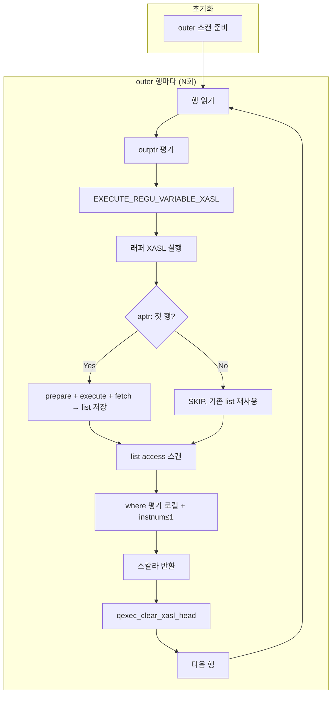
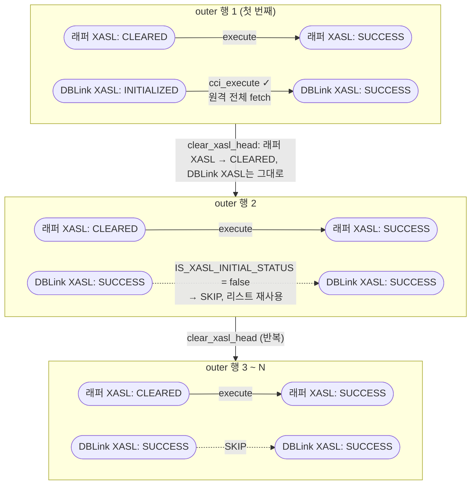

# DBLink Correlated 서브쿼리 소스 분석

| 항목 | 내용 |
|------|------|
| 대상 | `SELECT (SELECT col FROM remote_t@conn WHERE remote_t.id = l.id LIMIT 1) FROM local_t l` 형태의 **correlated 스칼라 서브쿼리** |
| 목적 | 서브쿼리 내 dblink에서 **correlation(outer ref)** 이 어떻게 처리되는지 코드 경로 정리 |

---

## 목차

1. [개요](#1-개요)
2. [전체 처리 흐름 (SQL → 결과)](#2-전체-처리-흐름-sql--결과)
3. [XASL 구조 (실제 덤프 기준)](#3-xasl-구조-실제-덤프-기준)
4. [파서·뷰 변환](#4-파서뷰-변환)
5. [XASL 생성](#5-xasl-생성)
6. [실행 경로 상세](#6-실행-경로-상세)
7. [Push-Down 불가 분석](#7-push-down-불가-분석)
8. [주요 코드 위치](#8-주요-코드-위치)
9. [한계 및 개선 방향](#9-한계-및-개선-방향)
10. [실용 예제 (스키마·문제 SQL)](#10-실용-예제-스키마문제-sql)

---

## 1. 개요

- **패턴**: 외부 쿼리의 행마다, 원격 테이블에서 "현재 outer 행과 맞는" 값 하나를 스칼라로 가져오는 형태.
- **현재 동작 (AS-IS)**:
  1. 원격에서 `SELECT name, id FROM remote_t` **1회** 전체 실행 → 결과 전체를 로컬 리스트에 저장.
  2. outer 각 행마다, 해당 리스트를 다시 스캔하면서 **로컬에서** `remote_t.id = l.id` 및 `inst_num() <= 1` 필터 적용.
- **한계**: 원격 테이블이 크면 **1회 전체 전송** 후 대부분 버리므로, 전송량·로컬 연산 모두 낭비.

---

## 2. 전체 처리 흐름 (SQL → 결과)

아래는 `SELECT (SELECT col FROM remote_t@conn WHERE remote_t.id = l.id LIMIT 1) FROM local_t l` 형태의 쿼리가 결과를 반환하기까지 거치는 **전체 단계**를 코드 기준으로 정리한 것이다.

```
SQL 문자열
  │
  ▼ [1] 파싱 (Lexing + Parsing)
  PT_NODE 트리 (parse tree)
  │
  ▼ [2] DBLink 구문 변환 (pt_rewrite_for_dblink)
  PT_NODE 트리 (@conn 표기 → DBLINK() 함수 형태)
  │
  ▼ [3] 의미 분석 (pt_compile → pt_semantic_check)
  이름 해석·타입 체크 완료 PT_NODE 트리
  │
  ▼ [4] 뷰·DBLink 재작성 (mq_translate → mq_rewrite_dblink_as_subquery)
  DBLINK() derived table → PT_IS_SUBQUERY 래퍼
  correlation_level 할당, push-down 시도(pt_copypush_terms)
  │
  ▼ [5] 쿼리 최적화 (qo_optimize_query)
  조인 순서·인덱스 선택 → QO_PLAN
  │
  ▼ [6] XASL 생성 (parser_generate_xasl → pt_plan_query)
  PT_NODE + QO_PLAN → XASL_NODE 트리 (메모리)
  │
  ▼ [7] XASL 직렬화 (xts_map_xasl_to_stream)
  XASL_NODE → 바이트 스트림 (xasl_stream.buffer)
  │
  ▼ [8] 서버 전송 및 등록 (prepare_and_execute_query)
  클라이언트: qmgr_prepare_and_execute_query → network
  서버: xqmgr_execute_query → XASL 캐시 등록 / 실행
  │
  ▼ [9] XASL 실행 (query_executor.c)
  outer scan → (aptr 1회) DBLink cci_execute → list 저장
  → (dptr N회) 리스트 재스캔 + 로컬 predicate 평가
  │
  ▼ 결과 리스트(QFILE_LIST_ID) → 클라이언트 fetch
```

---

### 2.1 [1] 파싱

| 항목 | 내용 |
|------|------|
| Lexer | `src/parser/csql_lexer.l` (flex) |
| Parser | `src/parser/csql_grammar.y` (bison) |
| 출력 | `PT_NODE` 트리 (`PT_SELECT`, `PT_SPEC`, `PT_NAME`, `PT_EXPR`, …) |
| DBLink 관련 | `remote_t@conn` 은 `PT_DERIVED_DBLINK_TABLE` spec으로 파싱됨 |
| LIMIT n | `PT_LIMIT` 절로 파싱. 이후 의미 분석에서 `inst_num() <= n` (`PT_INST_NUM`) 으로 변환 |

---

### 2.2 [2] DBLink 구문 변환 (pt_rewrite_for_dblink)

- **파일**: `src/parser/parser_support.c` (`pt_rewrite_for_dblink`)
- **역할**: `SELECT` 문에서 `@server` 형태의 DML/원격 테이블 참조를 `DBLINK(conn, 'sql')` 함수 형태로 변환.
  - `@conn` 으로 표현된 원격 테이블은 `PT_DERIVED_DBLINK_TABLE` spec + `conn_sql` 문자열 형태로 변환.
  - DML (INSERT/UPDATE/DELETE) 안의 DBLink는 원격 DML 쿼리로 변환하거나 에러 처리.
- **호출 위치**: `db_compile_statement_local()` (`src/compat/db_vdb.c`) — **의미 분석(pt_compile) 전**에 호출.

---

### 2.3 [3] 의미 분석 (pt_compile → pt_semantic_check)

- **파일**: `src/parser/compile.c` (`pt_compile`), `src/parser/semantic_check.c` (`pt_semantic_check`)
- **역할**: 이름 해석(테이블·컬럼 존재 확인), 타입 체크, 권한 확인, `PT_LIMIT` → `inst_num()` 변환 등.
- **호출 위치**: `db_compile_statement_local()` (`src/compat/db_vdb.c`).
- **DBLink 관련**: 이 단계에서 `remote_t@conn` 의 원격 테이블은 아직 로컬 스키마가 없으므로, `DBLINK()` 반환 컬럼은 파서에서 명시한 타입(`AS t(col TYPE)`)으로만 처리됨.
- **LIMIT**: `PT_LIMIT n` → `inst_num() <= n` 변환이 여기서 발생. 이후 push-down 시 `PT_INST_NUM` 은 명시적으로 차단됨(→ §7.3 참조).

---

### 2.4 [4] 뷰·DBLink 재작성 (mq_translate)

- **파일**: `src/parser/view_transform.c` (`mq_translate`)
- **호출 위치**: `do_execute_statement()` 혹은 `do_select()` 직전 — **`mq_translate` 는 실행(execute) 단계**에서 호출됨. `db_execute_and_keep_statement_local()` → `do_select()` 경로에서 `mq_translate` 호출.

`mq_translate_helper()` (`view_transform.c`) 내부에서 다음 순서로 처리:

```
parser_walk_tree(mq_translate_local)   ← 뷰/가상 클래스 로컬 번역
  ↓
parser_walk_tree(mq_rewrite_dblink_as_subquery)  ← [DBLink 핵심]
  ↓
mq_rewrite()                           ← push-down & constant fold
  ↓
pt_semantic_type()                     ← 상수 폴딩 재적용
```

#### mq_rewrite_dblink_as_subquery (view_transform.c)

- FROM 절의 `PT_DERIVED_DBLINK_TABLE` spec을 `PT_IS_SUBQUERY` 래퍼(파생 SELECT)로 변환.
- `mq_rewrite_dblink_as_derived()` 로 `SELECT * FROM DBLINK(...)` 형태의 derived SELECT 생성.
- **예외 없이** 모든 DBLink spec에 적용 → XASL 생성 시 `PT_DERIVED_DBLINK_TABLE` 경로(`pt_to_dblink_table_spec_list`)로는 진입하지 않음.

#### push-down 시도 (pt_copypush_terms, view_transform.c)

- `mq_rewrite()` 내에서 WHERE predicate 중 push-down 가능한 조건을 찾아 `conn_sql` 에 `WHERE ...` 절로 추가.
- `pt_check_pushable_term()` (`view_transform.c`) 이 pushability를 판단:
  - **correlated(outer 참조 포함)** 조건 → **차단** (correlated_with_dblink 감지).
  - `PT_INST_NUM`, `PT_ROWNUM` 등 → **차단** (`pt_find_only_name_id()` 내 명시적 차단).
- 결과: 우리 패턴에서는 `WHERE remote_t.id = l.id` 가 outer 참조이므로 push-down 실패 → 로컬 predicate로 남음.

#### correlation_level 할당

- `pt_set_correlation_level()` / `mq_bump_correlation_level()` 에 의해 서브쿼리 노드에 `correlation_level` 배정.
- `level == 1` (직계 부모 참조) → 이후 XASL 생성에서 `dptr_list` 연결.
- `level == 0` (비상관) → `aptr_list` 연결.

---

### 2.5 [5] 쿼리 최적화 (qo_optimize_query)

- **파일**: `src/optimizer/` 디렉터리 (`src/optimizer/query_graph.c`, `query_planner.c` 등)
- **진입점**: `qo_optimize_query()` — `pt_plan_query()` (`xasl_generation.c`) 에서 호출.
- **역할**: 조인 순서 결정, 인덱스 선택, NL/해시 조인 방식 결정 → `QO_PLAN` 반환.
- **DBLink 관련**:
  - DBLink 스캔은 `ACCESS_METHOD_SEQUENTIAL` 고정 → 옵티마이저가 순서·인덱스를 선택할 여지 없음.
  - 조인 관계가 있더라도 현재는 DBLink를 단순 sequential scan으로 취급.

---

### 2.6 [6] XASL 생성 (parser_generate_xasl)

- **파일**: `src/parser/xasl_generation.c`
- **진입점**: `parser_generate_xasl()` → `parser_generate_xasl_post()` → `parser_generate_xasl_proc()` → `pt_plan_query()`

```
pt_plan_query(select_node)
  ├─ qo_optimize_query()           → QO_PLAN
  ├─ pt_is_single_tuple() ?
  │    yes → pt_to_buildvalue_proc()   (단일 행 반환: 집계 있는 쿼리)
  │    no  → pt_to_buildlist_proc()    (다수 행: 일반 SELECT)
  └─ [이 패턴] pt_to_buildlist_proc()
```

`pt_to_buildlist_proc()` → `pt_to_spec_list()`:

```
spec->info.spec.derived_table_type 분기:
  PT_IS_SUBQUERY          → pt_to_subquery_table_spec_list()  ← [DBLink spec: 이 경로]
  PT_DERIVED_DBLINK_TABLE → pt_to_dblink_table_spec_list()    ← [직접 DBLINK() 문법만]
```

- `pt_to_subquery_table_spec_list()` 는 서브쿼리의 WHERE를 **로컬 predicate** (`TYPE_POSITION` regu 기반)로 변환 → `list sequential access spec` 생성.
- `pt_set_dptr()` / `pt_set_aptr()` 로 correlation_level 에 따라 dptr/aptr 연결.

---

### 2.7 [7] XASL 직렬화 (xts_map_xasl_to_stream)

- **파일**: `src/xasl/xasl_to_stream.c`
- **함수**: `xts_map_xasl_to_stream(xasl, &stream)` — `do_select_internal()` (`execute_statement.c`) 에서 호출.
- **역할**: 메모리 내 `XASL_NODE` 트리 전체를 연속 바이트 스트림으로 pack.
  - `PRED_EXPR`, `REGU_VARIABLE`, `ACCESS_SPEC_TYPE` 등 모든 구조체 직렬화.
  - `dblink_spec_node` 의 `conn_url`, `conn_sql`, `host_var_count` 등도 포함.
- **역직렬화**: 서버 측 `src/xasl/stream_to_xasl.c` (`stx_map_stream_to_xasl()`) 에서 수행.

---

### 2.8 [8] 서버 전송 및 XASL 캐시 등록

- **클라이언트**: `prepare_and_execute_query()` (`src/query/query_cl.c`)
  - → `qmgr_prepare_and_execute_query()` → 네트워크로 스트림 전송.
- **서버**: `sqmgr_execute_query()` (`src/communication/network_interface_sr.c`)
  - → `xqmgr_execute_query()` (`src/query/query_manager.c`)
  - XASL 캐시 조회: 동일 쿼리 재실행 시 재직렬화 없이 캐시된 XASL 사용 (`xqmgr_prepare_query()`).
  - `stx_map_stream_to_xasl()` 로 역직렬화 후 `qexec_execute_query()` 호출.

---

### 2.9 [9] XASL 실행 (query_executor.c)

> 상세 실행 흐름은 [§6. 실행 경로 상세](#6-실행-경로-상세) 참조.


핵심 요약:

| 단계 | 함수 | 시점 |
|------|------|------|
| aptr 실행 (DBLink 원격 질의 1회) | `qexec_execute_connect_by_iter_proc` / `qexec_execute_mainblock_iterations` | outer scan 최초 시작 시 |
| DBLink open | `dblink_open_scan()` (`dblink_scan.c`) | aptr XASL 실행 중 |
| cci_prepare + cci_execute | `dblink_open_scan()` 내 | 1회만 |
| 결과 fetch → 리스트 저장 | `scan_next_dblink_scan()` (`scan_manager.c`) | aptr buildlist 루프 |
| dptr 실행 (outer 행마다) | `qexec_execute_query()` dptr loop | outer 각 행 처리 시 |
| 리스트 재스캔 + 로컬 predicate | `scan_next_list_scan()` | dptr buildlist 루프 |
| instnum 평가 (LIMIT) | `qexec_eval_instnum_pred()` | 리스트 행 읽을 때마다 |

---

## 3. XASL 구조 (실제 덤프 기준)

실행 계획은 **3단 buildlist** 로 구성된다.

```
[buildlist_proc] outer (0x4026a110)   flag: XASL_TOP_MOST_XASL
  ├─ access spec: class, sequential  ← local_t 스캔
  ├─ val_list: [l.id: INTEGER, l.name: VARCHAR]
  └─ outptr: id, name, [xasl:0x40269c00][TYPE_CONSTANT]  ← 스칼라 서브쿼리 regu

[buildlist_proc] 서브쿼리 래퍼 (0x40269c00)  flag: XASL_LINK_TO_REGU_VARIABLE
  ├─ access spec: list, sequential    ← aptr(0x40249d60) 결과 리스트 스캔
  ├─ instnum predicate: inst_num() <= ?:0   (LIMIT 1)
  ├─ single_tuple: 스칼라 결과 (remote name)
  └─ aptr list → [buildlist_proc] dblink (0x40249d60)

[buildlist_proc] dblink (0x40249d60)
  ├─ access spec: dblink, sequential
  ├─ access pred: [_dbl.id: INTEGER] = [l.id: TYPE_CONSTANT]  ← 로컬 필터
  └─ val_list: [name: VARCHAR, id: INTEGER]
```

### XASL 덤프 핵심 관찰

- `0x40269c00` 는 **dptr_list** 에 연결되지만 `XASL_LINK_TO_REGU_VARIABLE` 플래그가 있어 **lazy 실행** 됨.
  - dptr 루프(`query_executor.c`)는 이 플래그가 있으면 skip.
  - 대신 outptr 평가 시 `TYPE_CONSTANT` regu_var 에서 `EXECUTE_REGU_VARIABLE_XASL` 로 실행.
- `0x40249d60` (DBLink)은 `0x40269c00` 의 **aptr_list** 에 연결 → **전체 실행에서 1회만 실행**.
- `access pred` 의 `l.id` 는 outer val_list 의 `TYPE_CONSTANT` (regu가 outer val_list slot을 참조) → **원격 SQL에 포함되지 않음**, 리스트 행 읽을 때 로컬에서만 평가.

`query_alias` 확인:

```text
(select [r].[name] from (
  select [_dbl].[name], [_dbl].[id]
  from DBLINK(..., 'SELECT name, id FROM remote_t r') as [_dbl](...)
  where ([_dbl].[id]=[a].[id])
) [r] (...) where (inst_num()<= ?:0 ))
```

→ 원격에는 `SELECT name, id FROM remote_t r` 만 나가고, `WHERE id = ?` 없음.

---

## 4. 파서·뷰 변환

### 4.1 dblink rewrite

- **파일**: `src/parser/view_transform.c`
- **함수**: `mq_rewrite_dblink_as_subquery()`
- **호출 위치**: `mq_translate_helper()` (`view_transform.c`) — `parser_walk_tree(... mq_rewrite_dblink_as_subquery ...)`
- **역할**: SELECT 노드를 순회하며, FROM 절의 `PT_DERIVED_DBLINK_TABLE` spec을 모두 **PT_IS_SUBQUERY** 래퍼(derived SELECT)로 변환.
- **develop 기준 코드 (조건 분기 없음)**:
  ```c
  for (spec = node->info.query.q.select.from; spec; spec = spec->next) {
    if ((derived_table = spec->info.spec.derived_table)
        && spec->info.spec.derived_table_type == PT_DERIVED_DBLINK_TABLE) {
      derived = mq_rewrite_dblink_as_derived(parser, derived_table);
      derived->info.query.is_subquery = PT_IS_SUBQUERY;
      spec->info.spec.derived_table = derived;
      spec->info.spec.derived_table_type = PT_IS_SUBQUERY;
    }
  }
  ```
- **결과**: 스칼라 서브쿼리 안의 dblink는 **예외 없이** PT_IS_SUBQUERY 로 감싸진 상태로 XASL 생성 단계에 넘어간다. `pt_to_spec_list()` 에서 `PT_DERIVED_DBLINK_TABLE` 경로로는 진입하지 않음.

### 4.2 correlation_level

- **필드**: `PT_NODE.info.query.correlation_level`
  - 0: uncorrelated
  - 1: 직계 부모 참조 (우리 패턴: `l.id` 참조)
  - N > 1: N단계 위 참조
- **규칙**:
  - `correlation_level == 1` → **dptr_list** (부모 XASL 재실행 시 매번 재실행 대상)
  - `correlation_level > 1` → **aptr_list** (전체에서 1회 선행 실행)
- **관련 함수**: `mq_bump_correlation_level()`, `pt_set_correlation_level()` (`view_transform.c`)

### 4.3 dptr / aptr 배치

- **파일**: `src/parser/xasl_generation.c`

| 함수 | 역할 |
|------|------|
| `pt_set_dptr()` | `corr_level == 1` 서브쿼리를 `xasl->dptr_list` 에 연결 |
| `pt_set_aptr()` | `corr_level > 1` (uncorr) 서브쿼리를 `xasl->aptr_list` 에 연결 |
| `pt_to_corr_subquery_list()` | `pt_corr_pre` walk로 level==1 XASL 수집 |
| `pt_to_uncorr_subquery_list()` | `pt_uncorr_pre/post` walk로 level>1 XASL 수집 |

- **우리 패턴에서의 배치**:
  - 스칼라 서브쿼리 `(SELECT r.name … WHERE r.id = l.id LIMIT 1)` → **level 1** → outer XASL의 `dptr_list` (0x40269c00)
  - 내부 DBLink 쿼리 `SELECT name, id FROM remote_t` → outer를 참조하지 않으므로 0x40269c00 기준 **level 0** → `pt_set_aptr` 경로 → 0x40269c00의 `aptr_list` (0x40249d60)

---

## 5. XASL 생성

### 5.1 pt_to_spec_list 분기

- **파일**: `src/parser/xasl_generation.c`
- **함수**: `pt_to_spec_list()`
- **분기** (`spec->info.spec.derived_table_type`):

| 값 | 처리 |
|----|------|
| `PT_IS_SUBQUERY` | `pt_to_subquery_table_spec_list()` |
| `PT_IS_SET_EXPR` | `pt_to_set_expr_table_spec_list()` |
| `PT_DERIVED_DBLINK_TABLE` | `pt_to_dblink_table_spec_list()` |

- **서브쿼리 내 dblink**: `mq_rewrite_dblink_as_subquery` 가 이미 `PT_IS_SUBQUERY` 로 변환했으므로 → **항상 `pt_to_subquery_table_spec_list()` 경로** 진입.

### 5.2 pt_to_subquery_table_spec_list

- **함수**: `pt_to_subquery_table_spec_list()`
- **입력**: `spec`, `subquery`(XASL 붙은 PT_NODE), `where_part`(서브쿼리 WHERE)
- **처리 흐름**:
  1. `subquery->info.query.xasl` → 이미 빌드된 서브쿼리 XASL (0x40249d60) 참조.
  2. `pt_split_attrs(parser, tbl_info, where_part, ...)` → pred/rest 속성 분리.
  3. `pt_to_position_regu_variable_list(...)` → **`TYPE_POSITION`** regu 생성 (리스트 파일 내 컬럼 위치 기반).
  4. `parser->symbols->current_class = NULL` 후 `pt_to_pred_expr(parser, where_part)` → where를 PRED_EXPR로 변환. 이 시점 `current_class = NULL` → **`TYPE_CONSTANT`** (val_list 슬롯) 기반 regu 생성.
  5. `pt_make_list_access_spec(subquery_proc, ACCESS_METHOD_SEQUENTIAL, NULL, where, ...)` → **list sequential access spec** 생성.
- **핵심**: `where_part` (`_dbl.id = l.id`) 는 **리스트 행을 읽은 뒤** 평가되는 **로컬 predicate**. 원격 SQL과 무관.

### 5.3 pt_to_dblink_table_spec_list (직접 dblink 경로)

- **함수**: `pt_to_dblink_table_spec_list()`
- **역할**: FROM 절에 직접 `DBLINK(...)` 가 있을 때(mq_rewrite 대상이 아닌 경우) dblink access spec 생성.
- **SQL 구성**:
  ```c
  if (pdblink->rewritten)
    sql = pt_append_string(parser, "/* DBLINK SELECT */ ", pdblink->rewritten->bytes);
  else
    sql = pt_append_string(parser, "/* DBLINK SELECT */ ", pdblink->qstr->...);
  ```
- **develop 기준**: `pushed_pred` 처리 등 push-down 관련 필드 존재 (PT_DBLINK_INFO 구조체 내). 단, correlated 서브쿼리 내 dblink는 이 경로를 거치지 않음.

### 5.4 instnum (LIMIT 1)

- **XASL 필드**: `xasl->instnum_pred` (`inst_num() <= ?`), `xasl->instnum_val`
- **실행**: `query_executor.c` 의 `qexec_eval_instnum_pred()` 에서 평가 → 리스트 스캔을 1건에서 멈춤.
- **직렬화**: `xasl_to_stream.c` / `stream_to_xasl.c` 에서 pack/unpack.

### 5.5 핵심 구조체

**`dblink_spec_node`** (`src/query/xasl.h`):
```c
struct dblink_spec_node {
  REGU_VARIABLE_LIST dblink_regu_list_pred;   /* predicate용 regu list */
  REGU_VARIABLE_LIST dblink_regu_list_rest;   /* 나머지 속성 regu list */
  int    host_var_count;   /* host variable (?:N) 수 */
  int   *host_var_index;   /* host variable 인덱스 배열 */
  char  *conn_url;         /* 원격 DB 연결 URL */
  char  *conn_user;        /* 원격 DB 사용자명 */
  char  *conn_password;    /* 원격 DB 패스워드 */
  char  *conn_sql;         /* 원격 실행 SQL 문자열 */
};
```
→ develop 기준 **push-down 키 관련 필드 없음** (join_key_count, join_key_regu_list 미존재).

**`DBLINK_SCAN_INFO`** (`src/query/dblink_scan.h`):
```c
struct dblink_scan_info {
  int   conn_handle;   /* CCI 연결 핸들 */
  int   stmt_handle;   /* CCI stmt 핸들 */
  int   col_cnt;       /* 결과 컬럼 수 */
  char  cursor;        /* T_CCI_CURSOR_POS */
  void *col_info;      /* T_CCI_COL_INFO* */
};
```
→ develop 기준 **rebind/re-execute 관련 필드 없음**.

---

## 6. 실행 경로 상세

### 6.1 실행 흐름 다이어그램

**① 전체 흐름 (AS-IS)**: prepare+execute+fetch는 **1회만** — 첫 outer 행 처리 시 aptr에서 수행. 이후 행은 같은 리스트 재사용. TO-BE 다이어그램과 동일한 단계 구조로 비교 가능.

> **코드 근거**: `fetch.c` TYPE_CONSTANT 시 `EXECUTE_REGU_VARIABLE_XASL` 호출 → 래퍼 실행. `query_executor.c` 래퍼의 aptr 루프에서 `IS_XASL_INITIAL_STATUS(xptr)` 일 때만 `qexec_execute_mainblock`(→ `dblink_open_scan`) 호출. `dblink_scan.c` `dblink_open_scan` 에서 `cci_prepare` 후 `cci_execute` 1회. dptr 루프에서 `qexec_clear_head_lists(dptr)` 로 매 outer 행마다 래퍼 clear.



**② XASL status 전이**: outer 행 진행에 따른 래퍼(0x40269c00)와 DBLink(0x40249d60) 상태 비교



> **핵심**: `qexec_clear_xasl_head(래퍼)`는 래퍼만 CLEARED로 리셋하고 aptr(DBLink)는 건드리지 않는다.
> 그 결과 래퍼는 N회 CLEARED↔SUCCESS를 반복하지만, DBLink는 행 1에서 SUCCESS가 된 뒤 고정되어 재실행이 없다.

### 6.2 텍스트 형식 상세 흐름

```
[초기화: 1회]
  qexec_execute_mainblock_internal(outer: 0x4026a110)
    └─ 스캔 준비: scan_open_scan(local_t)

[outer 행마다 반복]
  local_t 행 읽기 → val_list: [l.id=INTEGER, l.name=VARCHAR]

  [outptr 평가]
  fetch_peek_dbval(TYPE_CONSTANT[xasl:0x40269c00])
    └─ EXECUTE_REGU_VARIABLE_XASL(0x40269c00, vd)  ← xasl.h
         └─ IS_XASL_INITIAL_STATUS(0x40269c00) → YES (매번 clear됨)
         └─ qexec_execute_mainblock(0x40269c00)
              ├─ aptr_list 처리  ← qexec_execute_mainblock_internal()
              │    └─ 0x40249d60: IS_XASL_INITIAL_STATUS?
              │         ├─ [첫 행] YES  → qexec_execute_mainblock(0x40249d60)
              │         │               → dblink_open_scan: connect+prepare+execute → list
              │         └─ [2번째+] NO  → SKIP (list 재사용, 재실행 없음)
              └─ list access: 0x40249d60->list_id 스캔
                   ├─ access_pred: _dbl.id = l.id  (로컬 필터)
                   ├─ instnum: inst_num() <= 1
                   └─ → single_tuple → regu_var->value.dbvalptr

  [다음 outer 행 준비]  ← dptr 루프 (query_executor.c)
  qexec_clear_head_lists(0x40269c00)
    └─ qexec_clear_xasl_head(0x40269c00)  ← query_executor.c
         ├─ list_id 파괴 (qfile_destroy_list)
         ├─ status = XASL_CLEARED  → IS_XASL_INITIAL_STATUS = true 재진입 허용
         └─ ※ aptr 0x40249d60는 clear 안 함 → XASL_SUCCESS 유지 → 재실행 없음
```

### 6.3 핵심 매크로·함수 (코드 참조)

| 파일 | 식별자 | 역할 |
|------|--------|------|
| `xasl.h` | `IS_XASL_INITIAL_STATUS(s)` | `(s) <= XASL_CLEARED` — INITIALIZED 또는 CLEARED 이면 true |
| `xasl.h` | `EXECUTE_REGU_VARIABLE_XASL(thread_p, r, v)` | `XASL_LINK_TO_REGU_VARIABLE` xasl의 lazy 실행 진입점 |
| `query_executor.c` | `qexec_clear_xasl_head()` | list_id 파괴 + status=XASL_CLEARED. **aptr는 건드리지 않음** |
| `query_executor.c` | dptr 루프 | `XASL_LINK_TO_REGU_VARIABLE` 이면 skip; 나머지는 `qexec_clear_head_lists` |
| `query_executor.c` | `qexec_execute_mainblock_internal()` aptr 루프 | `IS_XASL_INITIAL_STATUS` 체크 후 execute; 이미 SUCCESS면 skip |
| `scan_manager.c` | `scan_reset_scan_block()` | `S_DBLINK_SCAN` reset → `dblink_scan_reset()` (cursor만 되감기) |
| `dblink_scan.c` | `dblink_open_scan()` | connect + cci_prepare + cci_bind_param(host_vars) + cci_execute |
| `dblink_scan.c` | `dblink_scan_reset()` | `scan_info->cursor = CCI_CURSOR_FIRST` 만 수행, re-execute 없음 |

### 6.4 AS-IS 정확한 실행 횟수

| 단계 | 횟수 |
|------|------|
| 원격 connect + prepare + execute | **1회** (첫 outer 행 시점) |
| 원격 결과 전체 fetch → local list | **1회** |
| local list 스캔 (access_pred + instnum) | **outer 행 수 N회** |
| `dblink_scan_reset` 호출 | 해당 없음 (서브쿼리 aptr 경로는 reset 미사용) |

→ `scan_reset_scan_block` → `dblink_scan_reset` 경로는 **FROM 절 직접 조인** 시에만 사용됨.
서브쿼리 내 dblink는 aptr에 고정되어 **1회 실행 후 list 재사용** 패턴.

---

## 7. Push-Down 불가 분석

### 7.1 아키텍처: DBLink = 행 스캔 소스

DBLink access spec은 항상 `dblink, sequential` — class/index 스캔과 동일한 **행 반환 추상화**다.
XASL 실행 모델에서 집계(`agg list`)는 항상 스캔 위의 buildvalue_proc/buildlist_proc 레이어가 담당한다.
DBLink 자체에는 스칼라 값이나 집계 결과를 반환하는 실행 모드가 없다.

### 7.2 Push-Down 경로: pt_copypush_terms

**파일**: `src/parser/view_transform.c` (`pt_copypush_terms`)

```c
case PT_DBLINK_TABLE:
    query->info.dblink_table.pushed_pred = parser_copy_tree_list (parser, term_list);
    rewritten = "SELECT * FROM (";
    rewritten += original_qstr;
    rewritten += ") cublink";
    if (pushed_pred != NULL) {
        rewritten += " WHERE ";
        rewritten += pushed_pred;
    }
    query->info.dblink_table.rewritten = rewritten;
```

`term_list`는 **WHERE 절 조건(predicate)만** 포함한다. SELECT 절의 집계 함수는 이 경로에 진입하지 않는다.

래핑(`SELECT * FROM (...) cublink WHERE ...`) 구조는 이기종 DB 호환 목적이 아니라, 원본 SQL이 이미 WHERE/ORDER BY 등을 가질 수 있어 조건을 추가하는 가장 단순한 구현 방식이다.

### 7.3 Push-Down 가능 조건 판단: pt_check_pushable_term

**파일**: `src/parser/view_transform.c` (`pt_check_pushable_term`)

```c
// 집계 포함 서브쿼리에 correlated term push 차단
if (pt_has_aggregate (parser, infop->in.subquery))
    is_correlated_with_agg = true;

return PT_PUSHABLE_TERM (infop) && !is_correlated_with_agg && !is_correlated_with_dblink;
```

집계 함수 자체의 push-down이 아니라, 집계 포함 서브쿼리에 correlated term을 push할 때의 차단이다.

### 7.4 LIMIT Push-Down 불가 경로

집계와 다른 경로로 차단된다.

**① LIMIT → inst_num() 변환**: 파서 단계에서 `LIMIT n`이 즉시 `inst_num() <= n`으로 변환. `pt_copypush_terms` 호출 시점에는 LIMIT 노드가 이미 없다.

**② inst_num() 명시적 차단** (`pt_find_only_name_id`, `view_transform.c`):

```c
case PT_EXPR:
    /* simply give up when we find rownum, inst_num(), orderby_num() in predicate */
    if (node->info.expr.op == PT_ROWNUM
     || node->info.expr.op == PT_INST_NUM
     || node->info.expr.op == PT_ORDERBY_NUM)
        infop->out.others_found = true;
    break;
case PT_FUNCTION:
    if (node->info.function.function_type == PT_GROUPBY_NUM)
        infop->out.others_found = true;
    break;
```

### 7.5 Push-Down 가능/불가 정리

| 항목                                       | Push-Down | 차단 경로                                                |
| ------------------------------------------ | --------- | -------------------------------------------------------- |
| `WHERE` 상수 조건 (`id=1`)                 | **가능**  | `pt_copypush_terms` → conn_sql `WHERE` 추가              |
| `WHERE` correlated 조건 (`id=l.id`)        | 불가      | `is_correlated_with_dblink = true`                       |
| `COUNT`, `MIN`, `MAX` 등 집계              | 불가      | SELECT 절 → push-down 경로 진입 없음 + 행 스캔 모델 한계 |
| `LIMIT n`                                  | 불가      | 파서에서 `inst_num()` 변환 → `PT_INST_NUM` 차단          |
| `rownum`, `orderby_num()`, `groupby_num()` | 불가      | `pt_find_only_name_id` 명시적 차단                       |

---

### 7.6 Explicit DBLINK() 비교

사용자가 `DBLINK()` 문법으로 conn_sql을 직접 작성하면 CUBRID 파서가 개입하지 않아 집계·LIMIT 모두 원격에 전달된다.

```sql
-- @conn 문법: COUNT 로컬 처리, 전체 행 전송
(SELECT COUNT(r.name) FROM remote_t@cubrid_conn r WHERE r.id = 1)

-- explicit DBLINK(): COUNT 원격 처리, 숫자 1개만 수신
(SELECT t.cnt
 FROM DBLINK(cubrid_conn, 'SELECT COUNT(name) FROM remote_t WHERE id=1') AS t(cnt bigint))
```

#### XASL 비교 (실측)

| 항목            | `@conn` 문법                             | explicit DBLINK()                             |
| --------------- | ---------------------------------------- | --------------------------------------------- |
| conn_sql        | `SELECT * FROM (...) cublink WHERE id=1` | `SELECT COUNT(name) FROM remote_t WHERE id=1` |
| 원격 반환       | name+id 전체 행                          | BIGINT 값 1개                                 |
| 로컬 agg list   | `COUNT(ALL name)` 존재                   | **없음**                                      |
| XASL 노드       | buildvalue_proc (집계용)                 | buildlist_proc (단순 fetch)                   |
| DBLink val_list | 2 슬롯 (name, id)                        | 1 슬롯 (cnt BIGINT)                           |

correlated 집계의 경우 outer 참조(`l.id`)를 정적 conn_sql 문자열에 포함할 수 없으므로 우회 방법이 없다.
→ **CBRD-26601**의 correlated push-down 구현이 유일한 해결책이다.

---

## 8. 주요 코드 위치

| 구분 | 파일 | 함수 |
|------|------|------|
| dblink rewrite | `view_transform.c` | `mq_rewrite_dblink_as_subquery` |
| correlation bump | `view_transform.c` | `mq_bump_correlation_level` |
| spec 분기 | `xasl_generation.c` | `pt_to_spec_list` |
| subquery → list spec | `xasl_generation.c` | `pt_to_subquery_table_spec_list` |
| dblink → access spec | `xasl_generation.c` | `pt_to_dblink_table_spec_list` |
| dptr 연결 | `xasl_generation.c` | `pt_set_dptr` |
| aptr 연결 | `xasl_generation.c` | `pt_set_aptr` |
| corr level==1 수집 | `xasl_generation.c` | `pt_to_corr_subquery_list` |
| corr level>1 수집 | `xasl_generation.c` | `pt_to_uncorr_subquery_list` |
| XASL 상태 | `xasl.h` | `IS_XASL_INITIAL_STATUS` |
| lazy 실행 매크로 | `xasl.h` | `EXECUTE_REGU_VARIABLE_XASL` |
| head list clear | `query_executor.c` | `qexec_clear_xasl_head` |
| dptr 루프 | `query_executor.c` | (buildlist scan loop) |
| aptr 실행 루프 | `query_executor.c` | `qexec_execute_mainblock_internal` |
| dblink scan open | `dblink_scan.c` | `dblink_open_scan` |
| dblink scan reset | `dblink_scan.c` | `dblink_scan_reset` |
| scan reset 분기 | `scan_manager.c` | `scan_reset_scan_block` |
| dblink scan 열기 | `scan_manager.c` | `scan_open_scan` (S_DBLINK_SCAN) |

---

## 9. 한계 및 개선 방향

| 항목 | 현재 (AS-IS) | 개선 후 (TO-BE) |
|------|-------------|-----------------|
| 원격 execute 횟수 | **1회** (전체 fetch) | **N회** (outer 행마다, WHERE id=? 포함) |
| 로컬 필터링 | N회 리스트 스캔 + predicate 평가 | 불필요 (원격에서 필터) |
| 네트워크 전송 | 전체 행 전송 | 매칭 행만 전송 |
| 효율 조건 | - | 원격 테이블 크고, 매칭 비율 낮을수록 유리 |

### 개선을 위해 변경 필요한 지점 (CBRD-26601 구현 대상)

아래 4개 항목은 CBRD-26601 correlated push-down 구현 시 변경해야 할 핵심 지점이다.
각 항목은 Design Doc의 구현 태스크(T2-1, T3-1~T3-3)와 1:1로 대응된다.

1. **0x40249d60 재실행 허용** *(T3-1)*: `qexec_clear_xasl_head(0x40269c00)` 시 aptr(0x40249d60)도 status를 CLEARED로 reset.
2. **correlation 조건 → DBLink SQL에 `?` 삽입** *(T2-1)*: `pt_to_dblink_table_spec_list` (또는 그 전 단계)에서 correlation predicate를 탐지하여 `WHERE col = ?` append.
3. **bind 정보 전달** *(T2-1 + T3-2)*: `dblink_spec_node` / `DBLINK_SCAN_INFO` 에 correlation key regu_list 추가. `dblink_open_scan` 에서 `vd` 를 통해 현재 outer 행 값 바인딩 후 execute.
4. **predicate 제거** *(T3-3)*: access_pred에서 push-down된 조건 제거 (이중 필터 방지).

---

## 10. 실용 예제 (스키마·문제 SQL)

```sql
-- 로컬
CREATE TABLE local_orders (
    order_id     INT PRIMARY KEY,
    product_code VARCHAR(20),
    qty          INT,
    order_date   DATE
);

-- 원격 (dblink)
CREATE TABLE remote_products (
    product_code VARCHAR(20) PRIMARY KEY,
    product_name VARCHAR(100),
    unit_price   DECIMAL(10,2)
);

-- 문제 SQL: 상품명을 스칼라 서브쿼리로 조회
SELECT o.order_id,
       o.product_code,
       o.qty,
       (SELECT p.product_name
        FROM remote_products@cubrid_conn p
        WHERE p.product_code = o.product_code
        LIMIT 1) AS product_name
FROM local_orders o
ORDER BY o.order_id;
```

**현재 실행**:
1. `remote_products` 전체를 1회 fetch하여 로컬 리스트 저장.
2. `local_orders` 각 행에서 해당 리스트를 스캔하며 `product_code = o.product_code` + LIMIT 1 로 필터.

**개선 (CBRD-26601 적용) 후 예상**:

1. `local_orders` 각 행에서 `cci_bind_param(product_code = o.product_code)` + `cci_execute`.
2. 원격에서 `SELECT product_name FROM remote_products WHERE product_code = ?` 실행 → **매칭 행만** 반환.
3. 로컬에서 instnum_pred (`LIMIT 1`) 적용 → 최종 1행.

※ LIMIT push-down은 CBRD-26601 범위 밖이므로 원격 SQL에 LIMIT 없음. instnum 필터는 로컬에 그대로 유지된다.
